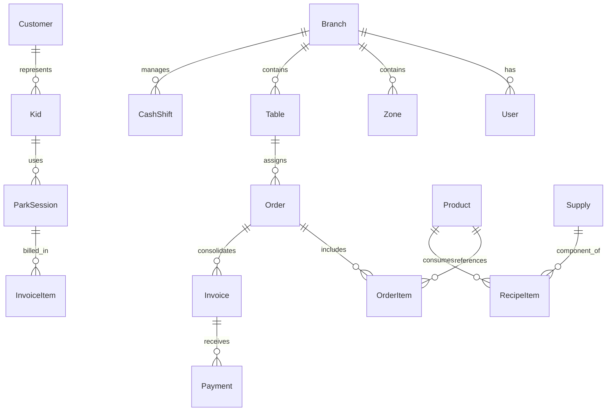

# L2 CONTROL - SISTEMA DE GESTIÓN INTEGRAL (PARQUE & RESTAURANTE)

> ⚠️ **DOCUMENTO SUPERADO — NO EJECUTAR.** Este es el plan v1.0, conservado solo como referencia
> histórica. El plan vigente es **`PLAN_L2_CONTROL_v2.md`**, que corrige 21 hallazgos de este
> documento (entre ellos la ausencia total de cumplimiento fiscal, de modelo de impuestos y de
> congelación de la tasa de cambio). Agentes de IA y desarrolladores: ejecutar v2, no este archivo.

> **Instrucciones para Agentes de IA / Desarrolladores:** Este documento es un archivo maestro ejecutable de especificación técnica, arquitectura, base de datos y checklist interactivo. Debe ser procesado fase por fase respetando la arquitectura estricta y el diseño del sistema. Cada tarea cuenta con una casilla de verificación `[ ]` para su seguimiento.

---

## 1. VISIÓN GENERAL DEL PROYECTO
**L2 Control** es una plataforma SaaS/Web integral para la administración operativa y financiera de centros recreativos familiares combinados con restauración gastronómica. Implementa control de estancias por tiempo con hardware de escaneo de pulseras, punto de venta (POS) unificado parque-restaurante, comandas digitales e impresas, gestión de inventarios con recetas/subrecetas, control de caja multimoneda adaptado a economías mixtas (USD/Bs/USDT/Zelle) y arquitectura extensible para videovigilancia.

* **Cliente / Caso Piloto:** Abby Kingdom (Parque Infantil + Restaurant).
* **Entorno de Despliegue:** Nube (Cloud Host / VPS / Docker / PostgreSQL gestionado).
* **Diseño y Experiencia:** Responsive First (Monitores POS táctiles, tablets de meseros/monitores y móviles).

---

## 2. STACK TECNOLÓGICO Y DECISIONES DE INGENIERÍA
El stack está seleccionado para garantizar reactividad en tiempo real, latencias mínimas en hardware térmico y código tipado de extremo a extremo:

* **Frontend:**
  * Framework: Next.js 14+ (App Router, React Server Components + Client Components optimizados).
  * Lenguaje: TypeScript (Strict mode).
  * Estilos & UI: Tailwind CSS + Shadcn UI (Radix Primitives) + Lucide Icons.
  * Gestión de Estado Local / Cache: Zustand + TanStack Query (React Query v5).
  * Sonido / Alertas: Web Audio API / Howler.js (notificaciones auditivas en estaciones de monitoreo).
* **Backend:**
  * Entorno: Node.js / TypeScript.
  * Framework API: NestJS (o Next.js API Routes robustas con Fastify/Express) con WebSockets nativos (Socket.io).
  * ORM: Prisma ORM (esquema fuertemente tipado con soporte relacional PostgreSQL).
  * Tiempo Real: Socket.io para actualización instantánea de comandas (KDS), cronómetros de parque y asignación de mesas.
* **Base de Datos & Cache:**
  * Motor Primario: PostgreSQL 16+.
  * Caché / PubSub en Memoria: Redis (utilizado para temporizadores de pulseras activas y sincronización WebSocket).
* **Hardware & Periféricos:**
  * Lectores de Código de Barras / QR: Conexión USB/Bluetooth en modo emulación de teclado (HID Keyboard Wedge) + Input Buffering listener en Frontend.
  * Impresoras Térmicas (58mm y 80mm):
    * Modo Red (Ethernet/Wi-Fi): Protocolo ESC/POS directo por sockets TCP (puerto 9100).
    * Modo Local / USB: Web Print Daemon local ligero (Node.js/Go) o WebUSB API / `window.print()` con CSS media print optimizado para tickets continuos.

---

## 3. IDENTIDAD VISUAL Y BRANDING ("L2 CONTROL")
* **Nombre del Sistema:** L2 Control.
* **Cliente:** Abby Kingdom.
* **Enfoque de UI:** Dark & Slate Professional UI con acentos cálidos inspirados en la naturaleza.
  * Fondo Principal: `#0F172A` (Slate 900) y `#1E293B` (Slate 800) para reducir fatiga visual en turnos nocturnos.
  * Color Primario (Marca): `#EAB308` (Ámbar Dorado) / `#F97316` (Naranja Aventura).
  * Color Secundario (Acento): `#10B981` (Esmeralda / Verde Selva activo).
  * Alertas y Estados de Tiempo:
    * *En tiempo / Seguro:* `#10B981` (Verde).
    * *Por vencer (últimos 5-10 min):* `#F59E0B` (Amarillo/Ámbar parpadeante).
    * *Tiempo vencido / Excedido:* `#EF4444` (Rojo neón con pulso visual).
* **Tipografía:**
  * Títulos y Display: **Quicksand** (Google Fonts) - Redondeada, amigable y legible.
  * Datos, Números, Tablas y POS: **Inter** / **JetBrains Mono** - Alta legibilidad numérica en facturas y balances.

---

## 4. ARQUITECTURA DE DATOS (MODELO RELACIONAL SIMPLIFICADO)



---

## 5. ESTRUCTURA DEL PROYECTO (MONOREPO / CLEAN ARCHITECTURE)

```text
l2-control/
├── apps/
│   ├── web/                        # Aplicación principal Next.js (Admin, POS, KDS, Monitor Parque)
│   │   ├── app/
│   │   │   ├── (auth)/             # Login, selección de sucursal
│   │   │   ├── (dashboard)/        # Panel administrativo, reportes, inventario
│   │   │   ├── (pos)/              # Punto de venta restaurante & parque
│   │   │   ├── (kds)/              # Kitchen Display System (Cocina)
│   │   │   └── (park-monitor)/     # Pantalla visual de control de tiempos de niños
│   │   ├── components/
│   │   │   ├── ui/                 # Componentes base Shadcn (buttons, modals, tables)
│   │   │   ├── hardware/           # Scanner listener, Print Manager
│   │   │   └── modules/            # Componentes especializados (Mesa, Cronómetro, etc.)
│   │   └── lib/
│   │       ├── hooks/              # useBarcodeScanner, useParkTimer, useSocket
│   │       └── printers/           # Generador ESC/POS para 58mm y 80mm
│   └── printer-agent/              # Agente de impresión opcional para impresoras USB en red local
├── packages/
│   ├── database/                   # Schema Prisma, migraciones y seeders
│   ├── types/                      # Tipos compartidos TypeScript (DTOs, Enums)
│   └── config/                     # Configuración de Tailwind, ESLint, TypeScript
└── docker-compose.yml              # PostgreSQL + Redis locales para desarrollo
```

---

## 6. CHECKLIST MAESTRO DE EJECUCIÓN PASO A PASO

### FASE 0: CONFIGURACIÓN BASE, BRANDING Y ARQUITECTURA
- [ ] Inicializar monorepo Turborepo con Next.js 14+, TypeScript y Tailwind CSS.
- [ ] Configurar tipografía Quicksand para encabezados e Inter para interfaz numérica.
- [ ] Configurar paleta corporativa Slate Dark con acentos ámbar/esmeralda y soporte de tokens de diseño.
- [ ] Configurar Docker Compose con PostgreSQL 16 y Redis 7.
- [ ] Inicializar Prisma ORM y configurar conexión a PostgreSQL.
- [ ] Diseñar hook universal `useBarcodeScanner` con buffer temporal de caracteres (captura de escáner USB sin requerir foco en campo de texto).
- [ ] Diseñar sistema de generación de tickets de impresión térmica (plantillas para anchos de 58mm y 80mm).

### FASE 1: AUTENTICACIÓN, ROLES Y CAJA CHICA (FINANZAS BASE)
- [ ] Crear sistema de autenticación con JWT seguro y control de acceso basado en roles (RBAC):
  - [ ] Administrador (Acceso total, configuración, reportes, anulaciones).
  - [ ] Cajero (Apertura/cierre de caja, facturación, cobros mixtos, notas de entrega).
  - [ ] Monitor de Parque (Check-in/Check-out de niños, recargas de tiempo, lector de pulseras).
  - [ ] Mesero (Toma de pedidos en mesas, asignación de cuentas de niños a mesas, envío a cocina).
  - [ ] Cocinero (Pantalla KDS, cambio de estados de preparación de platos).
- [ ] Implementar módulo de Apertura y Cierre de Caja (Corte X para arqueo de turno y Corte Z para cierre definitivo):
  - [ ] Registro de fondo inicial de caja por moneda (USD en efectivo, Bs en efectivo).
  - [ ] Módulo de Tasa de Cambio Oficial / Comercial (actualización manual o sincronización BCV en tiempo real).
  - [ ] Soporte para Métodos de Pago Mixtos en una misma transacción:
    - [ ] Efectivo en Dólares ($).
    - [ ] Efectivo en Bolívares (Bs).
    - [ ] Pago Móvil (con campo opcional de número de referencia/teléfono).
    - [ ] Punto de Venta / Tarjeta Débito y Crédito.
    - [ ] USDT / Cripto (Binance Pay / Wallet TxID).
    - [ ] Zelle (Nombre de titular y referencia).
  - [ ] Reporte de diferencias (cuadre de caja teórico vs. arqueo físico real).

### FASE 2: MÓDULO PARQUE INFANTIL (CONTROL DE TIEMPO & ACCESO)
- [ ] Modelo de datos para Niños, Representantes y Pulseras de Identificación.
- [ ] Flujo de Registro Rápido en Entrada:
  - [ ] Escaneo de código de barra/QR de pulsera de evento pre-impresa.
  - [ ] Asociación de pulsera al niño y a su representante (teléfono y datos de contacto).
- [ ] Motor de Tiempo Dual (Prepago y Postpago):
  - [ ] Modalidad Prepago: Selección de paquetes (ej. 30 min, 1 hora, tiempo libre).
  - [ ] Modalidad Postpago: Entrada con temporizador abierto y cobro acumulado al checkout.
  - [ ] Configuración de margen de tolerancia (gracia en minutos antes de disparar tarifa adicional).
  - [ ] Definición de bloques de penalización por tiempo extra vencido.
- [ ] Tablero de Monitoreo de Parque en Tiempo Real:
  - [ ] Tarjetas visuales interactivas por cada niño activo en sala.
  - [ ] Cronómetro regresivo (en prepago) o acumulativo (en postpago).
  - [ ] Código de color dinámico en tarjetas (Verde = activo, Amarillo = últimos minutos, Rojo parpadeante = tiempo cumplido).
  - [ ] Filtro rápido por escaneo: Al pasar la pulsera por el lector, abre directamente el perfil del niño.
- [ ] Salida y Liquidación del Parque:
  - [ ] Check-out inmediato con cálculo automático de minutos consumidos y cargos extra.
  - [ ] Opción A: Facturar y cobrar en taquilla de parque al instante.
  - [ ] Opción B: Cargar monto adeudado a la cuenta unificada de una mesa del restaurante.

### FASE 3: MÓDULO RESTAURANTE, MESAS, COMANDAS Y COCINA
- [ ] Editor y Visualizador Interactivo de Plano de Mesas:
  - [ ] Cuadrícula interactiva con distribución de mesas por zonas (Salón Principal, Terraza, Área Parque).
  - [ ] Estados en tiempo real por mesa: Libre (gris), Ocupada (azul), Con cuenta pedida (amarillo), Por limpiar (naranja).
- [ ] Unificación de Cuentas Parque + Restaurante:
  - [ ] Capacidad de vincular pulseras activas del parque a una mesa específica.
  - [ ] Visor unificado de consumo: Platillos/bebidas del restaurante + Estancias de parque de los niños en una sola cuenta maestra.
- [ ] Toma de Comandas (Meseros):
  - [ ] Catálogo visual táctil categorizado con modificadores de platos (término de cocción, sin cebolla, etc.).
  - [ ] Envío instantáneo a producción vía WebSockets.
- [ ] Módulo KDS (Kitchen Display System) y Despacho:
  - [ ] Pantalla táctil de cocina en tiempo real con tarjetas de pedidos ordenadas por antigüedad.
  - [ ] Estados de orden: Pendiente -> En preparación -> Listo para servir -> Entregado.
  - [ ] Impresión automática de comanda en impresora térmica de cocina/barra al confirmar el pedido.
- [ ] Facturación y División de Cuentas:
  - [ ] Impresión de pre-cuenta (estado de cuenta no fiscal para la mesa).
  - [ ] Capacidad de dividir la cuenta total: por partes iguales, por ítems seleccionados o pago parcial mixto.
  - [ ] Emisión de factura / nota de entrega térmica en formatos 58mm y 80mm.

### FASE 4: INVENTARIO, RECETAS Y PROVEEDORES
- [ ] Catálogo de Insumos y Materias Primas (gramos, mililitros, unidades, empaques).
- [ ] Gestión de Productos Terminados de Venta Directa (gaseosas, snacks, juguetes).
- [ ] Ficha Técnica y Escandallo de Recetas (Subrecetas e Ingredientes):
  - [ ] Vinculación de consumo por cada plato vendido (descarga automática de stock al facturar o al preparar).
- [ ] Registro de Compras, Entrada de Mercancía y Costeo Promedio Ponderado.
- [ ] Notificaciones y reportes de inventario crítico (alerta de stock bajo).

### FASE 5: REPORTES, AUDITORÍA Y DASHBOARD EJECUTIVO
- [ ] Panel de Métricas en Vivo:
  - [ ] Total facturado del día desglosado por moneda y método de pago.
  - [ ] Ingresos por Parque Infantil vs. Ingresos por Restaurante.
  - [ ] Cantidad de niños atendidos, promedio de tiempo de permanencia y horas pico.
- [ ] Platos más vendidos y margen de rentabilidad por producto.
- [ ] Registro de Auditoría (Logs de seguridad: anulaciones de platos, descuentos manuales, aperturas de gaveta).

### FASE 6: MÓDULO FUTURO - MONITOREO DE CÁMARAS (EZVIZ)
- [ ] Tabla de configuración de dispositivos de video (Nombre de cámara, Canal, ID de dispositivo EZVIZ, RTSP Stream URL local).
- [ ] Integración en panel de administración:
  - [ ] Pasarela de visualización mediante RTSP-to-WebRTC / HLS local o SDK Cloud de EZVIZ.
  - [ ] Acceso restringido exclusivo para perfiles con rol Administrador para supervisión del parque y áreas críticas.
