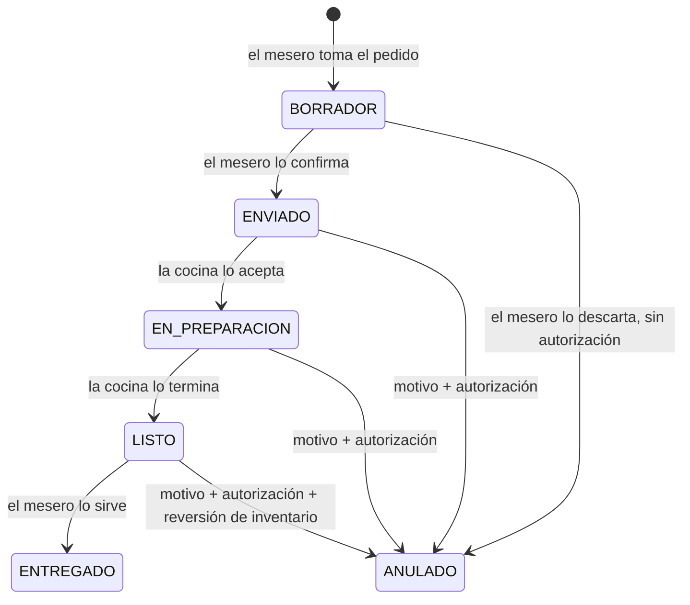
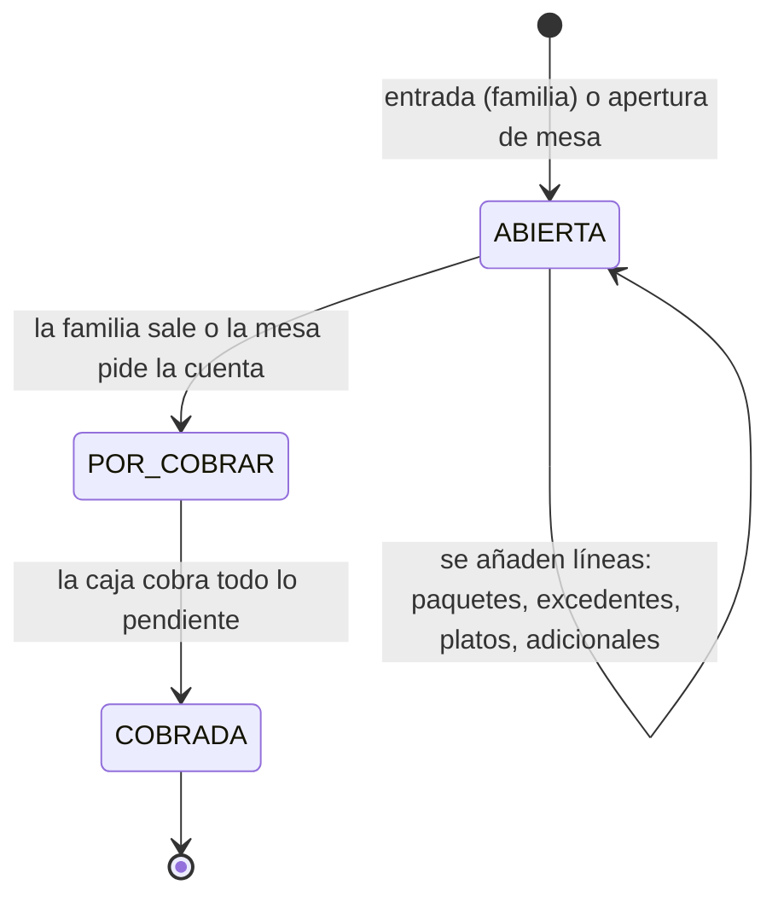

# Flujos del local

> **Qué es este documento.** Cómo se mueven las personas, los pedidos y el dinero dentro de Abby
> Kingdom, tal como se observó en las visitas, convertido en pasos que el sistema tiene que
> soportar. Es la base para tres cosas: **construir el frontend**, **simular la operación** antes
> de que exista el backend, y **escribir las pruebas de punta a punta** (cada flujo es una).
>
> **Relación con el plan.** Los flujos amplían los recorridos críticos R1–R7 de
> [PLAN.md §2.2](PLAN.md). Donde un paso pide algo que el plan deja fuera de la Ruta A, se dice
> (§11.3). Las decisiones que faltan están al final, en §7.
>
> Escrito el 2026-09-11.

---

## 1. Quién está en el local y dónde trabaja

| Actor | Dispositivo | Pantalla | Qué hace aquí |
|---|---|---|---|
| **Familia** (representantes y niños) | — | — | Entra, juega, come, paga, se va |
| **Monitora de parque** | Tablet de taquilla | Entrada · Sala · Salida | Pone pulseras, registra, vigila tiempos, cierra salidas |
| **Mesero** | Tablet de mesero | Mesas · Pedido | Abre mesas, vincula pulseras, toma y confirma pedidos, entrega |
| **Cocina** | Tablet de cocina + impresora | KDS | Recibe comandas, las prepara, las marca listas |
| **Cajera** | Equipo fijo del mostrador | Caja · Turno | Cobra cuentas de familia y de mesa, vende adicionales, cierra el turno |
| **Administración / supervisión** | Cualquiera, también el teléfono | Panel en vivo | Ve el local entero en tiempo real y autoriza excepciones |

Los permisos de cada acción son los de la matriz (§7.3) con las excepciones por persona de F2-11.

---

## 2. Los cinco flujos observados

Cada paso dice **quién** lo hace, **en qué pantalla**, **qué evento emite** (§4) y **qué cambia en
vivo** para los demás. Los eventos son el hilo que conecta las pantallas: si un paso no emite uno,
nadie más se entera de que ocurrió.

### Flujo A · Una familia: 2 adultos y 2 niños

```mermaid
sequenceDiagram
  autonumber
  participant F as Familia
  participant T as Taquilla
  participant S as Sala (monitor)
  participant M as Mesero
  participant K as Cocina
  participant C as Caja
  F->>T: llegan los 4; pulseras a los 2 niños
  T->>T: registra niños y representante, elige cómo paga
  T-->>S: estancia.abierta ×2 (cronómetros en marcha)
  alt Prepago
    T->>C: la cuenta pasa a caja y se paga el paquete
  else Cuenta abierta
    T->>T: la cuenta queda abierta, se paga al final
  end
  F->>M: los adultos se sientan en la mesa 3
  M->>M: abre la mesa 3 y vincula las 2 pulseras
  M->>K: confirma el pedido → pedido.enviado
  K-->>M: pedido.listo
  M->>F: entrega → pedido.entregado
  F->>C: van a caja
  C->>C: cuenta de la mesa 3 = comida + parque de los 2 niños
  C->>C: añade un caramelo, cobra, deja la propina
  C-->>S: estancias cerradas (la sala deja de contar)
  C-->>M: mesa 3 → por limpiar
```

| # | Quién · pantalla | Qué ocurre | Evento | Qué cambia en vivo |
|---|---|---|---|---|
| A1 | Monitora · Entrada | Escanea dos pulseras, escribe los nombres, busca al representante por teléfono | — | — |
| A2 | Monitora · Entrada | Elige **cómo paga** (DEC-21) y registra | `estancia.abierta` ×2 | Sala: dos tarjetas nuevas. Panel: aforo +2 |
| A3a | Monitora → Caja | *Prepago*: la cuenta pasa a la cola de caja; se cobra el paquete | `cuenta.por_cobrar`, `cuenta.cobrada` | Caja: la cuenta entra y sale de la cola |
| A3b | Monitora · Entrada | *Cuenta abierta*: se abre la cuenta sin cobrar | `cuenta.abierta` | Panel: cuentas abiertas +1 |
| A4 | Mesero · Mesas | Abre la **mesa 3** | `mesa.abierta` | Panel y caja: mesa 3 ocupada |
| A5 | Mesero · Mesa 3 | **Vincula** las pulseras de los niños a la mesa (R3, F6-05) | `mesa.vinculada` | Caja: el parque de esos niños se cobrará en la mesa 3 |
| A6 | Mesero · Pedido | Toma el pedido en borrador y lo **confirma** | `pedido.enviado` | Cocina: comanda nueva. Impresora: ticket |
| A7 | Cocina · KDS | Acepta y prepara | `pedido.aceptado` | Mesero: «en preparación» |
| A8 | Cocina · KDS | Termina | `pedido.listo` | Mesero: aviso en su tablet |
| A9 | Mesero · Mesa 3 | Entrega | `pedido.entregado` | Panel: tiempo de servicio de esa comanda |
| A10 | Cajera · Caja | La mesa 3 aparece en la cola: **platos + tiempo de parque** en un solo total | `cuenta.por_cobrar` | — |
| A11 | Cajera · Caja | Añade un **adicional** (un caramelo) a la misma cuenta | `cuenta.linea_añadida` | — |
| A12 | Cajera · Caja | Cobra, con **propina** si la hay | `cuenta.cobrada` | Panel: cobrado hoy. Mesa 3 → por limpiar |
| A13 | Monitora · Salida | Pasa las pulseras: los niños salen | `estancia.cerrada` ×2 | Sala: tarjetas fuera. Panel: aforo −2 |

> **Ojo con el orden de A12 y A13.** En la vida real los adultos pagan y *después* recogen a los
> niños, o al revés. Qué hace el sistema si se cobra la mesa con los niños todavía dentro es la
> decisión D3 de §7.

### Flujo B · El mesero

| # | Qué ocurre | Evento | Regla |
|---|---|---|---|
| B1 | Entra con su PIN en su tablet: ve el **plano de mesas** con su estado | — | F6-01, F6-02 |
| B2 | Abre una mesa libre | `mesa.abierta` | Una mesa no tiene dos sesiones abiertas (I-05) |
| B3 | Vincula pulseras si hay niños de esa familia en el parque | `mesa.vinculada` | F6-05 |
| B4 | Toma el pedido en el catálogo táctil, con modificadores | — | Queda en **borrador**: la cocina todavía no lo ve |
| B5 | Lo **confirma** con el cliente y lo envía | `pedido.enviado` | Desde aquí, anularlo exige motivo y autorización (§7.3) |
| B6 | Recibe «listo» y entrega | `pedido.entregado` | — |
| B7 | La mesa pide la cuenta: **pre-cuenta** no fiscal | `mesa.pide_cuenta` | F6-11. No cierra la mesa |
| B8 | La familia va a caja | — | **El mesero no toca dinero** (DEC-14) |
| B9 | *Futuro:* cobrar en la mesa con su tablet | — | Contradice DEC-14: necesita una decisión nueva (D5) |

### Flujo C · La cocina

La cocina ve **todo lo que entra, ordenado por antigüedad**, y lo mueve por estados. La regla que
evita cancelar un plato a medio cocinar: **el borrador es del mesero; lo enviado es de la cocina.**



| # | Qué ocurre | Regla |
|---|---|---|
| C1 | Llega la comanda: tarjeta nueva en el KDS **y** ticket en la impresora | DEC-19. Si la impresora falla, **se avisa en pantalla** y la comanda no avanza en silencio (F6-09) |
| C2 | El cocinero la acepta → «en preparación» | Toda transición registra quién y cuándo (F6-08) |
| C3 | La marca «lista» → el mesero recibe el aviso | Aquí se descuenta el inventario (ADR-012) |
| C4 | Una comanda que lleva mucho esperando **grita**: cambia de color y sube | §8.5: umbral configurable |
| C5 | Llega una anulación de algo en preparación | La tarjeta **no desaparece**: queda tachada y hay que confirmarla vista. Un plato que sigue cocinándose porque nadie vio la anulación es comida tirada |

### Flujo D · La caja

| # | Qué ocurre | Regla |
|---|---|---|
| D1 | Ve **todas las cuentas por cobrar**: de familia y de mesa | Cola en maestro-detalle (§9.10.9), hecha para familias |
| D2 | Una cuenta de mesa trae **platos + parque** de los niños vinculados | Cuenta maestra (R3). La cuenta de familia se une a la de la mesa al vincular (D2 de §7) |
| D3 | **Vende adicionales**: a una cuenta existente o como venta suelta | Catálogo de venta directa, F8-02 (fuera de la Ruta A, ver D6) |
| D4 | Cobro mixto con IVA e IGTF por medio de pago | Hecho en la interfaz (F4-03) |
| D5 | **Propina**: la que sale del vuelto, o una explícita | Del vuelto: hecho (§5.6). Explícita y servicio: F6-13, con DEC-6 |
| D6 | División de cuenta: iguales, por ítems, pago parcial | R5, F6-12. La suma de las partes es exactamente el total |
| D7 | Al cobrar una mesa, la mesa queda **por limpiar** | `cuenta.cobrada` → `mesa.por_limpiar` |

### Flujo E · Administración en vivo

Un solo tablero con **cinco zonas**, todas alimentadas por los eventos de §4, sin recargar:

| Zona | Qué muestra | Qué la hace urgente |
|---|---|---|
| **Parque** | En sala / aforo, por vencer, tiempo cumplido | Tiempo cumplido sin liquidar; aforo lleno con cola |
| **Cocina** | Comandas en cola, en preparación, tiempo medio y la más antigua | Una comanda por encima del umbral; impresora caída |
| **Mesas** | Plano: libre, ocupada, pide la cuenta, por limpiar, y desde cuándo | Mesa que pidió la cuenta hace rato |
| **Caja** | Turno, cobrado hoy por moneda, cuentas pendientes | Cuenta por cobrar con familia ya fuera |
| **Personas conectadas** | Quién tiene sesión, en qué dispositivo y desde cuándo | Un puesto sin nadie en hora de servicio |

Las excepciones del turno —anulaciones, cortesías, descuentos— entran en vivo en la misma vista.

> **Nuevo respecto al plan:** la zona «personas conectadas» no está en ninguna tarea. Es un
> requisito nuevo (D7).

---

## 3. La cuenta: familia y mesa son la misma idea

La cuenta de la familia (DEC-21, hecha) y la cuenta maestra de la mesa (R3, F6-05) no pueden ser dos
cosas que la cajera tenga que sumar de cabeza. Se propone **un solo concepto de cuenta** con dos
anclas:



- **Vincular una familia a una mesa** mueve sus líneas de parque a la cuenta de la mesa: queda **una**
  cuenta y **un** cobro. Nada se borra: la cuenta de la familia registra adónde se movió cada línea.
- **Una familia sin mesa** paga su cuenta de familia, como hoy.
- **Una mesa sin niños** es una cuenta de restaurante normal.

---

## 4. Eventos en tiempo real

Todo lo que otra pantalla necesita saber viaja como evento, por el canal de ADR-008 (Socket.io,
autorizado en el *handshake*, una sala por sucursal). Cada evento se valida con Zod igual que una
petición HTTP (§7.2).

| Evento | Lo emite | Lo reciben | Qué cambia |
|---|---|---|---|
| `estancia.abierta` · `.cerrada` | Entrada · Salida | Sala, caja, panel | Tarjetas y aforo |
| `estancia.por_vencer` · `.vencida` | Servidor (reloj, ADR-010) | Sala, taquilla, panel | Color y aviso |
| `cuenta.abierta` · `.por_cobrar` · `.cobrada` | Entrada, salida, mesero, caja | Caja, panel | Cola de caja y cifras |
| `cuenta.linea_añadida` | Caja, mesero | Caja, panel | Total de la cuenta |
| `mesa.abierta` · `.vinculada` · `.pide_cuenta` · `.por_limpiar` · `.libre` | Mesero, caja | Mesas, caja, panel | Plano de mesas |
| `pedido.enviado` · `.aceptado` · `.listo` · `.entregado` · `.anulado` | Mesero, cocina | Cocina, mesero, panel | KDS y avisos |
| `impresora.fallo` · `.recuperada` | Servidor (ADR-015) | Cocina, caja, panel | Alerta fija en pantalla |
| `sesion.iniciada` · `.cerrada` · `.bloqueada` | Acceso, F2-12 | Panel | Personas conectadas |
| `turno.abierto` · `.corte_x` · `.corte_z` | Turno | Caja, panel | Estado del turno |

---

## 5. Escenarios para simular

Para construir y probar las pantallas antes del backend, la operación se reproduce con **escenarios**
guionizados. Hay tres familias: el día normal, el pico y los fallos. Cada escenario dice qué debe
hacer el sistema y si esa regla ya existe o falta decidirla.

### 5.1 Orden: el día normal

| # | Escenario | Qué debe hacer el sistema | Estado |
|---|---|---|---|
| O1 | La tarde tranquila: 6 familias, 4 mesas, una a una | Los cinco flujos de §2 sin fricción | Base de todo lo demás |
| O2 | Familia que repite visita | El representante aparece al teclear su teléfono; los niños, con un toque | Parcial (F5-03) |
| O3 | Prepago que se pasa 7 minutos | Gracia de 5, cobra 1 bloque, con desglose en la salida | Hecho |
| O4 | Recarga de tiempo antes de vencer | La tarjeta vuelve a verde sin perder la historia (R2) | Pendiente |
| O5 | Cuenta dividida en dos, Bs y USDT | IGTF solo sobre la parte en divisas (R5) | Pendiente (F6-12) |

### 5.2 Pico: sábado a las cuatro

| # | Escenario | Qué debe hacer el sistema | Estado |
|---|---|---|---|
| P1 | Aforo lleno (30) con cola en la entrada | Avisa **antes** de registrar a uno más; la sala pasa a baldosas compactas | Hecho |
| P2 | 8 mesas llenas y 15 comandas en cocina | El KDS ordena por antigüedad y hace gritar las atrasadas | Pendiente (F6-07) |
| P3 | Tres familias salen a la vez en taquilla | Cada salida dice qué cobra; la caja recibe tres cuentas en cola | Hecho en la interfaz |
| P4 | La caja con cinco cuentas esperando | La cola se ordena por antigüedad y la cajera no pierde la que atiende | Hecho en la interfaz |
| P5 | Cumpleaños: 12 niños y un solo representante que paga | Una cuenta con 12 estancias y el desglose por niño | Por diseñar |

### 5.3 Caos: lo que falla de verdad

| # | Escenario | Qué debe hacer el sistema | Estado |
|---|---|---|---|
| X1 | Se cae internet a mitad de un cobro | Sigue cobrando con el servidor del local (ADR-003); la pantalla dice el nivel de degradación | Pendiente (R7) |
| X2 | Se va la luz y vuelve | Nada cobrado se pierde; nada se cobra dos veces (clave de idempotencia) | Parcial |
| X3 | La impresora de cocina sin papel | Alerta fija en KDS y panel; la comanda no avanza en silencio | Pendiente (F6-09) |
| X4 | La tablet del mesero se apaga con un pedido en borrador | El borrador se recupera al volver a entrar; nada llegó a cocina | Por decidir |
| X5 | Se envió un plato equivocado y ya se está cocinando | Anular exige motivo y autorización; la cocina lo ve tachado y confirma | Regla existe; pantalla pendiente |
| X6 | La tasa del día no está confirmada | No se cobra en bolívares; se dice antes de intentar cobrar | Hecho |
| X7 | Una pulsera ilegible o perdida | Búsqueda del niño por nombre; la pulsera nueva sustituye a la vieja con rastro | Por decidir |
| X8 | Se escanea una pulsera ya activa | Se rechaza: una pulsera, una estancia activa | Hecho |
| X9 | Un niño intenta salir **sin su representante** | La salida muestra a quién se entrega el niño y pide confirmarlo | **Por decidir (D9)** |
| X10 | La familia se va sin pagar | La cuenta sigue por cobrar y el panel la señala con la familia ya fuera | Parcial |
| X11 | El representante discute el excedente | El desglose por minutos y bloques está en pantalla y en el ticket | Hecho |
| X12 | El pedido está listo pero la mesa ya fue a caja | Caja ve el plato pendiente de entregar antes de cobrar | Por decidir |
| X13 | La familia se cambia de mesa o se juntan dos mesas | La cuenta se mueve entera; ninguna línea se duplica ni se pierde | Por decidir |
| X14 | Cambio de turno de caja con cuentas abiertas | Las cuentas no pertenecen al turno; el cobro sí | Por decidir |
| X15 | Doble toque en «Cerrar cobro» | Un solo cobro (I-11) | Hecho en el contrato |

---

## 6. Cómo se construye el frontend a partir de esto

**Un simulador de escenarios** que reproduce los eventos de §4 sobre los mismos contratos que usará el
servidor. Las pantallas no distinguen si el evento viene del simulador o del backend. Cuando el
backend exista, se cambia la fuente y las pantallas no se tocan (§11.4).

- **Selector de escenario** (O1…X15) y **velocidad** (×1, ×10, ×60): una tarde entera se ve en
  minutos.
- **Datos derivados del contrato**, validados al construirse, como el resto de datos de ejemplo.
- **Cada escenario es una prueba de punta a punta**, como las que ya verifican los cinco flujos de
  DEC-21.

**Orden propuesto de construcción**, cada paso sobre el simulador:

1. **Motor de simulación y catálogo de eventos** (§4). Sin él, las pantallas en vivo no tienen de qué
   alimentarse.
2. **Mesas y mesero**: plano de mesas, abrir, vincular pulseras, pedido con borrador y confirmación.
3. **KDS**: comandas por antigüedad, estados, anulación visible, fallo de impresora.
4. **Caja con cuentas de mesa**: cuenta maestra, adicionales y propina explícita.
5. **Panel en vivo**: las cinco zonas de §2, flujo E.

---

## 7. Decisiones pendientes

| # | Decisión | Por qué importa | Propuesta |
|---|---|---|---|
| **D1** | **Alcance.** Mesas, mesero, cocina y panel en vivo son F6 y F9, **fuera de la Ruta A** (§11.3) | Con dos personas, cada tarea nueva desplaza a otra (DEC-11) | Construir su **interfaz** ahora sobre el simulador, dentro de la fase de frontend, y dejar su backend para después del piloto del parque. La salida en vivo del parque no se mueve |
| **D2** | Cómo se une la cuenta de la familia a la de la mesa | Evita que la cajera sume dos cuentas de cabeza | Vincular mueve las líneas de parque a la cuenta de la mesa, con rastro (§3) |
| **D3** | ¿Se puede cobrar una mesa con los niños aún dentro? | El reloj sigue corriendo mientras se cobra | Al cobrar, la caja **cierra el tiempo** de los niños vinculados y la salida solo confirma la entrega |
| **D4** | ¿Quién anula un pedido enviado que la cocina aún no aceptó? | Es la frontera entre «borrador» y «en cocina» | Enviado ya es de la cocina: anular exige autorización (§7.3). Hasta confirmar, el mesero lo cambia libremente |
| **D5** | Cobrar en la mesa | Contradice DEC-14 | Se queda como futuro; si se quiere, es una decisión nueva que reabre DEC-14 |
| **D6** | Venta de adicionales en caja | Es F8-02, fuera de la Ruta A | Un catálogo mínimo de mostrador (golosinas, bebidas) sin inventario, que F8 completa después |
| **D7** | Personas conectadas en vivo | Requisito nuevo, no está en el plan | Añadirlo a F9 como tarea nueva, alimentada por los eventos de sesión de F2-12 |
| **D8** | Propina explícita y servicio del 10 % | DEC-6 dice «configurable por el administrador» | Propina voluntaria en caja ya; el servicio fijo, cuando la administración lo active |
| **D9** | **Un niño que sale sin su representante** | Seguridad, no solo cobro | La salida muestra a quién se entrega y pide confirmarlo. Si no coincide, no se cierra la estancia |
