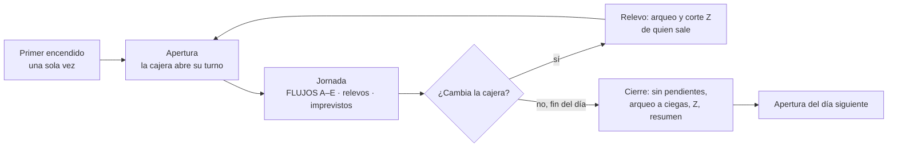

# La jornada del local

> **Qué es este documento.** El día completo de Abby Kingdom en cuatro momentos: el **primer
> encendido** (una sola vez), la **apertura**, la **jornada** y el **cierre**. Cada momento es un mapa
> de servicio: quién actúa, en qué equipo y pantalla, qué hace, qué ven los demás, qué debe tardar y
> qué pasa si algo falla. Sirve para una cosa: saber **exactamente qué hay que pulir** para que la app
> tenga un camino feliz de punta a punta.
>
> **Relación con los demás documentos.** Lo que pasa *durante* la jornada con familias, mesas,
> cocina y caja ya está en [FLUJOS.md](FLUJOS.md) (flujos A a E) y no se repite: aquí se añade lo
> que la jornada exige alrededor. Las decisiones que salen de aquí se registran en
> [MAESTRO.md](MAESTRO.md) §2 (M-13) y sus pasos en §3. Como FLUJOS, este documento es de
> referencia: se corrige cuando un paso de la ruta resuelve algo de su §7, y no se edita en cada
> sesión.
>
> Escrito el 2026-09-27, tras tres rondas de preguntas con el cliente.

---

## 0. Método

1. **Cuatro momentos, un mapa por momento.** Columnas fijas: quién y dónde, qué hace, qué queda
   listo o qué ven los demás, y qué pasa si falla. Los tiempos objetivo van al final de cada momento.
2. **Primero el camino feliz, completo y sin desvíos.** Las excepciones cuelgan del paso donde
   ocurren, nunca en medio del recorrido.
3. **Fail-closed sin paralizar.** Lo que falta bloquea **solo lo que depende de ello** y lo dice con
   un enlace para arreglarlo: sin tasa no se cobra en bolívares, pero en dólares sí.
4. **Se valida con el sistema real.** Sin ensayos en papel (decisión del cliente, 2026-09-27): cada
   momento es una prueba de punta a punta con Playwright en cuanto su paso existe (§8), y lo abierto
   se decide con el cliente cuando su paso llega.

---

## 1. Lo decidido (2026-09-27)

| Tema | Decisión |
|---|---|
| **Menú** | Arriba lo que se usa para operar: **Inicio, Parque, Restaurante, Caja**. Abajo, en **«Ajustes»**, lo que se configura de vez en cuando: impuestos, feriados bancarios, medios de pago, tasas, tarifas, carta, plano, personas y equipos. La tasa se aplica sola: solo sale a la vista con una alerta |
| **Turno** | Una sola sección. La estación queda en **Cobrar \| Turno**, y Turno se lee de arriba abajo: el resumen en vivo (fondo, cobrado por medio), las ventas (reimprimir, anular) y al final «Cerrar turno» |
| **Primer uso** | Un asistente corto (local, primera administración, este equipo) y una **«Puesta a punto»** en Inicio que se va tachando. Solo bloquea lo que no puede funcionar sin su dato |
| **Apertura** | La **cajera abre su turno** y el sistema comprueba solo lo necesario. Los demás puestos solo entran con su PIN; si algo de su equipo falla, lo avisa el propio puesto |
| **Horario** | Corrido, igual todos los días |
| **Fondo** | Variable: se teclea cada vez, por moneda |
| **Relevo** | Un turno dura lo que la persona está en la caja. Si otra la toma, **quien sale cuenta y cierra el suyo**; si no hay cambio, hay un solo turno en el día y no se pide nada más |
| **Cierre** | **No se cierra la jornada con pendientes** (niños en sala, cuentas o mesas abiertas): el cierre los lista y lleva a resolver cada uno |
| **Arqueo y corte Z** | La cajera **cuenta a ciegas**. Si la diferencia no pasa de **$ 1,00 o su equivalente**, ella misma cierra el Z; si lo pasa, supervisión revisa y firma (🔐). Supervisión puede cerrar un turno ajeno (la cajera se fue, el equipo falló). El umbral se cambia en Ajustes |
| **Qué queda para administración** | El **resumen del día en Inicio** y el **ticket de corte impreso** |
| **Cortes de luz e internet** | **Decidido en la visita técnica (2026-09-28, M-15, ADR-021):** un solo servidor en la nube, con internet de respaldo 4G y UPS en el local. Si caen los dos enlaces, papel; al volver, la cajera carga lo anotado y supervisión lo revisa (B3-7) |
| **Equipos** | **Decidido en la visita técnica (M-15):** la monitora trabaja en un teléfono del local (pulseras preimpresas de un solo uso, leídas con la cámara o un lector Bluetooth), la caja en una laptop, el mesero en una tablet y la cocina con la comanda impresa, sin pantalla (ADR-022). Una sola impresora, en caja |

---

## 2. Momento 1 · Primer encendido (una sola vez)

Con la base vacía (M-12). Nadie toca la consola.

| # | Quién · dónde | Qué hace | Qué queda listo | Si falla |
|---|---|---|---|---|
| P1 | Quien instala · el servidor | Arranca con la base vacía; el registro del servidor muestra un **código de instalación** de un solo uso | — | Sin código no hay instalación: la pantalla lo dice y no ofrece otra puerta |
| P2 | Administración · su equipo | En `/acceso`: «Instalar L2 Control» y el código | — | Código equivocado: se dice, con tope de intentos |
| P3 | Administración | Nombre del local y de la sucursal | El local | — |
| P4 | Administración | Su nombre, contraseña, PIN y **llave de acceso** (Windows Hello o el bloqueo del teléfono); guarda impresos los **diez códigos de recuperación** | La primera administración | Sin llave de acceso en ese equipo, no se sigue (ADR-020) |
| P5 | Sistema | Aprueba **este equipo** y entra al panel. La pantalla de instalación deja de existir | El primer equipo | — |
| P6 | Administración · Inicio | Recorre la **Puesta a punto**, que se tacha sola cuando el dato existe (tabla de abajo) | El local listo para su primer día | Cada punto sin hacer dice qué no funcionará todavía |

**La Puesta a punto.** Cada fila enlaza a su sección de Ajustes. «Bloquea» dice qué puesto no puede
trabajar sin ella; lo demás es recomendable pero no detiene nada.

| Punto | Bloquea | Nota |
|---|---|---|
| Personas del equipo, con su rol y su PIN | Que otra persona opere | — |
| Equipos de cada puesto aprobados (caja, taquilla, mesero, cocina) | Ese puesto | Se aprueban desde el propio equipo (M-7) |
| Tarifas del parque publicadas | La entrada | — |
| Impuestos vigentes | Cobrar | Una base nueva no los trae: el contador los confirma |
| Tasa del BCV | Cobrar en bolívares | Se trae sola; **la primera no se aplica sola** (ADR-019): se confirma aquí |
| Medios de pago | — | El efectivo y el USDT nacen encendidos; Pago Móvil, Zelle y el punto piden los datos del local |
| Catálogo de mostrador | La venta directa | B9-1 |
| Impresoras | Comandas y ticket de corte | B5-2 |
| Feriados bancarios del año | — | Recordatorio: sin ellos, ese día pide la tasa a mano |
| Carta y plano del restaurante | Mesas y comandas | El restaurante entra en el piloto (M-15) |
| Existencias iniciales del inventario | Vender lo que lleva existencia | Sin existencia no se vende (ADR-023, B9-3) |
| Descuentos y familias VIP | — | Opcional (B3-6) |
| Segunda administración con su llave | — | Regla de operación: siempre dos (M-7) |

**Objetivo:** de la base vacía al primer cobro en una tarde, sin consola ni ayuda externa.

---

## 3. Momento 2 · Apertura del día

| # | Quién · dónde | Qué hace | Qué ven los demás | Si falla |
|---|---|---|---|---|
| A1 | Cajera · equipo de caja | Entra con su PIN; la caja ofrece «Abrir turno» | — | Equipo no aprobado: lo aprueba administración desde ese equipo (M-7) |
| A2 | Cajera · Turno | **Teclea el fondo** de cada moneda de la gaveta y abre | Inicio: «Turno desde 10:02 am · Marisol Prieto» y el fondo en gaveta | Un importe mal escrito se señala en su campo |
| A3 | Sistema | **Comprueba al abrir**: tasa vigente, impuestos vigentes, al menos un medio que ofrecer, tarifario publicado e impresora de caja | Si todo está, «Listo para cobrar» | Lo que falte sale como lista, con enlace, y bloquea solo lo suyo |
| A4 | Monitora · su teléfono | Entra con su PIN: Entrada lista | — | Si la cámara o el lector Bluetooth no leen, lo dice su pantalla |
| A5 | Mesero · su tablet | Entra con su PIN; la cocina no entra: trabaja con la comanda impresa (ADR-022) | — | Si una comanda no se imprime, lo avisan la tablet del mesero y la caja |
| A6 | Administración · Inicio, en el local o fuera | Ve el local abierto: turno, tasa del día, puestos conectados | — | — |

**Si quedó algo de ayer.** No debería (el cierre no deja pendientes), pero un corte de luz o un
equipo dañado pueden dejar un turno sin cerrar. La apertura lo enseña **antes que nada**, y
supervisión lo cierra desde otro equipo (🔐), con su arqueo, antes de abrir el nuevo.

**Un feriado bancario** se abre igual: la tasa del día hábil anterior lo cubre sola (B2-4).

**Objetivo:** abrir el turno en menos de un minuto.

---

## 4. Momento 3 · La jornada

El camino feliz de cada puesto está en [FLUJOS.md](FLUJOS.md): la familia (A), el mesero (B), la
cocina (C), la caja (D) y administración en vivo (E). Aquí va lo que la jornada añade alrededor.

**El relevo de caja**

| # | Quién · dónde | Qué hace | Si falla |
|---|---|---|---|
| R1 | Cajera que sale · Turno | «Cambiar de cajera» | — |
| R2 | Cajera que sale | **Cuenta a ciegas** su gaveta por moneda y denominación | — |
| R3 | Sistema | Compara con el libro. Hasta $ 1,00 de diferencia, ella firma el Z; más, supervisión revisa y firma (🔐) | Sin supervisión en el local, el relevo espera: el turno no se cierra con una diferencia sin revisar |
| R4 | Sistema | Corte Z de su turno y **ticket impreso** | Sin impresora, el Z queda sellado y el ticket se reimprime después |
| R5 | Cajera que entra | Entra con su PIN y **abre su turno** tecleando el fondo que recibe | — |

Las **cuentas por cobrar no son de un turno**: siguen en la cola y las cobra la que entra. Los
pendientes solo bloquean el **cierre de la jornada**, no un relevo.

**Lo que interrumpe** (y nada más, para no entrenar a ignorar avisos): tasa retenida por salto o
por fuente dudosa, impresora caída, comanda atrasada, tiempo cumplido sin liquidar y aforo lleno.
Todo lo demás espera en Inicio.

**Una tasa nueva a mitad del día** se aplica sola; un cobro en curso conserva la suya y avisa
(B2-1c).

**Un corte de internet** pasa solo al 4G de respaldo (ADR-021). Si caen los dos enlaces, o la luz sin
UPS, se sigue en **papel** con los formularios impresos (entrada y cobro) y, al volver, **la cajera carga
lo anotado en su turno**, marcado «desde papel» con la hora real, antes de seguir; **supervisión lo
revisa** en el cierre (B3-7, hecha: ADR-027).

---

## 5. Momento 4 · El cierre de la jornada

| # | Quién · dónde | Qué hace | Qué ven los demás | Si falla |
|---|---|---|---|---|
| C1 | Cajera del último turno · Turno | «Cerrar la jornada» | — | — |
| C2 | Sistema | **Lista lo pendiente**: niños en sala, cuentas por cobrar, mesas abiertas, comandas sin entregar y lo anotado en papel sin cargar. Cada fila lleva a resolverla | Monitora, mesero y cocina ven lo suyo resaltado | No hay «cerrar igual»: el Z no se ofrece hasta que la lista está vacía |
| C3 | Cajera | **Cuenta a ciegas** por moneda y denominación | — | — |
| C4 | Sistema | Compara con el libro. Hasta $ 1,00, ella firma; más, supervisión revisa, justifica y firma (🔐) | La diferencia entra en vivo en Inicio | — |
| C5 | Sistema | **Corte Z**: sella el turno (nada lo toca después, F4-06) e **imprime el ticket de corte** | — | Sin impresora, se sella igual y se reimprime después |
| C6 | Administración · Inicio | Ve el **resumen del día** | — | — |
| C7 | Los demás puestos | Salen; no tienen un cierre propio: lo suyo ya lo exigió C2 | — | — |

**El ticket de corte** lleva: día de negocio, turno, cajera, fondo, cobrado por medio y moneda,
IGTF, excepciones (anulaciones, cortesías, descuentos), el arqueo con su diferencia y quién firmó.

**El resumen del día en Inicio** lleva: ventas del parque y del restaurante, cobrado por medio y
moneda, turnos del día, excepciones con su responsable y las diferencias de arqueo.

**Supervisión puede cerrar un turno ajeno** desde otro equipo (la cajera se fue, el equipo falló),
con su autorización y el mismo arqueo.

**Objetivo:** cerrar la jornada sin pendientes en menos de diez minutos, contando el arqueo.

---

## 6. Qué exige esto a la ruta

| Necesidad | Paso | Qué cambia |
|---|---|---|
| Menú: operar arriba, Ajustes abajo | **T-6** (nuevo) | Reordena la navegación del panel; nada se borra |
| Una sola sección Turno (Cobrar \| Turno) con las ventas dentro | **B3-4** | Las ventas del turno se construyen ya dentro de Turno |
| Apertura con comprobación | **B3-5** | Abrir turno lista lo que falta con enlace |
| Relevo con corte, arqueo a ciegas, Z según umbral, cierre de un turno ajeno | **B3-5** | Amplía F4-05 a F4-08 |
| Cierre sin pendientes | **B3-5**, y crece con **B4-3** (niños) y **Etapa 6** (mesas y comandas) | La lista gana filas a medida que llega cada módulo |
| Umbral de diferencia en Ajustes ($ 1,00) | **B4-4** | Ajuste de la sucursal |
| Ticket de corte impreso | **B5-2** | Plantilla de 58 y 80 mm |
| Resumen del día en Inicio | **B3-5** (caja) y **B4-2** (parque) | Sustituye las cifras sin fuente de Inicio |
| Puesta a punto en Inicio | **T-4** | Amplía la instalación inicial |
| Contingencia en papel y carga posterior | **B3-7** (hecha) y B8-2 | Decidido (M-15); la hora real, con su ventana, en ADR-027 |

---

## 7. Abierto: se pregunta al cliente cuando llegue su paso

1. ~~**Una familia se va sin pagar**~~ — **decidido el 2026-09-28:** la cuenta se marca incobrable
   con motivo y 🔐 de supervisión; sale en las excepciones y deja cerrar la jornada.
2. ~~**En el relevo**~~ — **decidido:** la que sale retira lo vendido y deja solo el fondo; la que
   entra lo declara al abrir su turno.
3. ~~**El equivalente de $ 1,00** en bolívares~~ — **decidido:** con la tasa del turno, contra un
   solo umbral.
4. ~~**La carga de lo anotado en papel**~~ — **decidido el 2026-09-28 (M-15):** la cajera, al volver y en
   su turno, marcado «desde papel» con la hora real; supervisión lo revisa en el cierre (B3-7, hecha: ADR-027).
5. ~~**D-INF**~~ — **decidido el 2026-09-28 (M-15, ADR-021):** solo VPS, con internet de respaldo 4G.

---

## 8. Cómo se valida

1. **Pruebas de punta a punta** (Playwright): *instalar* (P1–P6), *abrir* (A1–A6), *relevo* (R1–R5)
   y *cerrar* (C1–C7), cada una en cuanto su paso de la ruta exista. La de cerrar crece con cada
   módulo que añade pendientes.
2. **Lo que no encaje** al construir un momento se corrige aquí y se registra en MAESTRO.
