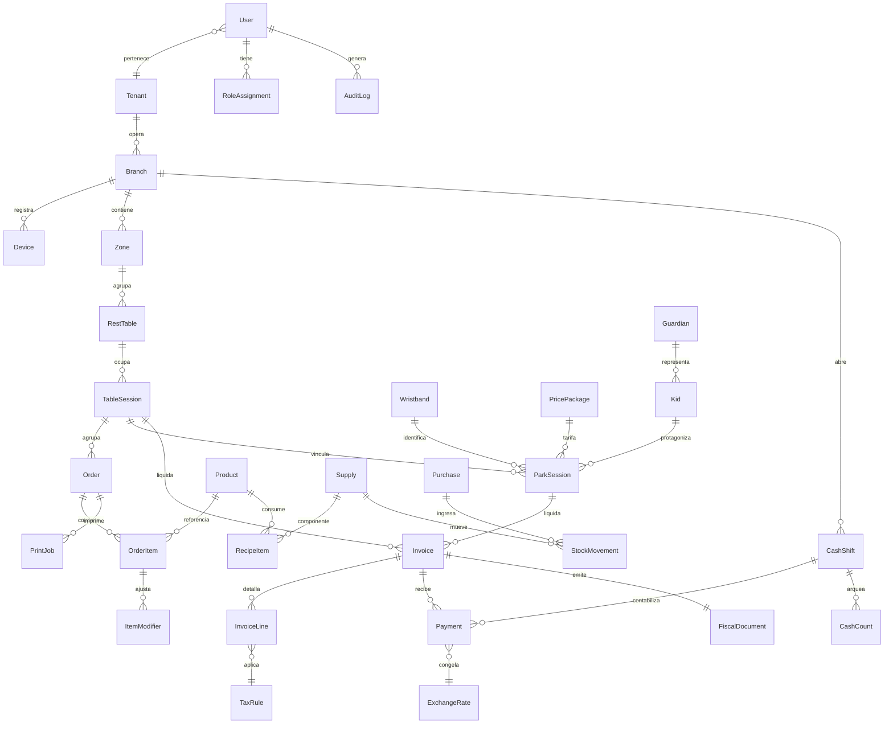
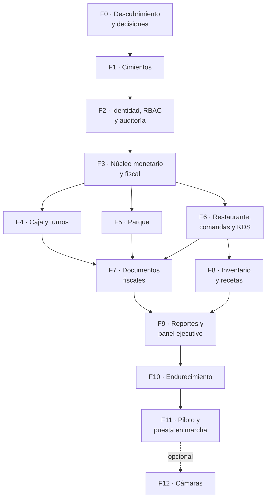

# L2 CONTROL — PLAN MAESTRO DE DESARROLLO v2.0

> **Estado:** Borrador para aprobación del cliente y del equipo técnico.
> **Reemplaza a:** la especificación v1.0 (`docs/archivo/SPEC-v1.md`), retirada del árbol el 2026-09-17; se recupera con `git show 6eda825:docs/archivo/SPEC-v1.md`.
> **Fecha de revisión:** 2026-09-08.
> **Cliente / caso piloto:** Abby Kingdom (Parque Infantil + Restaurante), Venezuela.

---

## 0. CÓMO USAR ESTE DOCUMENTO

### 0.1 Para quién es

Este documento está escrito para que **tres audiencias distintas** trabajen sin tener que
preguntarle nada a quien lo escribió:

| Audiencia | Qué lee | Qué produce |
|---|---|---|
| **Dueño / cliente (Abby Kingdom)** | §1, §2, §13, §14 | Aprueba alcance y responde las decisiones pendientes |
| **Desarrollador o agente de IA** | §3 a §12 completo | Código, migraciones, pruebas |
| **Quien recibe el sistema (gerente, contador)** | §2.2, §5, §12-F12 | Valida que el negocio queda cubierto |

**Regla de oro para quien ejecuta:** ninguna tarea de §12 se marca como hecha hasta que su
**criterio de aceptación** se cumple y es *demostrable a otra persona*. "Ya lo programé" no es
un criterio de aceptación. "El test `T-F3-04` pasa y el arqueo muestra Bs 0,00 de diferencia"
sí lo es.

### 0.2 Convenciones

- **`ADR-nnn`** — *Architecture Decision Record*: una decisión técnica cerrada, con su porqué.
  Para cambiarla se escribe un ADR nuevo que la supersede. No se cambia en silencio.
- **`Fn-nn`** — Identificador de tarea. `F3-07` = Fase 3, tarea 7. Se usa en ramas y commits
  (`feat/F3-07-motor-igtf`), de modo que el historial de Git se lee contra este plan.
- **`DEC-n`** — Decisión que **depende del cliente**, no del equipo. Bloquea las tareas que la citan.
- **`RIE-n`** — Riesgo registrado en §13.
- **Severidad:** 🔴 crítico (bloquea producción) · 🟠 alto (deuda cara) · 🟡 medio.
- **Casillas:** `[ ]` pendiente · `[~]` en curso · `[x]` hecho y verificado.

### 0.3 Glosario obligatorio

Nadie debe adivinar estos términos. Si aparece uno del dominio que no esté aquí, **se agrega**.

#### Negocio — restaurante

| Término | Significado exacto en este sistema |
|---|---|
| **Comanda** | Instrucción de producción enviada a cocina o barra. **No es una factura.** Puede imprimirse y mostrarse en pantalla a la vez. |
| **Pre-cuenta** | Impresión **no fiscal** que el cliente revisa antes de pagar. No genera número de control ni cierra la mesa. |
| **Cuenta maestra** | Consumo consolidado de una mesa: platos y bebidas + estancias de parque de los niños vinculados a esa mesa. Es el diferencial del producto. |
| **Escandallo** | Ficha de costo de una receta: qué insumos consume un plato y cuánto de cada uno. Permite calcular margen real, no estimado. |
| **Subreceta** | Preparación intermedia (ej. salsa base) que se produce una vez y se consume en varios platos. |
| **Modificador** | Variante de un plato que puede cambiar precio y consumo de insumos (ej. «sin cebolla», «término tres cuartos», «porción extra»). |
| **KDS** | *Kitchen Display System*: pantalla de cocina donde las comandas cambian de estado. |
| **Anulación (void)** | Eliminar un ítem ya enviado a producción. Es el principal vector de fraude interno; siempre exige motivo y autorización de supervisor. |
| **Cortesía** | Ítem entregado sin cobro (invitación, error de cocina, consumo de personal). Se **registra**, nunca se borra. |

#### Negocio — parque

| Término | Significado exacto en este sistema |
|---|---|
| **Pulsera (wristband)** | Soporte físico con código de barras o QR. **Es desechable:** se corta al salir el niño y su código no vuelve a usarse. El código identifica **una estancia**, no a un niño ni a un objeto con historia. |
| **Estancia (ParkSession)** | Período entre check-in y check-out de un niño. Es la unidad que se cobra. |
| **Prepago** | El representante compra un bloque de tiempo por adelantado (30 min, 1 h, pase libre). El cronómetro cuenta hacia atrás. |
| **Postpago** | El niño entra con cronómetro abierto y se cobra al salir. El cronómetro cuenta hacia adelante. |
| **Gracia (tolerancia)** | Minutos después del vencimiento que **no** se cobran. Debe ser un valor explícito; ver ADR-011 sobre por qué «cero» es peligroso. |
| **Bloque de penalización** | Unidad mínima de cobro del tiempo excedido (ej. «cada 15 min iniciados se cobran completos»). |
| **Representante (guardian)** | Adulto responsable del niño. Su teléfono es el contacto de emergencia. Es dato personal sensible (§7.6). |

#### Dinero y fiscalidad (Venezuela)

| Término | Significado exacto en este sistema |
|---|---|
| **Moneda funcional** | Aquella en la que el negocio *piensa* y lleva sus libros internos. Ver DEC-2. |
| **Moneda de liquidación** | Aquella en la que el cliente efectivamente paga. Puede diferir de la funcional en cada pago. |
| **Tasa congelada** | La tasa de cambio usada en una transacción, **guardada dentro de esa transacción**. Nunca se recalcula después. Es la regla más importante de §5. |
| **IVA** | Impuesto al Valor Agregado. Alícuota vigente a confirmar con el contador (DEC-1). |
| **IGTF** | Impuesto a las Grandes Transacciones Financieras: **3 % sobre pagos en divisas y criptoactivos**. Lo paga el comprador; el comercio lo **retiene, declara y entera**. Va como línea **separada del IVA**, y su base incluye el IVA cuando la operación está gravada. |
| **Máquina fiscal** | Impresora certificada por el SENIAT que emite el documento con valor fiscal en el mostrador físico. |
| **Sistema homologado** | Software autorizado por el SENIAT para emitir documentos fiscales digitales. |
| **Número de control** | Correlativo asignado por una imprenta digital autorizada. **Es distinto** del número de factura. |
| **Corte X** | Arqueo intermedio de turno. **No cierra** la caja; puede repetirse cuantas veces se quiera. |
| **Corte Z** | Cierre definitivo del turno o del día. Es irreversible y sella los correlativos. |
| **Día de negocio (`businessDate`)** | El día contable, que **no** es el día calendario: una venta a la 01:30 del martes pertenece al lunes si el turno abrió el lunes. Ver ADR-009. |

#### Técnicos

| Término | Significado exacto en este sistema |
|---|---|
| **RLS** | *Row-Level Security* de PostgreSQL: la base de datos misma decide qué filas ve cada usuario, aunque la aplicación tenga un bug. |
| **Ledger append-only** | Libro de asientos donde **nunca se hace UPDATE ni DELETE**: un error se corrige insertando un asiento de reversión. Deja rastro auditable. |
| **Idempotencia** | Que repetir la misma operación no cambie el resultado. Sin esto, un doble clic cobra dos veces. |
| **Fail-closed** | Ante un error, el sistema **niega** en lugar de permitir. Lo contrario (*fail-open*) es cómo se regalan servicios. |
| **HID Keyboard Wedge** | Modo en que un lector de códigos se comporta como teclado: «teclea» el código y pulsa Enter. |
| **ESC/POS** | Lenguaje de comandos de las impresoras térmicas de tickets. |
| **Bounded context** | Frontera de un dominio de negocio. Dentro de ella los términos tienen un solo significado; fuera se traducen. Es la unidad de modularidad de este proyecto (§9). |

### 0.4 Definición de Hecho (DoD) — aplica a TODA tarea

Una tarea está hecha cuando **todas** estas condiciones se cumplen:

- [ ] El criterio de aceptación específico de la tarea se cumple y fue demostrado a otra persona.
- [ ] Existe al menos una prueba automatizada que **falla** si la funcionalidad se rompe.
- [ ] Si toca dinero, impuestos o stock: hay una prueba con **números reales del cliente**.
- [ ] Si toca datos: la migración corre hacia adelante y hacia atrás sin pérdida.
- [ ] Si toca permisos: hay una prueba **negativa** (el rol que no debe poder, no puede).
- [ ] Si es visible al usuario: cumple el checklist de UI de §8.7.
- [ ] Toda operación con impacto monetario o de acceso queda registrada en el `AuditLog`.
- [ ] No introduce duplicación de lógica de dominio; respeta las fronteras de módulo de §9.
- [ ] El código está en la rama `Fn-nn`, revisado por otra persona, y el CI está verde.

---

## 1. DIAGNÓSTICO DEL PLAN v1

Movido a `docs/archivo/diagnostico-plan-v1.md` el 2026-09-11 y retirado del árbol el 2026-09-17 (se
recupera con `git show 6eda825:docs/archivo/diagnostico-plan-v1.md`). Explicaba qué se conservó del plan
original y por qué se reescribió; es historia, no especificación. La
numeración de secciones se mantiene para que las referencias «§n» del código sigan valiendo.

---

## 2. CONTEXTO DE NEGOCIO Y ALCANCE

### 2.1 Actores y sus estaciones de trabajo

| Actor | Dispositivo real | Condiciones de uso | Consecuencia de diseño |
|---|---|---|---|
| **Administrador** | Laptop / escritorio | Oficina, sin prisa | Densidad alta, tablas, exportables |
| **Cajero** | Monitor táctil POS 15", teclado numérico | De pie, cola de gente, luz variable | Objetivos táctiles grandes, atajos de teclado, cero diálogos innecesarios |
| **Monitor de parque** | Tablet o monitor fijo + lector de pulseras | De pie, mucho ruido, atención dividida | Estado legible a 2 m, alerta sonora, escaneo sin foco de campo |
| **Mesero** | Tablet 8-10", una mano | En movimiento, entre mesas | Alcance del pulgar, funciona con conexión intermitente |
| **Cocinero** | Monitor 21-27" colgado, a veces con guantes | Calor, grasa, distancia 1-2 m | Tipografía grande, toque de 64 px, sin arrastrar, sin hover |

> El KDS y el monitor de parque **se leen de lejos y se tocan con la mano sucia**. Esto no es un
> detalle de estilo: define tamaños mínimos, contraste y ausencia total de interacciones de precisión.

### 2.2 Los seis recorridos críticos

Si estos seis flujos funcionan de punta a punta, el sistema sirve. Todo lo demás es secundario.
Cada uno es también un **test E2E obligatorio** (§10.1).

**R1 · Entrada al parque (prepago).** Llega representante con dos niños → el monitor escanea dos
pulseras pre-impresas → registra o busca al representante por teléfono → elige paquete «1 hora»
para cada niño → cobra en taquilla con pago mixto (USD efectivo + Pago Móvil) → el sistema calcula
IVA e IGTF sobre la porción en divisas → imprime documento fiscal → aparecen dos tarjetas verdes en
el tablero con cronómetro regresivo.
*Duración objetivo: menos de 90 segundos.*

**R2 · Vencimiento y recarga.** Faltan 10 min → las tarjetas pasan a ámbar → suena alerta →
el monitor avisa al representante → este recarga 30 min → la tarjeta vuelve a verde sin perder
el historial de la estancia.

**R3 · Cuenta unificada.** El representante se sienta en la mesa 12 → el mesero escanea las pulseras
de sus niños y las vincula a la mesa → toma pedido de comida → al pedir la cuenta, la mesa muestra
platos + tiempo de parque consumido en un solo total.

**R4 · Comanda a cocina.** El mesero envía el pedido → aparece en el KDS en menos de 2 s → se imprime
en la térmica de cocina → el cocinero la mueve a «en preparación» y luego a «listo» → el mesero recibe
el aviso en su tablet.

**R5 · Cierre de cuenta con división.** La mesa pide dividir: una parte paga en Bs con Punto de Venta,
otra en USDT → el sistema aplica IGTF solo a la porción en cripto → emite los documentos fiscales
correspondientes → libera la mesa a estado «por limpiar».

**R6 · Cierre de caja (Corte Z).** El cajero cuenta el efectivo físico por moneda → el sistema muestra
el teórico por moneda y método → registra la diferencia → sella los correlativos → genera el reporte
del `businessDate` → nadie puede facturar en ese turno después del Z.

**Recorrido de contingencia (R7).** Se cae internet a mitad de R5. Ver ADR-003 para qué debe seguir
funcionando y qué se degrada.

### 2.3 Fuera de alcance (explícito, para evitar discusiones después)

No forman parte de este plan salvo que se aprueben como cambio de alcance: nómina y recursos humanos,
contabilidad general (libro diario, balance), reservas de mesas en línea, delivery e integración con
plataformas de reparto, programa de fidelidad, tienda en línea, aplicación móvil nativa,
integración bancaria automática para conciliación, y facturación a crédito con cuentas por cobrar.

### 2.4 Restricciones del entorno (y por qué cambian el diseño)

| Restricción | Impacto en el diseño |
|---|---|
| Cortes de energía e internet frecuentes | ADR-003: degradación por niveles, no «todo o nada» |
| Alta inflación y tasa cambiaria móvil | §5.2: tasa congelada por transacción, no configuración global |
| Pagos en 6 medios y 3 monedas en una misma cuenta | §5.5: ledger de pagos, no un campo `metodoPago` |
| Régimen fiscal con IVA + IGTF + número de control | §5.3 y §5.4: motor de impuestos y documentos fiscales |
| Personal con alta rotación | §8: la interfaz debe enseñarse en menos de 30 min |
| Hardware heterogéneo y de bajo costo | §9.6: capa de hardware desacoplada por interfaz |

---

## 3. DECISIONES DE ARQUITECTURA (ADR)

Las 17 decisiones viven **una sola vez**, en `docs/adr/`, un archivo por decisión.
Mantener el texto completo también aquí crearía dos fuentes de verdad que se
desincronizan — exactamente lo que §9.7 prohíbe para las reglas de negocio, y vale
igual para las decisiones.

Para cambiar cualquiera se escribe un ADR nuevo que la supersede. No se editan en silencio.

| # | Decisión | Estado |
|---|---|---|
| [ADR-001](adr/001-monorepo-turborepo.md) | Monorepo con Turborepo | ✅ Implementada |
| [ADR-002](adr/002-multi-tenencia-rls.md) | Multi-tenencia: esquema compartido + RLS forzada | · Aceptada |
| [ADR-003](adr/003-operacion-offline.md) | Operación offline: degradación por niveles | · Aceptada |
| [ADR-004](adr/004-dinero-entero-unidades-menores.md) | El dinero se almacena como entero en unidades menores | ✅ Implementada |
| [ADR-005](adr/005-tasa-congelada.md) | La tasa de cambio se congela dentro de la transacción | · Aceptada |
| [ADR-006](adr/006-un-solo-backend.md) | Un solo backend: Next.js con capa de aplicación propia | ✅ Implementada |
| [ADR-007](adr/007-orm-prisma.md) | ORM: Prisma 7+ | · Aceptada |
| [ADR-008](adr/008-tiempo-real.md) | Tiempo real: WebSocket para lo bidireccional, SSE donde alcance | · Aceptada |
| [ADR-009](adr/009-dia-de-negocio.md) | Zona horaria y día de negocio | · Aceptada |
| [ADR-010](adr/010-cronometro-del-servidor.md) | El cronómetro es del servidor | ✅ Implementada |
| [ADR-011](adr/011-tipos-semanticos.md) | Configuración peligrosa: tipos semánticos, no números desnudos | ✅ Implementada |
| [ADR-012](adr/012-descarga-de-inventario.md) | La descarga de inventario ocurre al marcar «listo» en el KDS | · Aceptada |
| [ADR-013](adr/013-autenticacion.md) | Autenticación: Better Auth, con PIN para el piso | · Aceptada |
| [ADR-014](adr/014-video-rtsp-webrtc.md) | Video: pasarela RTSP→WebRTC en la LAN, no la nube del fabricante | · Aceptada |
| [ADR-015](adr/015-impresion-en-cola.md) | Impresión: cola con confirmación, nunca «disparar y olvidar» | · Aceptada |
| [ADR-016](adr/016-cache-valkey.md) | Caché y pub/sub: Valkey | · Aceptada |
| [ADR-017](adr/017-validacion-zod.md) | Validación: un solo esquema Zod por contrato, compartido | · Aceptada |

`Implementada` significa que hay código y prueba que la hacen cumplir, no que alguien
esté de acuerdo con ella.

## 4. STACK FIJADO (revisión septiembre 2026)

v1 fijaba Next.js 14 y dejaba el resto sin versión. Esto es lo vigente, con la razón de cada elección.

| Capa | v1 decía | **v2 fija** | Por qué el cambio |
|---|---|---|---|
| Runtime | (sin especificar) | **Node.js 24 LTS** | Línea LTS activa. Node 22 entra en mantenimiento y muere en abril de 2027; Node 26 no es LTS hasta octubre de 2026. |
| Framework | Next.js 14+ | **Next.js 16.3.x (LTS activo)** | Dos versiones mayores de diferencia. Turbopack por defecto, React 19.2, Cache Components, `params` asíncronos y `proxy.ts` en lugar de `middleware.ts`. |
| Lenguaje | TypeScript strict | **TypeScript strict + `noUncheckedIndexedAccess`** | El *strict* por sí solo permite `array[i]` como si nunca fuera `undefined`. |
| UI | Tailwind + shadcn/ui + Lucide | **Igual** | Elección correcta. shadcn se copia al repo (§9.4), no se consume como dependencia opaca. |
| Estado servidor | TanStack Query v5 | **TanStack Query v5** | Correcto. Con la advertencia de §9.5 sobre no duplicar estado de servidor en Zustand. |
| Estado cliente | Zustand | **Zustand, solo para estado de sesión de UI** | Carrito en curso, terminal seleccionada, panel abierto. Nada que venga del servidor. |
| ORM | Prisma (sin versión) | **Prisma 7.4+** | ADR-007. |
| Base de datos | PostgreSQL 16+ | **PostgreSQL 17+ con RLS forzada** | ADR-002. |
| Caché / pub-sub | Redis 7 | **Valkey 8.x** | ADR-016 (licencia). |
| Backend | «NestJS o Next.js API» | **Next.js + worker separado** | ADR-006 (decidir, no ofrecer dos). |
| Tiempo real | Socket.io | **Socket.io + adaptador Valkey** | ADR-008. Se añade autorización en el handshake, que v1 no mencionaba. |
| Autenticación | «JWT seguro» | **Better Auth + cookie httpOnly + PIN por dispositivo** | ADR-013. Auth.js está en mantenimiento. |
| Validación | (sin especificar) | **Zod compartido** | ADR-017. |
| Monorepo | Turborepo | **Turborepo + pnpm** | ADR-001. |
| Pruebas | (ausente) | **Vitest + Playwright + Testcontainers** | §10.1. Era la ausencia más grave. |
| Observabilidad | (ausente) | **OpenTelemetry + logs estructurados + Sentry** | §10.2. |
| Video | SDK nube EZVIZ | **go2rtc / MediaMTX en LAN** | ADR-014. |
| Tipografía | Quicksand + Inter/JetBrains Mono | **Igual, con regla de numerales** | §8.3. Buena elección; se añade `tabular-nums` obligatorio para cifras. |

> **Política de versiones.** Todas las versiones se fijan exactas en el *lockfile*. Las actualizaciones
> de dependencias son una tarea planificada (F11-09), no un efecto colateral de instalar algo.
---

## 5. NÚCLEO MONETARIO Y FISCAL

Esta sección entera **no existía en v1** y es la de mayor riesgo del proyecto. Todo lo que cobra depende
de ella, y equivocarse aquí contamina el histórico de forma irreversible. Se construye completa y probada
en la fase F3, **antes** de que ninguna pantalla cobre nada.

### 5.1 Representación del dinero

**Un monto nunca viaja solo.** El tipo del proyecto es:

```
Money  = { amount: bigint, currency: 'USD' | 'VES' | 'USDT' }
```

**Reglas que el módulo `packages/money` impone y nadie puede saltarse:**

1. `amount` es un entero en la **unidad menor** de la moneda (centavos). No hay decimales en memoria
   ni en la base de datos.
2. No se pueden sumar dos `Money` de distinta moneda. El compilador lo rechaza. Para combinarlos hay
   que pasar por `convert(money, rate)`, que **exige** una tasa explícita.
3. La conversión devuelve un `ConvertedMoney` que arrastra la tasa usada (ADR-005). No se puede
   «perder» la trazabilidad por accidente.
4. **El reparto usa el algoritmo de mayor resto**, nunca división simple. Dividir 100 entre 3 produce
   `[34, 33, 33]`, no `[33.33, 33.33, 33.33]`. La suma de las partes es siempre igual al total.
   Esto importa en la división de cuentas de R5 y en el prorrateo de descuentos.
5. El redondeo se aplica **una sola vez, al final** de cada cálculo, con modo declarado (DEC-5).
   Redondear en pasos intermedios produce diferencias de céntimos que en un cierre de mes son visibles.

**En base de datos:** `amount_minor BIGINT NOT NULL` + `currency CHAR(3) NOT NULL`, siempre en pareja,
con `CHECK` de coherencia. Prohibido `FLOAT`, `REAL` y `DOUBLE PRECISION` en toda la base — verificado
por una prueba de esquema en CI.

### 5.2 Motor de tasas de cambio

**Modelo.** Una tasa es un **registro histórico inmutable**, no un ajuste que se sobrescribe:

| Campo | Significado |
|---|---|
| `id` | Identificador referenciable desde cada pago |
| `pair` | `USD/VES`, `USDT/VES`, … |
| `value` | La tasa, entero escalado con precisión declarada (`CHECK value > 0`) |
| `source` | `BCV` · `MANUAL` · `COMERCIAL` |
| `effectiveFrom` / `effectiveTo` | Ventana de vigencia; nunca se borra la anterior |
| `capturedBy` | Quién la cargó (usuario o proceso automático) |
| `rawPayload` | Respuesta cruda de la fuente, para auditoría |

**Obtención.** El BCV **no publica una API oficial**: solo el valor en su portal. Existen servicios de
terceros que lo republican en JSON. Consecuencias de diseño obligatorias:

- La sincronización automática es **una comodidad, nunca una dependencia**. Si el proveedor externo cae,
  el negocio debe poder seguir operando con carga manual.
- Toda tasa obtenida automáticamente entra en estado `PENDIENTE_CONFIRMACIÓN` y **un administrador la
  confirma** antes de que se use para cobrar. Un proveedor tercero comprometido no debe poder alterar
  los precios del negocio (es una entrada no confiable; ver §7.5).
- Se aplican límites de cordura: una variación superior al umbral configurado respecto de la última tasa
  confirmada exige confirmación explícita con doble verificación.
- El valor y su origen se muestran **siempre visibles en la barra del POS**, con la hora de captura.
  El cajero debe poder ver con qué tasa está cobrando sin buscarla.

**Regla fail-closed (repetida porque es la que se olvida).** Sin tasa vigente confirmada para el
`businessDate` actual, el cobro en la moneda afectada **se bloquea**. Nunca cero, nunca la de ayer en
silencio, nunca un valor por defecto.

### 5.3 Motor de impuestos: IVA e IGTF

> **Aviso.** La normativa fiscal cambia. Las cifras y reglas de abajo son el punto de partida
> **a confirmar con el contador del cliente** (DEC-1) antes de escribir la primera línea del motor.
> El diseño está hecho para que la alícuota y las reglas sean **datos versionados**, no constantes en
> el código, precisamente porque van a cambiar.

**Dos impuestos con naturalezas distintas, y confundirlos es el error clásico:**

| | **IVA** | **IGTF** |
|---|---|---|
| Se calcula sobre | El valor de los bienes y servicios | El **medio de pago** usado |
| Momento | Al emitir el documento | Al liquidar cada pago |
| Alícuota | General, con exentos y exonerados | 3 % |
| Depende de | Qué se vendió | **En qué moneda se pagó** |
| En el documento | Línea propia | Línea **separada** del IVA |
| Rol del comercio | Contribuyente | **Agente de retención**: retiene, declara y entera |

**La consecuencia arquitectónica es la parte importante:** el IGTF **no se puede calcular al armar la
cuenta**, porque en ese momento aún no se sabe cómo va a pagar el cliente. Solo se conoce al elegir los
medios de pago. Y con pagos mixtos (R5), **se aplica únicamente a la porción liquidada en divisas o
cripto**, no al total.

**Orden de cálculo obligatorio:**

```
1.  Subtotal de líneas             (suma de ítems × cantidad, en moneda funcional)
2.  – Descuentos                   (prorrateados por línea con mayor resto)
3.  + Servicio / propina           (DEC-6: define si es base imponible)
4.  = Base imponible por alícuota  (agrupada: general / reducida / exenta)
5.  + IVA por alícuota
6.  = TOTAL DEL DOCUMENTO          ← esto es lo que se factura
    ─────────────────────────────────────────────────────────────
7.  Reparto del total entre medios de pago (aquí entra el mixto)
8.  Por cada pago en divisa o cripto: IGTF = 3 % × (monto pagado, IVA incluido)
9.  = TOTAL A COBRAR
```

**Casos límite que deben tener prueba automatizada** (§10.1, familia `T-TAX-*`):

- Pago 100 % en Bs → IGTF cero.
- Pago 100 % en USD efectivo → IGTF sobre el total con IVA.
- Pago mixto USD + Bs → IGTF **solo** sobre la porción en USD.
- Pago en USDT → tratamiento de criptoactivo.
- Cuenta con ítems exentos y gravados mezclados.
- Cuenta con descuento: el descuento reduce la base imponible antes del IVA.
- Devolución o nota de crédito: reversa IVA e IGTF de forma proporcional.
- Redondeo: la suma de líneas coincide con el total, al céntimo.

**Diseño del motor.** Las reglas fiscales viven en `packages/tax` como un módulo **puro** (sin base de
datos, sin red, sin reloj): entra una cuenta y una tabla de reglas vigentes, sale un desglose. Esto lo
hace trivial de probar con los números reales del contador y evita que la lógica se filtre a las
pantallas. Las tablas de alícuotas son **datos con vigencia** (`effectiveFrom`/`effectiveTo`): cuando el
IVA cambie, se agrega una fila, y las facturas viejas siguen recalculándose con la regla que tenían.

### 5.4 Documentos fiscales y SENIAT

**Este es el hallazgo H-01 y es el mayor riesgo de proyecto.** El sistema debe distinguir con claridad:

| Documento | ¿Valor fiscal? | Correlativo | Se puede anular |
|---|---|---|---|
| Comanda | No | Interno | Sí, con motivo |
| Pre-cuenta | No | Interno | Sí, libremente |
| **Factura fiscal** | **Sí** | **Número de control de imprenta autorizada** | **No.** Solo se corrige con nota de crédito |
| Nota de entrega | Según régimen (DEC-1) | Propio | Según régimen |
| Nota de crédito / débito | Sí | Correlativo propio | No |

**Lo que hay que confirmar antes de construir (DEC-1), con el contador y ante el SENIAT:**

1. ¿El negocio está obligado a **máquina fiscal** en el mostrador? Un local físico con ventas al público
   generalmente lo está, y en operaciones mixtas la máquina fiscal para el mostrador **y** la facturación
   digital homologada para el canal electrónico conviven — no son alternativas.
2. ¿Qué alcanza la obligación de **facturación digital** (Providencia SNAT/2024/000102, vigente desde el
   19 de marzo de 2026) para este negocio?
3. ¿Con qué **imprenta digital autorizada** se contrata la asignación de números de control?
4. ¿Es **contribuyente especial**? Eso cambia el calendario de declaración y activa retenciones de IVA.
5. ¿Qué **modelo y marca de máquina fiscal** hay o se comprará? El protocolo serial es específico del
   fabricante y define el trabajo de integración.

**Diseño que protege del riesgo.** La emisión fiscal se aísla detrás de una **interfaz `FiscalDevice`**
con implementaciones intercambiables (`MaquinaFiscalX`, `FacturacionDigitalY`, `Simulador`). Así:

- El desarrollo avanza contra el simulador mientras se resuelve el trámite legal, sin quedar bloqueado.
- Cambiar de proveedor o de máquina no toca el dominio.
- Las pruebas fiscales corren sin hardware.

**Invariantes no negociables del módulo fiscal:**

- Los correlativos son **estrictamente secuenciales y sin huecos**, asignados por la base de datos bajo
  bloqueo, no por la aplicación.
- Un documento fiscal emitido es **inmutable**: sin `UPDATE`, sin `DELETE`. Se corrige emitiendo una nota.
- La **reimpresión** genera una copia marcada como tal y **queda en auditoría** (es vector de fraude).
- El **Libro de Ventas** se genera desde los documentos emitidos, no desde las órdenes.
- Un corte Z **sella** el rango de correlativos del turno.

### 5.5 Ledger de pagos (libro de asientos)

**El problema con v1.** Modelar el pago como campos de la factura (`metodoPago`, `montoPagado`) no admite
el pago mixto que el propio plan pide, ni deja rastro de correcciones.

**Decisión.** Los pagos son un **libro append-only**. Cada asiento:

| Campo | Nota |
|---|---|
| `invoiceId` | A qué documento se aplica |
| `method` | Enum tipado: `EFECTIVO_USD`, `EFECTIVO_VES`, `PAGO_MOVIL`, `PDV_DEBITO`, `PDV_CREDITO`, `USDT`, `ZELLE` |
| `amount` + `currency` | `Money` (§5.1) |
| `rateId`, `rateValue`, `rateSource`, `rateCapturedAt` | Tasa congelada (ADR-005) |
| `igtfAmount` | Calculado sobre este asiento, no sobre el documento |
| `reference` | Referencia bancaria, TxID, titular de Zelle — **datos sensibles**, ver §7.6 |
| `shiftId`, `businessDate`, `deviceId`, `userId` | Trazabilidad completa |
| `idempotencyKey` | **Único**. Impide que un doble clic cobre dos veces |
| `reversesPaymentId` | Si es una reversión, a qué asiento revierte |

**Nunca se hace `UPDATE` ni `DELETE` sobre un asiento.** Un error se corrige insertando un asiento de
reversión que apunta al original. El saldo de un documento es siempre la suma del libro, calculada, no
almacenada.

**Consecuencia práctica:** el arqueo de caja (R6) deja de ser un cálculo frágil y pasa a ser una consulta
de agregación sobre el libro, agrupada por moneda y método. Y cualquier diferencia tiene un asiento con
nombre, hora y dispositivo detrás.

### 5.6 Vuelto, diferencias y redondeo

**DEC-5 respondida por el cliente:** *«lo que se paga, la diferencia se da de vuelto si el cliente lo
requiere, o queda en caja».* Esa frase describe tres operaciones distintas que deben quedar separadas
en el libro, porque contablemente no son lo mismo y porque juntas son un vector de fraude.

**Principio.** El vuelto **es un asiento del libro, no una resta.** El arqueo tiene que ver el efectivo
que entró y el que salió por separado; si el vuelto se descuenta del pago, la gaveta deja de cuadrar
contra el sistema y nadie sabe por qué.

**Las tres disposiciones de la diferencia.** Cuando lo pagado supera lo debido, el excedente se
resuelve con uno o varios asientos, y ninguno es implícito:

| Asiento | Qué es | Reglas |
|---|---|---|
| `CHANGE_OUT` | **Vuelto entregado.** Efectivo que sale de la gaveta | Lleva su propia moneda y su propia tasa. Resta del efectivo disponible en el arqueo |
| `TIP_FROM_CHANGE` | **El cliente rechaza el vuelto y lo deja de propina** | Va al fondo de propinas (F6-13). **No es ingreso del negocio** y no se suma a la venta |
| `ROUNDING_RETAINED` | **Residuo por debajo de la denominación mínima disponible**, que queda en caja | Acotado por un umbral configurable. Por encima del umbral **no se permite**: hay que dar vuelto o marcarlo como propina con consentimiento |

**Invariante de cierre de la transacción.** Un cobro no se cierra si no se cumple, exactamente:

```
Σ pagos  =  total del documento  +  Σ vuelto  +  Σ propina desde vuelto  +  Σ residuo retenido
```

Si la ecuación no cuadra al céntimo, la operación **no se confirma**. Nunca se «ajusta» la diferencia
en silencio: ese ajuste silencioso es exactamente donde se pierde el dinero.

**Vuelto en moneda distinta a la del pago.** Es el caso más común del negocio —el cliente paga con un
billete de USD y recibe el vuelto en Bs— y también donde más se filtra dinero. Reglas obligatorias:

1. El vuelto cruzado usa **la misma tasa congelada de la transacción** (ADR-005), nunca una tasa
   distinta ni la del momento de entregarlo.
2. La tasa aplicada al vuelto **se muestra en pantalla y se imprime en el ticket.** El cliente debe
   poder verificar por qué recibe esa cantidad.
3. El sistema **propone** el vuelto en la moneda con efectivo suficiente en gaveta, pero el cajero
   puede elegir otra; la elección queda registrada.

**Denominación mínima disponible.** Si no hay billetes ni monedas para el vuelto exacto, el sistema:
propone el vuelto alcanzable con las denominaciones que hay, muestra la diferencia restante de forma
explícita, y **exige** decidir entre las tres disposiciones de la tabla. No se redondea por su cuenta.

**Control anti-fraude.** El umbral de `ROUNDING_RETAINED` es configurable **solo por administrador**
(§7.3) y su acumulado por turno y por cajero aparece en el reporte de excepciones (F4-08). Un residuo
pequeño y recurrente en el mismo cajero es la señal de T1 más barata de detectar.

> **Pregunta abierta para el contador (parte de DEC-1).** Si el cliente paga US$ 20 por una cuenta de
> US$ 17 y recibe US$ 3 de vuelto, ¿la base del IGTF son los 20 pagados o los 17 efectivamente
> aplicados a la operación? La lectura razonable es 17 —el monto realmente destinado a pagar—, pero es
> una interpretación con consecuencia monetaria en cada venta y **debe confirmarla el contador**. El
> motor deja este comportamiento **parametrizable** para no tener que reescribirlo.

---

## 6. MODELO DE DATOS v2

### 6.1 Correcciones al ERD de v1

| En v1 | Problema | En v2 |
|---|---|---|
| `Order ||--o{ Invoice` | Cardinalidad invertida: sugiere que una orden tiene varias facturas | Una factura **consolida** una o varias órdenes; una orden puede facturarse parcialmente |
| Pulsera implícita en `Kid` | El código no pertenece al niño: identifica una estancia concreta | `wristbandCode` es un atributo de `ParkSession`. **No hay entidad `Wristband`** (ver §6.6) |
| Sin `Tenant` | ADR-002 | `tenant_id` en toda tabla de negocio |
| Sin entidades de dinero | §5 completo | `Currency`, `ExchangeRate`, `TaxRule`, `Payment`, `FiscalDocument` |
| Sin auditoría | H-06 | `AuditLog` desde F2 |
| Sin movimientos de stock | El stock como número mutable no es auditable | `StockMovement` append-only; el stock es la suma |
| Sin dispositivos | No se sabe qué terminal hizo qué | `Device`, referenciado por pagos y sesiones |
| Sin propinas | H-14 | `ServiceCharge` y `TipDistribution` |

### 6.2 Diagrama de dominios



### 6.3 Invariantes del modelo — reglas que la base debe hacer cumplir

No basta con validarlas en la aplicación: se implementan como restricciones, disparadores o índices
únicos, porque la aplicación tendrá bugs y la base es la última línea.

| # | Invariante | Cómo se impone |
|---|---|---|
| I-01 | Ningún monto en punto flotante | Prueba de esquema en CI que falla si aparece `FLOAT`/`REAL`/`DOUBLE` |
| I-02 | Todo monto tiene moneda | `CHECK (amount_minor IS NULL) = (currency IS NULL)` |
| I-03 | Toda tasa es positiva | `CHECK rate_value > 0` |
| I-04 | Un código de pulsera no tiene dos estancias activas a la vez | Índice único parcial sobre `(tenant_id, wristband_code) WHERE status = 'ACTIVA'`. **Parcial a propósito:** al ser desechables, un lote nuevo puede repetir códigos de uno viejo, así que la unicidad global sobre el histórico sería falsa (§6.6) |
| I-05 | Una mesa no tiene dos sesiones abiertas a la vez | Índice único parcial |
| I-06 | Un turno de caja abierto por dispositivo, como máximo | Índice único parcial |
| I-07 | Los correlativos fiscales no tienen huecos | Secuencia con bloqueo; auditoría de huecos en el cierre |
| I-08 | Un documento fiscal emitido es inmutable | Disparador que rechaza `UPDATE`/`DELETE` |
| I-09 | Un asiento de pago es inmutable | Disparador que rechaza `UPDATE`/`DELETE` |
| I-10 | Un movimiento de stock es inmutable | Disparador que rechaza `UPDATE`/`DELETE` |
| I-11 | Idempotencia de cobro | Índice único sobre `idempotency_key` |
| I-12 | Aislamiento entre tenants | RLS `FORCE` + prueba negativa en CI |
| I-13 | Toda fila de venta tiene `businessDate` | `NOT NULL`, asignado por el turno |
| I-14 | No se factura en un turno cerrado | `CHECK` contra el estado del turno + validación de dominio |

### 6.4 Entidades que v1 no tenía y por qué cada una es necesaria

- **`Tenant`** — ADR-002. Sin ella, el segundo cliente obliga a migrar todo el histórico.
- **`Device`** — Responde «¿desde qué terminal se anuló ese ítem?». Es la mitad del modelo anti-fraude
  y el primer factor de autenticación de ADR-013.
- ~~**`Wristband`** + **`WristbandAssignment`**~~ — **Eliminadas el 2026-09-09.** Se modelaron
  suponiendo pulseras reutilizables; el cliente confirmó que son desechables. Ver §6.6.
- **`ExchangeRate`** — §5.2. Sin ella no hay tasa congelada y ADR-005 es imposible.
- **`TaxRule`** — §5.3. Alícuotas con vigencia, para que cambiar el IVA no reescriba el pasado.
- **`FiscalDocument`** — §5.4. Separado de `Invoice` porque el documento fiscal tiene ciclo de vida
  legal propio: correlativo, inmutabilidad, sellado en el corte Z.
- **`StockMovement`** — El stock como número mutable no permite responder «¿por qué faltan 3 kg?».
  Como suma de movimientos, sí.
- **`AuditLog`** — §7.4. Append-only, desde la primera fase.
- **`PrintJob`** — ADR-015. Sin ella no se puede saber si la comanda llegó al papel.
- **`ServiceCharge` / `TipDistribution`** — H-14. El 10 % de servicio y su reparto entre el personal.
- **`Discount` / `Void` / `Comp`** — Los tres eventos de mayor riesgo de fraude, cada uno con motivo
  obligatorio, autorizador y registro.
- **`CashCount`** — El arqueo físico declarado por moneda y denominación, frente al teórico del ledger.

### 6.5 Ciclos de vida (máquinas de estado)

Definir esto ahora evita estados imposibles después. Cada transición es una operación con permiso propio.

**Estancia de parque**
`REGISTRADA → ACTIVA → (POR_VENCER) → VENCIDA → EN_LIQUIDACIÓN → LIQUIDADA | CARGADA_A_MESA`
con `CERRADA_ADMINISTRATIVAMENTE` como salida de excepción para el caso «el niño se fue sin check-out»
(H-19): auto-cierre tras el umbral configurado, con revisión obligatoria del administrador y sin cobro
automático de tiempo indefinido.

**Ítem de orden**
`BORRADOR → ENVIADO → EN_PREPARACIÓN → LISTO → ENTREGADO`
con `ANULADO` alcanzable desde cualquier estado, exigiendo motivo y autorización. **En `LISTO` se
descuenta el inventario** (ADR-012); anular después de `LISTO` genera movimiento de reversión.

**Mesa**
`LIBRE → OCUPADA → CUENTA_PEDIDA → PAGADA → POR_LIMPIAR → LIBRE`

**Documento**
`BORRADOR → EMITIDO → (PAGADO_PARCIAL) → PAGADO`
con `ANULADO_POR_NOTA_DE_CRÉDITO` como única salida después de `EMITIDO`. Nunca borrado.

**Turno de caja**
`ABIERTO → (CORTE_X, repetible) → EN_CIERRE → CERRADO_Z`
Después de `CERRADO_Z` no se admite ninguna operación monetaria contra ese turno.
### 6.6 Las pulseras son desechables (corrección del 2026-09-09)

**Qué se creía.** El plan modelaba `Wristband` como entidad propia con historial de
asignaciones, suponiendo que la misma pulsera sirve a distintos niños en distintos días.

**Qué confirmó el cliente.** Las pulseras son de un solo uso: se cortan al salir el niño y ese
código no vuelve a leerse nunca.

**Qué cambia.** El código deja de ser un objeto con vida propia y pasa a ser **un atributo de la
estancia**. Desaparecen `Wristband` y `WristbandAssignment`, y con ellas una tabla, una relación
y toda la lógica de reasignación. El modelo se simplifica de verdad, no solo sobre el papel.

**La consecuencia que no es obvia, y que importa.** Al ser preimpresas y desechables, **un lote
nuevo puede repetir códigos de un lote viejo**. Por eso:

- La unicidad de `wristband_code` **no puede ser global sobre el histórico**: sería falsa, y el
  día que el proveedor reinicie la numeración el sistema empezaría a rechazar entradas válidas.
- La unicidad se impone **solo entre estancias activas** (I-04), que es lo que de verdad hay que
  evitar: escanear dos veces la misma pulsera en sala.
- Un reporte que busque «la pulsera AK-0142» debe acotar por fecha o por turno. Sin eso, mezcla
  niños distintos de meses distintos.

**Lo que NO cambia.** La minimización de datos de menores (DEC-9) sigue igual: el código de la
pulsera no es un dato personal, y al no persistir entre visitas tampoco sirve para seguir a un
niño entre días — lo cual, desde §7.6, es una mejora.

---

## 7. SEGURIDAD

v1 resolvía la seguridad con dos frases: «JWT seguro» y «RBAC». Esta sección la especifica contra
OWASP Top 10:2025 y ASVS 5.0, con el modelo de amenazas real de un POS.

### 7.1 Modelo de amenazas — quién ataca esto realmente

El error habitual es diseñar contra el hacker externo. En un POS de restaurante, **la amenaza número uno
es interna y es económica**, y hay estadística de sobra al respecto en el sector.

| # | Adversario | Qué intenta | Control principal |
|---|---|---|---|
| **T1** | **Empleado del piso** | Anular ítems ya cobrados y quedarse el efectivo; aplicar descuentos falsos; reimprimir cuentas; reabrir mesas cerradas; extender tiempo de parque a conocidos | §7.5 completo: motivo obligatorio, autorización de supervisor, inmutabilidad, auditoría de reimpresión |
| **T2** | **Empleado con acceso a configuración** | Alterar la tasa de cambio o los precios para beneficiarse | Tasa con confirmación y límites de cordura (§5.2); cambios de precio en auditoría; separación de funciones |
| **T3** | **Cliente en el local** | Escanear una pulsera ajena; manipular el reloj de una tablet; salir sin liquidar | Cronómetro del servidor (ADR-010); pulsera vinculada a sesión activa única (I-04); control físico de salida |
| **T4** | **Atacante en la red del local** | Interceptar tráfico de POS o cámaras; hablarle directo a la impresora | TLS también en LAN; VLAN separada para hardware; credenciales RTSP nunca en el navegador |
| **T5** | **Atacante externo** | Robar sesión, acceder a datos de menores, entrar por la API | ADR-013; RLS (ADR-002); §7.6 |
| **T6** | **Proveedor externo comprometido** | La API de tasas devuelve un valor manipulado y el sistema cobra mal | La tasa automática **no cobra sin confirmación humana** (§5.2) |

> El diseño de v1 no contenía ningún control contra T1 y T2, que son los que efectivamente hacen perder
> dinero al negocio todos los días.

### 7.2 Cobertura OWASP Top 10:2025

| Riesgo | Cómo lo cubre este plan |
|---|---|
| **A01 Control de acceso roto** | Matriz de §7.3, deny-by-default, verificación de pertenencia a sucursal en cada operación, RLS como red de seguridad, autorización también en el handshake de WebSocket |
| **A02 Configuración insegura** | Sin cuentas por defecto; secretos en gestor, nunca en el repositorio; cabeceras de seguridad y CSP; superficie mínima expuesta; validación de configuración al arrancar (falla el arranque, no en producción) |
| **A03 Cadena de suministro** | Versiones fijadas en lockfile; auditoría de dependencias en CI; revisión de mantenimiento de paquetes; actualizaciones como tarea planificada (F11-09) |
| **A04 Fallos criptográficos** | TLS 1.3 en todo, incluida la LAN; Argon2 para contraseñas y PIN; cifrado en reposo de referencias de pago y datos de menores |
| **A05 Inyección** | Prisma parametrizado siempre; el buffer del escáner **es entrada no confiable** y se valida contra formato esperado (§7.7); nada de SQL construido por concatenación |
| **A06 Diseño inseguro** | §7.1 (modelo de amenazas), §7.5 (anti-fraude), límites de tasa, ADR-011 (tipos que impiden la ambigüedad) |
| **A07 Fallos de autenticación** | ADR-013: cookie httpOnly, PIN atado a dispositivo, límite de intentos con bloqueo creciente, 2FA para administración, invalidación de sesión al salir |
| **A08 Integridad de datos** | Documentos, pagos y movimientos inmutables (I-08/09/10); auditoría append-only; firma de trabajos de impresión sensibles |
| **A09 Registro y alerta** | §7.4: auditoría desde F2, formato estructurado, envío fuera de la máquina, alertas sobre eventos de fraude |
| **A10 Condiciones excepcionales** | **Fail-closed en todo**: sin tasa no se cobra; sin confirmación de impresión la comanda no avanza; si el servicio de autorización falla, se **niega** |

### 7.3 Matriz RBAC

**Principio.** Los permisos son un **conjunto tipado**, no una cadena de texto. Nunca se compara
`role === 'admin'`; se pregunta `can(user, 'invoice.void', { branchId })`. La comprobación de pertenencia
a la sucursal es **parte del permiso**, no un `if` aparte que alguien olvidará.

Leyenda: ✅ permitido · 🔐 permitido con autorización de supervisor y motivo obligatorio · ❌ denegado.

| Operación | Admin | Supervisor | Cajero | Mesero | Monitor parque | Cocina |
|---|:--:|:--:|:--:|:--:|:--:|:--:|
| Abrir / cerrar turno de caja | ✅ | ✅ | ✅ | ❌ | ❌ | ❌ |
| Corte X | ✅ | ✅ | ✅ | ❌ | ❌ | ❌ |
| **Corte Z** | ✅ | ✅ | 🔐 | ❌ | ❌ | ❌ |
| Tomar pedido | ✅ | ✅ | ✅ | ✅ | ❌ | ❌ |
| Enviar comanda a cocina | ✅ | ✅ | ✅ | ✅ | ❌ | ❌ |
| **Anular ítem no enviado** | ✅ | ✅ | ✅ | ✅ | ❌ | ❌ |
| **Anular ítem ya en producción** | ✅ | 🔐 | 🔐 | 🔐 | ❌ | ❌ |
| **Aplicar descuento** | ✅ | 🔐 | 🔐 | ❌ | ❌ | ❌ |
| **Marcar cortesía** | ✅ | 🔐 | 🔐 | ❌ | ❌ | ❌ |
| Emitir documento fiscal (cobrar) — DEC-25 | ✅ | ✅ | ✅ | ❌ | ❌ | ❌ |
| **Emitir nota de crédito** | ✅ | 🔐 | ❌ | ❌ | ❌ | ❌ |
| **Reimprimir documento** | ✅ | 🔐 | 🔐 | ❌ | ❌ | ❌ |
| **Anular un cobro** (DEC-24) | ✅ | 🔐 | 🔐 | ❌ | ❌ | ❌ |
| **Reabrir mesa cerrada** | ✅ | 🔐 | ❌ | ❌ | ❌ | ❌ |
| Cambiar estado en KDS | ✅ | ✅ | ❌ | ❌ | ❌ | ✅ |
| Check-in / check-out de niño | ✅ | ✅ | ✅ | ❌ | ✅ | ❌ |
| **Extender tiempo sin cobro** | ✅ | 🔐 | ❌ | ❌ | 🔐 | ❌ |
| Vincular pulsera a mesa | ✅ | ✅ | ✅ | ✅ | ✅ | ❌ |
| **Confirmar tasa de cambio** | ✅ | 🔐 | ❌ | ❌ | ❌ | ❌ |
| **Modificar precios o recetas** | ✅ | ❌ | ❌ | ❌ | ❌ | ❌ |
| Ajustar inventario | ✅ | 🔐 | ❌ | ❌ | ❌ | ❌ |
| Ver reportes de la sucursal | ✅ | ✅ | ❌ | ❌ | ❌ | ❌ |
| Ver reportes de todas | ✅ | ❌ | ❌ | ❌ | ❌ | ❌ |
| **Gestionar usuarios y PIN** | ✅ | ❌ | ❌ | ❌ | ❌ | ❌ |
| **Ver cámaras** | ✅ | ❌ | ❌ | ❌ | ❌ | ❌ |
| Ver datos de contacto de representantes | ✅ | ✅ | ❌ | ❌ | ✅ | ❌ |

**Reglas transversales.** Todo lo marcado 🔐 exige: motivo de una lista cerrada (más texto libre
opcional), identificación del autorizador, y registro en auditoría **antes** de ejecutar la acción.
Toda operación se valida además contra la sucursal y el tenant del usuario: un supervisor de la sucursal
A no autoriza nada en la B. Cada celda ✅/🔐 de esta tabla debe tener su **prueba negativa** en CI: el rol
que tiene ❌ recibe 403.

### 7.4 Auditoría — desde F2, no desde F5

**Qué se registra sin excepción:** todo evento de autenticación (éxito y fallo), toda operación 🔐 de la
matriz, todo cambio de precio, receta, tarifa, alícuota o tasa, toda emisión y reimpresión de documento,
toda anulación, descuento y cortesía, toda apertura de gaveta, todo ajuste de inventario, todo cambio de
permisos, y todo acceso a datos de menores.

**Cómo se registra:** tabla append-only con `tenant_id`, `actorId`, `deviceId`, `ip`, `action`,
`entityType`, `entityId`, `before`, `after`, `reason`, `authorizedBy`, `occurredAt` (reloj sincronizado),
`businessDate`. Formato estructurado, codificado contra inyección en el log, y **enviado fuera de la
máquina** para que quien tenga acceso local no pueda borrarlo.

**Alertas activas** (§10.2), porque un registro que nadie lee no es un control: anulaciones por encima
del umbral por usuario y turno, descuentos por encima del umbral, diferencias de arqueo recurrentes en el
mismo cajero, reimpresiones repetidas del mismo documento, y actividad fuera del horario del turno.

### 7.5 Controles anti-fraude (contra T1 y T2)

Este es el conjunto de reglas que hace que el sistema proteja el dinero del negocio:

1. **Nada se borra.** Anular es un evento registrado, no una eliminación de fila.
2. **Todo lo sensible pide motivo** de una lista cerrada. El texto libre solo, no sirve para analizar.
3. **Autorización de un segundo par de ojos** para anulación en producción, descuento, cortesía,
   nota de crédito, reapertura y reimpresión.
4. **La reimpresión sale marcada como copia** y queda en auditoría.
5. **La cuenta cerrada no se reabre**: se emite nota de crédito. Reabrir es un permiso aparte, de admin.
6. **La gaveta solo se abre asociada a una operación** registrada, nunca con un botón suelto.
7. **El corte Z sella el turno.** Ninguna operación monetaria posterior lo toca.
8. **Reporte de excepciones por turno**, visible para el administrador, no enterrado: anulaciones,
   descuentos, cortesías y diferencias, con nombre y hora.
9. **Separación de funciones:** quien configura precios y tasas no es quien cobra.

### 7.6 Datos personales — y el caso especial de los menores

**El sistema almacena nombres de niños y teléfonos de sus representantes.** Es la categoría de dato más
sensible del proyecto y v1 no lo trataba en absoluto (H-13).

- **Minimización.** Se recoge **solo** lo necesario para operar y para contactar en emergencia: nombre o
  apodo del niño, edad aproximada si la tarifa depende de ella, y contacto del representante. Sin
  documento de identidad del menor, sin fotos, sin dirección, salvo que DEC-9 lo exija con justificación.
- **Consentimiento.** Al registrar, el representante ve qué se guarda y para qué. Queda constancia.
- **Retención limitada.** Los datos de contacto se conservan el plazo definido en DEC-9 y luego se
  **anonimizan**, conservando solo lo agregado que los reportes necesitan (cuántos niños, cuánto tiempo).
  El histórico fiscal, que sí debe conservarse por ley, no requiere el nombre del niño.
- **Acceso restringido.** Ver contacto de un representante es un permiso propio en la matriz, y **se
  audita cada consulta**.
- **Cifrado en reposo** para contactos y para referencias de pago (TxID de USDT, titular de Zelle,
  teléfono de Pago Móvil), que son datos financieros identificables.
- **Nunca en logs.** Ni contactos, ni referencias de pago, ni PIN, ni tokens. Redacción activa en el
  pipeline de logs, verificada por prueba.

### 7.7 Entradas no confiables poco obvias

Tres fuentes de datos que **no parecen entrada de usuario y lo son**:

1. **El buffer del escáner.** El hook `useBarcodeScanner` captura pulsaciones globales sin foco en un
   campo. Eso es un canal de entrada abierto: cualquier teclado conectado puede escribir en él. Debe
   validar longitud, alfabeto y formato esperado antes de enviar nada, y limitar la frecuencia.
2. **La respuesta de la API de tasas.** Ver T6 y §5.2. Se valida el rango, se exige confirmación humana.
3. **Los mensajes entrantes de WebSocket.** Se validan con el mismo esquema Zod que las rutas HTTP, y se
   autorizan por sala. Un cliente conectado no es un cliente autorizado a todo.

---

## 8. SISTEMA DE DISEÑO Y UX OPERATIVA

### 8.1 El principio que gobierna todo

Esto **no es una aplicación que se lee: es una que se opera**, de pie, con prisa y a veces a dos metros
de distancia. La calidad se mide en *segundos por operación* y *errores por turno*, no en estética.

La dirección visual correcta para este producto es **minimalismo funcional de alta densidad con estado
codificado en la forma, no solo en el color** — la familia de interfaces de sala de control, no la de
sitios de restaurante. La búsqueda de patrones lo confirma para esta categoría (aplicaciones de empresa,
paneles, herramientas profesionales): riesgo de accesibilidad bajo, coste de rendimiento bajo, y como
antipatrones explícitos **paneles lentos, gráficos decorativos y estados de error ocultos**.

### 8.2 Paleta — se conserva la de v1, con reglas añadidas

La elección de v1 es correcta y se mantiene: fondos Slate 900/800, ámbar dorado y naranja como marca,
esmeralda como acento. Lo que se añade son las reglas que faltaban:

| Rol | Valor | Regla de uso |
|---|---|---|
| Fondo base | `#0F172A` | Superficie de la aplicación |
| Superficie elevada | `#1E293B` | Tarjetas y paneles. La elevación se gana, no se reparte a todo |
| Marca | `#EAB308` / `#F97316` | **Solo** identidad y acción primaria |
| Estado correcto | `#10B981` | En tiempo, disponible, listo |
| Estado atención | `#F59E0B` | Por vencer, requiere revisión |
| Estado crítico | `#EF4444` | Vencido, error, bloqueo |

**Reglas no negociables:**

- **Los colores de estado son reservados.** Nunca se reutilizan como color decorativo ni como «serie 4»
  de un gráfico. Si un verde significa «en tiempo» en el tablero, no puede significar otra cosa en otro lado.
- **El estado nunca se comunica solo por color.** Cada estado lleva **color + icono + texto**. Un
  cocinero con daltonismo (≈8 % de los hombres) debe operar el KDS igual de rápido. Esto es requisito
  funcional, no accesibilidad opcional.
- **El ámbar de marca y el ámbar de «por vencer» son el mismo tono y eso es un conflicto real.** Regla:
  en las superficies operativas (KDS, monitor de parque, POS) el ámbar pertenece **al estado**; la marca
  no aparece en ellas salvo en el encabezado.
- **Contraste mínimo 4.5:1** para todo texto sobre su fondo real, verificado con herramienta, no a ojo.
  En modo oscuro los grises medios sobre Slate 800 fallan con facilidad.

### 8.3 Tipografía

Se conserva la elección de v1 — **Quicksand** para títulos, **Inter** para interfaz — y se añade la regla
que faltaba:

- **Todo número que se compara o se suma usa `font-variant-numeric: tabular-nums`.** Precios, totales,
  cronómetros y columnas de arqueo. Sin esto las cifras bailan al actualizarse y la lectura de una
  columna se vuelve lenta y propensa a error.
- **Quicksand no se usa para cifras.** Es redondeada y amigable, buena para títulos y para el carácter
  del producto; sus numerales no son los adecuados para leer un total de un vistazo.
- Escala mínima por superficie: KDS ≥ 20 px de cuerpo (se lee a 2 m); POS ≥ 16 px; administración ≥ 14 px.

### 8.4 Objetivos táctiles

Las guías generales dan mínimos por plataforma (44 pt en iOS, 48 dp en Android, 24 px en web según WCAG).
**Para este proyecto son insuficientes** en las superficies de piso, porque el uso es de pie, apurado y a
veces con guantes:

| Superficie | Objetivo mínimo | Separación mínima |
|---|---|---|
| KDS (cocina, con guantes) | **64 × 64 px** | 12 px |
| POS táctil (cajero) | **56 × 56 px** | 8 px |
| Tablet de mesero | **48 × 48 px** | 8 px |
| Administración (ratón) | 32 × 32 px | 8 px |

Prohibido en superficies de piso: interacciones que dependan de `hover`, arrastrar y soltar como única
vía, y menús que requieran precisión. Toda acción destructiva pide confirmación **con el dedo lejos** del
botón que la disparó.

### 8.5 Patrones específicos de este producto

- **Tarjeta de niño (monitor de parque).** Debe leerse a 2 m: nombre grande, cronómetro en cifras
  tabulares, estado con color + icono + texto, y borde de estado. El pulso del estado crítico debe
  **respetar `prefers-reduced-motion`** y no ser la única señal.
- **Alerta sonora.** El vencimiento suena; el sonido es distinto por severidad, se puede silenciar por
  estación, y **nunca es la única señal** (hay ruido en un parque infantil).
- **Tarjeta de comanda (KDS).** Ordenada por antigüedad, con temporizador de espera visible y umbral de
  color propio. Una comanda que lleva 20 min debe gritar.
- **Barra permanente del POS.** Turno abierto, tasa vigente con origen y hora, estado de conexión
  (los niveles N0-N3 de ADR-003) y estado de la impresora. El cajero no debe tener que buscar nada de esto.
- **Estado de conexión siempre visible.** Cuando el sistema está degradado, la interfaz lo dice con
  palabras («Sin internet: cobrando con la tasa de las 8:00»), no con un icono ambiguo.

### 8.6 Gráficos del panel ejecutivo (F9)

Reglas derivadas del análisis de visualización, para que el panel informe en lugar de decorar:

- **Nunca un gráfico de doble eje.** Dos magnitudes de escala distinta van en dos gráficos o indexadas
  a una base común. Es el error número uno de los paneles.
- **Ingresos por moneda:** barras apiladas con 2 px de separación entre segmentos, **no** un anillo.
  Comparar ángulos es más lento que comparar longitudes.
- **KPI contra objetivo** (ventas del día, ocupación): rejilla de *bullet charts*, no medidores grandes.
  Ocupan menos y se comparan mejor entre sí.
- **Horas pico:** mapa de calor de hora × día de semana, rampa **de un solo tono** claro→oscuro.
  Nunca arcoíris.
- **Ventas en el tiempo:** línea con marca del cierre y del `businessDate`, con capa de anomalías.
- La paleta categórica se asigna **en orden fijo y por entidad**, jamás por posición en el ranking: si
  un filtro cambia el número de series, las que quedan no se repintan.
- Todo gráfico tiene **vista de tabla** equivalente y etiquetas de texto: el color nunca es el único
  portador de significado.
- El panel se diseña **primero como cifras y estado**, y solo se añade un gráfico donde la forma aporte
  algo que el número no dice.

### 8.7 Checklist de UI — obligatorio antes de dar por hecha cualquier pantalla

- [ ] Contraste ≥ 4.5:1 verificado con herramienta, en el fondo real.
- [ ] Objetivos táctiles según la tabla de §8.4 para esa superficie.
- [ ] Estado comunicado por color **+** icono **+** texto.
- [ ] Cifras con `tabular-nums`.
- [ ] Foco de teclado visible; toda la pantalla operable sin ratón donde aplique.
- [ ] `prefers-reduced-motion` respetado; sin parpadeos como única señal.
- [ ] Estados de carga, vacío y **error visibles**, nunca ocultos.
- [ ] Sin emoji como iconos; iconos SVG con etiqueta accesible.
- [ ] Funciona a 1024 × 768 (monitores POS antiguos) y en tablet 8".
- [ ] Sin desplazamiento horizontal en el cuerpo de la página.
- [ ] Textos escritos desde el lado del usuario: el botón dice qué pasa, el error dice cómo arreglarlo.

### 8.8 Pantallas sin scroll de página — decisión del 2026-09-11

El cliente pidió que en escritorio las pantallas **no se alarguen hacia abajo**. No es estética: con
cola delante, lo que queda bajo el pliegue no existe. Las reglas salen de NN/g, Material 3, Apple HIG
y Shopify Polaris, y se verifican midiendo, no a ojo.

**Tamaños de referencia.** Equipos fijos 1366×768 y tablet 1280×800 (el caso peor del hardware sin
verificar; si cabe ahí, cabe en cualquier monitor mayor). En móvil el scroll es lo esperado.

| Patrón | Cuándo | Ejemplo |
|---|---|---|
| **Estructura fija, scroll interno** | Siempre en estaciones desde 1024 px | La barra de estación no se mueve; solo se desplaza la lista que crece |
| **Maestro-detalle** | Una lista y el elemento elegido | Caja: cola de cuentas a la izquierda, cobro a la derecha |
| **Hoja lateral** (inferior en móvil) | Tarea acotada que acompaña al contexto | Ficha de un niño en la sala |
| **Diálogo** | Decisión corta que hay que terminar | Confirmar el corte Z |
| **Pestañas** | Contenido secundario del mismo objeto | Turno: arqueo · por punto · por medio · excepciones |

**Lo que no se hace.** Un modal nunca aloja un flujo principal: rompe el camino y el botón de volver.
Entrada, salida y caja son pantallas; las capas se abren encima.

**Movimiento.** Avanzar en la jerarquía entra desde la derecha, volver desde la izquierda, mismo
nivel es un fundido. Tras navegar, el foco pasa al contenido nuevo (WCAG). Todo respeta
`prefers-reduced-motion` y nada espera a que termine una animación.

**Verificación.** Un script mide `scrollHeight − innerHeight` de cada pantalla de parque y caja a
1366×768 y 1280×800; el objetivo es cero.

---

## 9. ARQUITECTURA MODULAR, REUTILIZACIÓN Y ESTÁNDARES DE INGENIERÍA

Esta sección no existía en v1 (H-15) y es la que determina si el sistema sigue siendo mantenible al
año dos. Un plan puede tener el dominio perfectamente entendido y aun así producir una bola de barro
si nada impide que cada módulo importe las tripas de los demás.

### 9.1 El principio: modularizar por dominio, no por capa técnica

El árbol de carpetas de v1 agrupaba por **tipo de archivo** (`components/`, `lib/`, `hooks/`). Ese
criterio parece ordenado y produce el peor resultado posible: para tocar «el cobro» hay que abrir seis
carpetas, y nada impide que la pantalla del KDS importe el cálculo de impuestos.

**Regla del proyecto:** el código se agrupa por **contexto de negocio** (*bounded context*), y dentro de
cada contexto por capa. La pregunta «¿dónde vive esto?» se responde con «¿de qué habla?», no con «¿qué
tipo de archivo es?».

Los contextos de L2 Control son ocho, y coinciden con los dominios de §6:

`identity` (usuarios, roles, dispositivos) · `money` (monedas, tasas, impuestos, ledger) ·
`fiscal` (documentos, correlativos, SENIAT) · `park` (niños, pulseras, estancias, tarifas) ·
`dining` (mesas, órdenes, comandas, KDS) · `inventory` (insumos, recetas, movimientos, compras) ·
`cash` (turnos, arqueos, cortes) · `reporting` (agregados y paneles).

### 9.2 Mapa del monorepo y regla de dependencias

```text
l2-control/
├── apps/
│   ├── web/                 # Next.js: TODAS las superficies (admin, POS, KDS, parque)
│   ├── worker/              # Tiempo real, cola de impresión, trabajos programados
│   └── printer-agent/       # Agente local para impresoras USB (Go o Node)
├── packages/
│   ├── domain/              # ❶ NÚCLEO: reglas de negocio puras, un subpaquete por contexto
│   │   ├── money/           #    Money, aritmética, conversión, reparto por mayor resto
│   │   ├── tax/             #    IVA + IGTF. Función pura: cuenta + reglas → desglose
│   │   ├── park/            #    Cálculo de tiempo, gracia, penalización, tarifas
│   │   ├── dining/          #    Estados de orden, división de cuentas, servicio
│   │   ├── inventory/       #    Escandallo, costeo promedio ponderado, mermas
│   │   └── cash/            #    Arqueo teórico, cuadre, corte X/Z
│   ├── contracts/           # ❷ Esquemas Zod + tipos derivados (ADR-017). Única definición
│   ├── database/            # ❸ Prisma: esquema, migraciones, semillas, políticas RLS
│   ├── application/         # ❹ Casos de uso: orquestan dominio + persistencia + eventos
│   ├── ui/                  # ❺ Biblioteca de componentes (§9.4)
│   ├── hardware/            # ❻ Puertos e implementaciones: escáner, impresión, fiscal, video
│   ├── auth/                # ❼ Better Auth, sesión, permisos (`can()`)
│   ├── observability/       # ❽ Logger, trazas, métricas, redacción de datos sensibles
│   └── config/              # ❾ Tailwind, ESLint, TS, tokens de diseño compartidos
└── docker-compose.yml       # PostgreSQL 17 + Valkey 8 para desarrollo local
```

**La regla de dependencias (se verifica automáticamente, ver §9.3):**

```
apps  →  application  →  domain
  ↓          ↓             ↑
 ui      database     contracts   ← domain NO importa de nadie salvo contracts
  ↓          ↓
config   hardware
```

1. **`domain` no importa nada de infraestructura.** Ni Prisma, ni Next, ni React, ni `fetch`, ni
   `Date.now()`. Recibe lo que necesita como argumento. Esto es lo que hace que el motor de impuestos
   se pueda probar con los números del contador en milisegundos y sin base de datos.
2. **`apps` nunca importa `database` directamente.** Pasa por `application`.
3. **Ningún contexto importa el interior de otro.** `dining` no importa `packages/domain/park/src/...`;
   consume su interfaz pública o un evento. Esta es la regla que impide la bola de barro.
4. **`ui` no conoce el dominio.** Un componente recibe datos y emite eventos; no sabe qué es una comanda.
5. **`contracts` no depende de nada.** Es la hoja del grafo.

### 9.3 Las fronteras se imponen con herramientas, no con disciplina

Una convención que solo vive en un documento se rompe el primer viernes con prisa. Por eso:

- **`dependency-cruiser`** con reglas explícitas de arquitectura, corriendo en CI. Una importación que
  cruce una frontera prohibida **rompe la construcción**, no genera una discusión en la revisión.
- **`eslint-plugin-boundaries`** para etiquetar cada carpeta con su tipo y declarar qué puede importar qué.
- **`package.json` con campo `exports` explícito** en cada paquete: lo que no está listado **no es
  importable desde fuera**, ni siquiera conociendo la ruta. La superficie pública de un módulo es una
  decisión, no un accidente de dónde quedó el archivo.
- **Sin importaciones relativas que suban de paquete.** `../../../otro-paquete` está prohibido por lint;
  se usa el nombre del paquete.
- **Un `index.ts` por módulo** que declara su API pública. Todo lo demás es privado por defecto.

### 9.4 Biblioteca de componentes reutilizables — tres niveles

El error habitual con los componentes es abstraer demasiado pronto y terminar con un `<Button>` de
veintitrés props que nadie entiende. La estructura en tres niveles evita las dos patologías (duplicar
todo y abstraer todo):

**Nivel 1 · Primitivos (`packages/ui/primitives`)**
Base de shadcn/ui, copiada al repositorio y **adaptada a los tokens del proyecto**. No conocen el
dominio. `Button`, `Input`, `Dialog`, `Table`, `Sheet`, `Toast`, `Tabs`.
*Regla:* no aceptan colores literales; solo tokens. Un primitivo que necesita saber qué es una mesa
está mal ubicado.

**Nivel 2 · Patrones (`packages/ui/patterns`)**
Composiciones reutilizables **sin lógica de negocio**, que resuelven un problema recurrente de esta
aplicación. Es el nivel donde vive la reutilización real:

| Patrón | Resuelve | Se usa en |
|---|---|---|
| `StatusCard` | Tarjeta con color + icono + texto de estado y borde semántico | Monitor de parque, KDS, mesas |
| `CountdownDisplay` | Cifra tabular con corrección de desfase e interpolación (ADR-010) | Parque, KDS |
| `MoneyDisplay` | Renderiza un `Money` con su moneda, escala y `tabular-nums` | Todo el sistema |
| `NumericKeypad` | Teclado táctil grande para montos y PIN | POS, cobro, acceso |
| `ScannerField` | Campo que consume el buffer del escáner con validación (§7.7) | Parque, mesas, inventario |
| `ConfirmDestructive` | Confirmación con motivo obligatorio y autorizador | Toda acción 🔐 de §7.3 |
| `TouchGrid` | Rejilla de objetivos táctiles con el tamaño de §8.4 según superficie | Catálogo, KDS |
| `DataTable` | Tabla con orden, filtro y virtualización (TanStack Table) | Administración, reportes |
| `ConnectionBadge` | Nivel de degradación N0-N3 en palabras | Barra permanente |
| `EmptyState` / `ErrorState` | Vacío y error explícitos, nunca ocultos | Todas las pantallas |

**Nivel 3 · Funcionalidad (`apps/web/src/features/<contexto>`)**
Componentes que **sí** conocen el dominio y solo se usan en su contexto: `KitchenOrderCard`,
`ParkChildCard`, `TableFloorPlan`, `PaymentSplitter`. **No se comparten entre contextos.** Si dos
contextos parecen necesitar el mismo, lo que se comparte es el patrón de nivel 2, no el componente.

**La regla de las tres veces.** Un componente sube a `patterns` **cuando lo pide un tercer uso real**,
no cuando alguien anticipa que hará falta. Duplicar dos veces es más barato que la abstracción
equivocada, porque el tercer uso es el que revela cuál es de verdad la variación.

**Storybook** documenta los niveles 1 y 2, con sus estados: normal, cargando, error, vacío, y
deshabilitado. Es el catálogo que hace que el componente se reutilice en vez de reescribirse — nadie
reutiliza lo que no sabe que existe.

### 9.5 Reglas de estado (evitar la duplicación más cara del frontend)

| Tipo de estado | Dónde vive | Ejemplo |
|---|---|---|
| Estado del servidor | **TanStack Query, única fuente** | Menú, mesas, órdenes, tasas |
| Estado en tiempo real | Socket → **actualiza la caché de Query**, no un store paralelo | Comandas del KDS, cronómetros |
| Estado de sesión de UI | Zustand | Terminal seleccionada, panel abierto, carrito en curso |
| Estado de URL | Los parámetros de la ruta | Filtros, pestaña activa, sucursal |
| Estado de formulario | React Hook Form + esquema Zod de `contracts` | Todos los formularios |

**Prohibido copiar datos del servidor a Zustand.** Es la fuente número uno de bugs de «la pantalla
muestra un precio viejo». Los eventos de socket invalidan o actualizan la caché de Query; no crean una
segunda copia de la verdad.

### 9.6 El hardware se aísla detrás de puertos

Todo periférico se consume a través de una **interfaz** definida en `packages/hardware`, con
implementaciones intercambiables y **una implementación simulada** para desarrollo y pruebas:

| Puerto | Implementaciones | Simulador para |
|---|---|---|
| `BarcodeScanner` | HID keyboard wedge, cámara web | Pruebas E2E sin lector físico |
| `ReceiptPrinter` | TCP 9100, agente USB, `window.print()` | Pruebas de plantillas sin papel |
| `FiscalDevice` | Máquina fiscal por serie, facturación digital homologada | **Avanzar sin esperar el trámite legal** |
| `CashDrawer` | Pulso vía impresora | Pruebas de auditoría de apertura |
| `CameraGateway` | go2rtc / MediaMTX | Desarrollo sin cámaras |

Este aislamiento es lo que permite que el equipo trabaje sin tener el hardware delante, y que cambiar
de modelo de impresora o de máquina fiscal sea un cambio en un solo paquete.

### 9.7 Dónde vive cada regla de negocio — registro anti-duplicación

La duplicación cara no es la de código, es la de **reglas**. Cuando la misma regla existe en dos sitios,
uno de los dos se queda viejo. Este registro es de cumplimiento obligatorio:

| Regla | Vive **solo** en | Nunca en |
|---|---|---|
| Aritmética y redondeo de dinero | `domain/money` | Componentes, controladores, consultas SQL |
| IVA e IGTF | `domain/tax` | La pantalla de cobro, la plantilla del ticket |
| Tiempo de parque, gracia, penalización | `domain/park` | El componente del cronómetro |
| División de cuentas | `domain/dining` | El modal de pago |
| Costeo y escandallo | `domain/inventory` | Los reportes |
| Arqueo teórico | `domain/cash` | La pantalla de cierre |
| Permisos | `packages/auth` (`can()`) | Condicionales sueltos en JSX |
| Validación de entrada | `packages/contracts` | Formularios y rutas por separado |
| Formato de moneda y fecha | `packages/ui` (`MoneyDisplay`, `DateDisplay`) | `toFixed(2)` esparcido |

**Prueba de arquitectura en CI:** una regla de lint que falla si aparece `toFixed(`, aritmética de
dinero, o una comparación de rol por cadena, fuera de sus paquetes autorizados.

### 9.8 Convenciones de código

- **TypeScript `strict` + `noUncheckedIndexedAccess` + `exactOptionalPropertyTypes`.** Sin `any`; para
  lo desconocido, `unknown` y validación. `@ts-ignore` requiere justificación escrita en el mismo sitio.
- **Nombres del dominio en el código.** Se llama `ParkSession`, no `Registro2`. El código usa el
  vocabulario del glosario de §0.3, incluidos los términos en español donde son los del negocio
  (`businessDate`, `corteZ`), sin traducirlos a medias.
- **Una carpeta por funcionalidad**, con sus componentes, hooks, tipos y pruebas juntos. No una carpeta
  global de hooks donde nadie sabe quién usa qué.
- **Archivos por debajo de ~300 líneas** y funciones por debajo de ~50. Cuando algo crece, casi siempre
  es que hay dos responsabilidades juntas.
- **Errores tipados por dominio**, no cadenas: `InsufficientStockError`, `NoActiveRateError`. La interfaz
  decide qué mensaje mostrar; el dominio dice qué pasó.
- **Formato y lint automáticos** (Biome o ESLint + Prettier) en un *pre-commit hook*. No se discute
  formato en revisión de código.
- **Commits convencionales** referenciando la tarea: `feat(tax): F3-07 motor de IGTF por medio de pago`.
- **Ramas por tarea** (`feat/F3-07-motor-igtf`), *pull request* con revisión obligatoria y CI verde.
- **Cada paquete tiene su `README.md`** con: qué resuelve, su API pública, y qué **no** le corresponde.

### 9.9 Criterio de extensibilidad — el sistema debe admitir lo que no está planeado

El plan v1 ya anticipa un módulo futuro (cámaras). Habrá más. Para que añadirlos no exija cirugía:

- **Eventos de dominio.** Las acciones publican eventos (`OrderReady`, `SessionExpired`,
  `InvoiceIssued`) y los interesados se suscriben. Añadir «avisar por WhatsApp al vencer el tiempo» es
  un suscriptor nuevo, no un cambio en el módulo de parque.
- **Catálogos como datos, no como código.** Métodos de pago, motivos de anulación, tipos de documento,
  paquetes de tiempo y alícuotas son filas configurables con vigencia, no `enum` incrustados en el
  código. Añadir un medio de pago no debe requerir un despliegue.
- **Banderas de funcionalidad** para activar módulos por sucursal y para desplegar sin publicar.
- **Puertos de hardware** (§9.6) para que un modelo nuevo de impresora sea un adaptador.

### 9.10 Arquitectura de aplicación: cáscara, estaciones y sesión

**Añadida el 2026-09-09**, tras definir con el cliente cómo se opera físicamente el local. Esta
sección decide la navegación, el modelo de sesión y en qué grupo de rutas vive cada pantalla.
Es estructural: cambiarla después obliga a mover todas las superficies.

#### 9.10.1 Este producto no es un CRM

Un CRM gira alrededor del **cliente**: contactos, oportunidades, seguimiento. Esto gira alrededor
de la **operación**: tiempo, comandas, dinero e inventario. Lo que un CRM llamaría su núcleo aquí
es un módulo pequeño —representantes y niños recurrentes— y ni siquiera es el importante.

La categoría correcta es **punto de venta con back-office**, con forma de SaaS. La consecuencia
práctica es que **no todas las pantallas van dentro de una cáscara de aplicación**, y confundir
eso es lo que hace que un POS se sienta pesado de usar.

#### 9.10.2 Dos mundos, no uno

| | **Back-office** | **Estaciones de operación** |
|---|---|---|
| Quién | Dueño, administrador, supervisor | Cajero, mesero, monitor, cocina |
| Dónde | Escritorio y móvil, dentro o fuera del local | Aparato fijo del puesto o tablet |
| Cómo se ve | Barra lateral, barra superior, área de trabajo | **Pantalla completa, sin navegación** |
| Para qué | Configurar, revisar, entender | Ejecutar rápido, turnos largos |
| Superficies | Inicio, reportes, catálogos, personas, configuración | Monitor de parque, entrada, salida, caja, comandas, KDS |

**Por qué las estaciones no llevan cáscara.** El monitor de parque es una pantalla de pared que
nadie toca. El KDS se opera con guantes a dos metros. La caja se usa con cola delante. Meterles
una barra lateral les roba espacio, añade objetivos táctiles que nadie quiere pulsar y les da
aire de herramienta administrativa. §8.1 ya lo dice: se operan, no se leen.

**Implementación (Next App Router).** Dos grupos de rutas con layouts distintos:

```text
app/
├── (marketing)/            página que explica el sistema, antes de entrar
├── (admin)/                CÁSCARA: barra lateral + barra superior
│   ├── layout.tsx
│   ├── inicio/
│   ├── reportes/
│   ├── personas/
│   └── configuracion/
└── (estacion)/             PANTALLA COMPLETA, sin navegación
    ├── layout.tsx
    ├── monitor/
    ├── entrada/
    ├── salida/
    ├── caja/
    ├── comandas/
    └── cocina/
```

#### 9.10.3 Módulos del back-office

La barra lateral **se recorta sola por permisos** (§7.3): no hay listas de roles repartidas por
el código, cada módulo declara la acción que lo abre.

| Módulo | Contiene |
|---|---|
| **Inicio** | Lo que exige atención, el día en curso, excepciones |
| **Parque** | Sala en vivo · Estancias del día · Tarifas y paquetes · Aforo |
| **Restaurante** | Mesas y zonas · Menú · Modificadores · Comandas del día |
| **Caja** | Turnos y cortes · Movimientos · Tasas de cambio · Medios de pago |
| **Inventario** | Insumos · Recetas · Compras · Ajustes y mermas |
| **Personas** | Representantes y niños · Usuarios y permisos · Dispositivos |
| **Reportes** | Ventas · Excepciones y auditoría · Libro de ventas |
| **Configuración** | Sucursal · Impuestos · Impresoras · Preferencias |

#### 9.10.4 El inicio del back-office

El cliente pidió «las mejores prácticas» (DEC-16). Estas son, y el orden importa:

1. **Lo que exige atención, arriba y en grande.** Turno de ayer sin cerrar, arqueo con
   diferencia, tasa del día sin confirmar, niños con tiempo cumplido ahora mismo. Si no hay nada,
   se dice que no hay nada — un panel que no distingue «todo bien» de «no he mirado» no sirve.
2. **El día en curso**, desglosado por **moneda y punto de cobro**, no un número único. Con una
   sola caja y dos puntos de cobro, saber cuánto entró por taquilla y cuánto por mostrador es lo
   que permite explicar una diferencia.
3. **Las excepciones del turno**, con nombre y motivo. §7.5: visibles, no enterradas en un log.
4. **La comparación honesta.** Contra **el mismo día de la semana pasada**, nunca contra ayer:
   comparar un sábado con un viernes en un parque infantil no dice nada. Es el error más común de
   los paneles de negocio.

Lo que **no** va: gráficos decorativos, cifras acumuladas sin contexto, y cualquier métrica que
nadie vaya a mirar dos veces.

#### 9.10.5 Sesión en dispositivos compartidos

**DEC-17: los aparatos son del puesto, no de la persona.** Eso cambia el modelo de sesión:

- **Cambio rápido de usuario**, siempre a un toque de distancia. En un puesto compartido, salir
  y entrar ocurre decenas de veces al día.
- **Bloqueo por inactividad**, configurable y corto en las estaciones. Un puesto desatendido con
  la sesión de la cajera abierta es una anulación esperando a ocurrir.
- **Toda operación registra a la PERSONA, no al aparato.** El dispositivo es el primer factor de
  autenticación (ADR-013) y queda en la auditoría, pero la responsabilidad es de quien la hizo.
- **La sesión no sobrevive al cierre del turno.** El corte Z devuelve el aparato a la pantalla de
  acceso.

#### 9.10.6 Permisos: el rol es la base, la excepción es un dato

**DEC-15** añade algo que el modelo de §7.3 no contemplaba: el rol define el permiso por defecto,
pero **un usuario concreto puede tener excepciones**. «Marisol es cajera, pero además puede
confirmar la tasa de cambio.»

Se modela como **concesiones y revocaciones explícitas sobre el actor**, nunca como un rol nuevo
inventado para una persona:

```ts
type Actor = {
  role: Role;
  branchIds: string[];
  grants?: Partial<Record<Action, Permission>>;   // excepciones a favor
  revokes?: Action[];                             // excepciones en contra
};
```

Tres reglas que hacen que esto no se convierta en un desorden:

1. **Toda excepción se audita**: quién la concedió, cuándo y por qué. Es un cambio de permisos y
   §7.4 ya lo exige.
2. **La excepción nunca amplía la sucursal.** Un permiso extra no saca a nadie de su sede.
3. **La pantalla de usuarios muestra el rol y las excepciones por separado**, para que se vea de
   un vistazo quién tiene poderes que su puesto no da.

#### 9.10.7 Reparto de los cuatro aparatos

**DEC-18: hay dos equipos fijos y dos tablets.** El reparto que sale de la operación:

| Aparato | Puesto | Modo |
|---|---|---|
| Fijo 1 | Caja | Estación · pantalla completa |
| Fijo 2 | Monitor de parque, en la pared | Estación · solo lectura, nadie lo toca |
| Tablet 1 | Mesero | Estación · comandas |
| Tablet 2 | Parque, entrada y salida | Estación · móvil por la sala |

**El dueño no necesita aparato propio:** entra por navegador desde escritorio o teléfono
(DEC-16), y por eso el back-office se diseña **responsive de verdad**, no solo «que no se rompa».

**Resuelto (DEC-19): un quinto aparato, y es barato.** Al repartir los cuatro la cocina se quedaba
sin pantalla. La salida no es comprar un tercer equipo fijo: **un KDS es una página web** y corre
en una tablet de gama baja o un teléfono viejo montado en pared.

| Aparato | Puesto | Modo |
|---|---|---|
| Tablet 3 | Cocina | Estación · KDS a pantalla completa |

Y van **las dos cosas**, como ya manda ADR-015: la pantalla es la fuente de verdad —estados,
tiempos de espera, aviso al mesero cuando algo está listo— y **el papel es el objeto físico** que
el cocinero clava en el riel y marca. El papel solo tiene un fallo que no se arregla con más
papel: si la impresora se atasca, la comanda no llega y nadie se entera hasta que el cliente
reclama.

> ⚠️ **Nota de instalación.** En cocina hay calor y grasa. La tablet va **fuera de la línea de
> fuego**, con carcasa y montada en pared, y se opera con guantes: objetivos táctiles de 64 px
> (§8.4).

#### 9.10.8 Lo que queda fuera

**DEC-20: no hay capa de plataforma.** Abby Kingdom es el único cliente por ahora, así que **no**
se construye registro de clientes, planes ni facturación de la suscripción. Eso sería otra
aplicación entera, con su propio dominio y sus propios usuarios.

Lo que **sí** se mantiene es el `tenant_id` y la RLS de ADR-002: cuesta una columna y un índice
ahora, y añadirlo después sería migrar un histórico fiscal. La capa de plataforma se puede
construir encima el día que haga falta, sin tocar los datos.


#### 9.10.9 La cuenta de la familia: cómo se enlazan entrada, salida y caja

**DEC-21** fija que una familia paga el parque **de una de dos formas, según el cliente**, y se elige
en cada entrada. Lo que enlaza las tres pantallas es **la cuenta de la familia**: nace en la entrada,
la salida la actualiza y la caja la cierra.

| Modo | En la entrada | En la salida | En la caja |
|---|---|---|---|
| **Prepago** | Se cobra el paquete: la cuenta pasa a caja y se vuelve a la entrada | Si hay excedente, solo eso pasa a caja; si no, la salida no cobra nada | Cobra lo que llega y devuelve a la pantalla de origen |
| **Cuenta abierta** | Se abre la cuenta sin cobrar | Se cierra el tiempo y la cuenta entera —paquetes, excedente y restaurante— pasa a caja | Un solo cobro con todo |

- **La caja es una cola de cuentas por cobrar** (maestro-detalle, §8.8): a la izquierda las cuentas
  pendientes, a la derecha el cobro de la elegida.
- **Cargar a una mesa** mueve la deuda del parque a la cuenta de la mesa: sigue siendo un solo pago.
- **Cobrar devuelve a la pantalla de origen.** El cajero no busca a dónde volver.
- Toda cuenta se cierra con un cobro o con una anulación con motivo: nada se borra (regla 5).

---

## 10. CALIDAD, OPERACIÓN Y CONTINUIDAD

Todo este capítulo estaba ausente en v1 (H-10, H-11, H-12).

### 10.1 Estrategia de pruebas

**Por qué es innegociable aquí:** el sistema calcula impuestos, retiene un tributo en nombre del Estado y
emite documentos legales. Un error no es un bug: es una diferencia contable que alguien tiene que pagar.

| Nivel | Herramienta | Qué cubre | Meta |
|---|---|---|---|
| **Unitarias de dominio** | Vitest | `domain/*` puro: dinero, impuestos, tiempo, arqueo, escandallo | **Cobertura ≥ 95 % en `domain/money`, `domain/tax` y `domain/cash`.** Sin excepción |
| **Integración** | Vitest + Testcontainers (PostgreSQL real) | Casos de uso, migraciones, invariantes de §6.3, **RLS** | Toda invariante tiene su prueba |
| **Contrato** | Zod + pruebas de esquema | Que cliente y servidor comparten la misma definición | Automático |
| **E2E** | Playwright | Los seis recorridos de §2.2, con escáner e impresora simulados | R1-R6 en cada *pull request* |
| **Arquitectura** | dependency-cruiser | Las fronteras de §9.2 | Falla la construcción si se cruzan |
| **Seguridad** | Pruebas negativas de RBAC y RLS | Cada ❌ de la matriz de §7.3 devuelve 403; el tenant A no ve al B | Obligatorio por operación |
| **Estática** | Semgrep + auditoría de dependencias | Inyección, secretos, patrones inseguros | En cada *pull request* |

**Pruebas de referencia fiscal (`T-TAX-*`) — las más importantes del proyecto.** Se toman **facturas
reales** del negocio, revisadas por el contador, y se convierten en casos con entrada y salida esperada
al céntimo. Se ejecutan en cada cambio. Si el motor de impuestos deja de reproducirlas, no se despliega.
Cubren como mínimo los ocho casos límite listados en §5.3.

**Pruebas de propiedad** para el dinero: para cualquier reparto, la suma de las partes es igual al total;
para cualquier conversión de ida y vuelta, la diferencia está acotada al redondeo declarado.

### 10.2 Observabilidad

- **Logs estructurados** en JSON con `traceId`, `tenantId`, `branchId`, `userId`, `deviceId`,
  `businessDate`, y **redacción activa** de contactos, referencias de pago, PIN y tokens (§7.6),
  verificada por prueba.
- **Trazas OpenTelemetry** en el camino crítico: cobrar, emitir documento, enviar comanda, imprimir.
- **Métricas de negocio, no solo técnicas:** latencia de comanda a KDS, tasa de fallo de impresión,
  duración del cierre de caja, sesiones de parque abiertas fuera de horario, edad de la tasa vigente.
- **Alertas que despiertan a alguien:**

| Alerta | Umbral | Por qué importa |
|---|---|---|
| Comanda sin llegar al KDS | > 5 s | Es el fallo que el cliente descubre antes que el equipo |
| Impresión fallida | Cualquiera | La cocina no cocina |
| Sin tasa vigente | Al abrir el turno | Bloquea el cobro (fail-closed) |
| Anulaciones sobre umbral por usuario/turno | Configurable | Señal de T1 |
| Diferencia de arqueo recurrente | 3 turnos seguidos | Señal de T1 |
| Sesión de parque > N horas | Configurable | H-19 |
| Retraso de replicación a la nube | > 15 min | Riesgo de pérdida de datos |

- **Sentry** para errores del cliente, con la misma redacción de datos sensibles.

### 10.3 Entornos y despliegue

| Entorno | Para qué | Datos |
|---|---|---|
| **Local** | Desarrollo | Docker Compose: PostgreSQL 17 + Valkey 8 + simuladores de hardware |
| **Staging** | Aceptación del cliente y ensayo de migraciones | Copia **anonimizada** de producción |
| **Producción — sitio** | Operación real | Servidor en el local (ADR-003) |
| **Producción — nube** | Réplica, respaldo, reportes | Réplica del sitio |

- **CI en cada *pull request*:** lint → tipos → unitarias → integración con base real → arquitectura →
  seguridad → E2E → construcción.
- **Migraciones versionadas, hacia adelante y hacia atrás,** ensayadas primero en staging con datos
  reales anonimizados. Una migración que no se puede revertir requiere aprobación explícita y un plan.
- **Despliegue con posibilidad de reversión**, y **nunca durante horario de servicio**. La ventana de
  despliegue se acuerda en DEC-10.
- **Configuración validada al arrancar:** si falta una variable o un valor es inválido, el proceso
  **no arranca**. Nunca un valor por defecto silencioso en producción.

### 10.4 Respaldos y recuperación

**Este sistema contiene el histórico fiscal del negocio.** Perderlo es a la vez pérdida económica y falta
legal.

- **RPO objetivo ≤ 15 minutos** (cuánto se puede perder) y **RTO ≤ 2 horas** (cuánto se puede tardar en
  volver) — a confirmar en DEC-10.
- Respaldo continuo (WAL) del PostgreSQL del sitio hacia la nube, más volcado diario cifrado con
  retención escalonada (diaria, semanal, mensual).
- **Prueba de restauración mensual obligatoria**, con registro. Un respaldo que nunca se restauró no es
  un respaldo: es una suposición.
- **Procedimiento de contingencia en papel** (F12-08) impreso y colgado en el local, para el nivel N3.
- Exportación periódica del Libro de Ventas a un formato que el contador pueda leer sin el sistema.
---

## 11. ORDEN DE EJECUCIÓN Y DEPENDENCIAS

### 11.1 Por qué este orden y no el de v1

v1 ordenaba las fases por *módulo de negocio*. Eso hace que el dinero, la auditoría y los permisos se
construyan tres veces, una por módulo, y de forma incompatible entre sí. v2 ordena por **dependencia
técnica**: lo que muchos usan se construye una vez y primero.



**Se puede paralelizar:** F5 y F6 son independientes entre sí una vez cerrada F3. F8 puede avanzar en
paralelo a F7. **No se puede adelantar:** nada que cobre antes de F3; ninguna pantalla operativa antes
de F2 (quedaría sin auditoría, que es H-06).

### 11.2 Hitos verificables por el cliente

| Hito | Qué puede ver y validar el cliente | Depende de |
|---|---|---|
| **M1 — «El dinero está bien»** | Una hoja de cálculo con sus facturas reales reproducidas al céntimo por el motor, incluidos IVA e IGTF en pagos mixtos | F3 |
| **M2 — «El parque funciona»** | R1 y R2 completos con pulseras y lector reales | F5 |
| **M3 — «La cocina funciona»** | R4 completo: comanda en pantalla y en papel | F6 |
| **M4 — «Se puede cerrar el día»** | R5 y R6 completos, con documento fiscal | F7 |
| **M5 — «El negocio se ve»** | Panel con el día de ayer, cuadrado contra el arqueo físico | F9 |
| **M6 — «Operando en vivo»** | Una semana de operación real sin volver al método anterior | F11 |

> **Estimaciones:** este plan deliberadamente **no** asigna semanas a cada fase. Depende del tamaño del
> equipo y de cuánto tarde el trámite fiscal (DEC-1), que es la incógnita mayor. Las estimaciones se
> hacen al cerrar F0, cuando las decisiones DEC-1 a DEC-10 estén respondidas y el alcance sea firme.

### 11.3 Recorte de alcance para un equipo de dos personas

**DEC-11 respondida: el equipo son dos personas.** Con esa capacidad, ejecutar las 134 tareas antes de
poner algo en producción no es realista, y fingir que sí lo es sería el error de planificación más caro
del proyecto. La respuesta correcta no es apurar: es **cortar el alcance de la primera salida en vivo**
y dejar el resto detrás de una frontera clara.

Combinado con DEC-12 (*parque primero*) y con DEC-1 (*la fiscalidad no es crítica ahora*), queda una
ruta corta defendible:

#### Ruta A — Piloto de parque en producción

Lo mínimo para que el parque opere de verdad, cobre y cuadre la caja:

| Fase | Qué entra completo | Qué se difiere y por qué se puede |
|---|---|---|
| **F0** | Relevamiento, datos maestros, decisiones | Recolección de 20 facturas: bastan las tarifas del parque, que es lo único que se cobra |
| **F1** | Monorepo, tipos, fronteras, Docker, Prisma con RLS, tokens, primitivos, contratos, puertos de hardware, escáner, CI, semillas | **Storybook** (F1-08 parcial) y **`apps/printer-agent` completo**: la impresora comprada admite red, así que se imprime por socket TCP 9100 y el agente local no hace falta (DEC-8, ADR-015). Es una aplicación entera menos |
| **F2** | Completa. No se recorta | — |
| **F3** | Dinero, tasas, IVA, IGTF, ledger, **vuelto (§5.6)**, día de negocio | Nada. Es el núcleo |
| **F4** | Turnos, medios de pago, cobro mixto, cortes X y Z, arqueo | Reporte de excepciones puede ser una consulta simple al inicio |
| **F5** | Completa. Es el producto | — |
| **F11** | Manual, capacitación, operación en paralelo, contingencia en papel | — |

**Fuera de la Ruta A:** todo F6 (restaurante), F7 (documentos fiscales homologados), F8 (inventario),
F9 (panel ejecutivo), F12 (cámaras) y `apps/printer-agent`. De F10 entran solo los respaldos **y el
equipo en espera (F10-03c)**, porque F11-07b lo convierte en condición de salida en vivo: sin él no se
puede cumplir la media hora de tolerancia que fijó el cliente.

#### Por qué esto no es «hacerlo a medias»

El recorte funciona porque respeta las fronteras de §9. Lo que se difiere es **funcionalidad completa
detrás de una frontera**, no una versión coja de algo. En concreto:

- El **motor de impuestos** se construye entero en F3 aunque el parque solo cobre entradas. Añadir el
  restaurante después no lo toca.
- El **puerto `FiscalDevice`** existe desde el principio con simulador; el día que la fiscalidad pase a
  ser obligatoria se implementa un adaptador y nada más del sistema cambia (ver §5.4 y la respuesta a
  DEC-1 en §14).
- El **ledger de pagos** ya soporta pago mixto y vuelto; el restaurante solo añade otro origen de líneas.
- La **cuenta unificada** —el diferencial del producto— aparece cuando entra F6, y para entonces el
  parque ya lleva meses en producción generando los datos que la hacen valiosa.

#### Cómo repartir dos personas

La división por capas (uno hace frontend, otro backend) es la peor opción con dos personas: crea una
cola de bloqueos mutuos. La que funciona:

- **Persona A — vertical de dinero.** F3 completa y F4. Es el trabajo de mayor riesgo, más denso en
  pruebas y menos visual. No debe interrumpirse.
- **Persona B — vertical de operación.** F1, F2 y F5, incluidos hardware e interfaz.
- **Ambas** revisan el código de la otra: con dos personas, la revisión cruzada es el único control de
  calidad humano que existe, y por eso el DoD la exige (§0.4).
- **F0 se hace en conjunto.** Las decisiones tomadas por una sola persona se pagan después.

#### La regla que protege el plazo

Con dos personas, **cada tarea nueva que entre desplaza a otra**. No hay holgura donde absorberla. Todo
lo que llegue fuera de la Ruta A entra como cambio de alcance explícito, con qué sale a cambio, y lo
aprueba el cliente. Este es el control de RIE-9 y con este tamaño de equipo deja de ser una formalidad.

### 11.4 Cambio de orden: frontend → backend → producción

**Decidido por el cliente el 2026-09-09.** Sustituye al orden por dependencia técnica de §11.1
para la Ruta A: se completan primero **todas las superficies de interfaz**, después la
persistencia y la lógica de servidor, y por último la puesta en producción.

**Por qué es defendible.** El cliente puede ver y corregir la operación antes de que exista
backend, que es cuando corregirla sale barato. F11-06 exige resolver los tres puntos de fricción
más citados por el personal; descubrirlos con pantallas reales meses antes del piloto vale más
que el orden teórico. Y con dos personas (DEC-11) la paralelización que justificaba el orden
original apenas existe.

**El riesgo que sí tiene, y cómo se neutraliza.** Construir pantallas contra datos de ejemplo
con la forma que resulte cómoda garantiza retrabajo: al llegar el backend, la mitad no encaja.
La neutralización no es opcional, es la condición para que este orden funcione:

> **Contratos primero.** Antes de cada pantalla se define su forma de datos con Zod en
> `packages/contracts` (F1-09), y **los datos de ejemplo se derivan del contrato**, nunca al
> revés. El backend implementa después ese mismo contrato. Así el contrato es el acuerdo entre
> las dos mitades y el frontend construido ahora sobrevive intacto.

**Qué NO cambia:**

- La Ruta A sigue siendo el alcance (§11.3) y el parque sigue siendo primero (DEC-12).
- El dominio se sigue construyendo puro y antes que la pantalla que lo usa. `@l2/domain-park`
  ya existe, y por eso el monitor calcula el excedente de verdad en lugar de simularlo.
- Las reglas de frontera de §9.2 no se relajan; `pnpm arch` sigue rompiendo la construcción.
- F2 (identidad y auditoría) **no se salta**: sus pantallas entran en la fase de frontend, pero
  su lógica sigue siendo requisito antes de que nada cobre.

**Orden de superficies acordado**

| # | Superficie | Tareas del plan | Estado |
|---|---|---|---|
| 1 | Monitor de parque | F5-08, F5-10 | Interfaz hecha |
| 2 | Registro de entrada | F5-02, F5-03, F5-04 | Interfaz hecha |
| 3 | Salida y liquidación | F5-14 | Interfaz hecha |
| 4 | Caja: cobro mixto y vuelto | F4-03, F4-04b | Interfaz hecha |
| 5 | Cortes X y Z, arqueo | F4-05, F4-06, F4-07 | Interfaz hecha |
| 6 | Acceso por PIN y dispositivo | F2-03 | Interfaz hecha |
| 7 | Mesas, comandas y KDS | F6-01…F6-07 | Interfaz: filas 9 a 11 (DEC-22). Backend fuera de la Ruta A |
| 8 | Simulador de operación y catálogo de eventos | F1-19, F1-20 | Base hecha; crece con cada paso |
| 9 | Mesas y mesero | F6-01…F6-05 (interfaz) | **Interfaz hecha** (2026-09-12) |
| 10 | Cocina (KDS) | F6-06…F6-09 (interfaz) | **Interfaz hecha** (2026-09-14) |
| 11 | Caja con cuentas de mesa, adicionales y división | F6-05, F6-12, F8-02 (interfaz) | **Interfaz hecha** (2026-09-14). La propina pasa a Configuración (D8) |
| 12 | Panel en vivo del local | F9-08 | **Interfaz hecha** (2026-09-14), fusionada con Inicio |

**Estado al 2026-09-14.** **Las doce superficies tienen su interfaz**: parque, caja con ventas, anulación
y cuentas de mesa, mesas con su plano y su editor, cocina y el panel en vivo. Con esto se cierra el
frontend de DEC-22 y lo que sigue es el backend, que es lo que convierte todo esto en producto.

**Estado al 2026-09-11.** Las seis superficies de la Ruta A tienen su interfaz, y con ellas las
pantallas de F2 que este orden obliga a no saltarse: permisos por persona (F2-11) y sesión en
dispositivo compartido (F2-12), además del punto de cobro (F4-01b). «Interfaz hecha» no es «hecha»:
falta el backend que implemente los mismos contratos, y el frontend no se da por terminado hasta la
revisión de carga, error y degradación con red real que exige RIE-13.

**Deuda que este orden crea, y que se paga al entrar el backend.** Los estados de carga, error
y degradación (N0-N3) se diseñan ahora contra situaciones simuladas. Cuando exista red real
habrá que revisarlos con latencia y fallos reales: queda registrado en §13 como RIE-13 y no se
considera terminado el frontend hasta esa revisión.

---

## 12. CHECKLIST MAESTRO DE EJECUCIÓN

> **Estado:** la evidencia por tarea vive en **[PROGRESO.md](PROGRESO.md)**; aquí solo se marcan
> las casillas. Un recuento escrito a mano en este encabezado se desincronizaba con cada tarea.
> `[x]` hecha y verificada · `[~]` en curso o parcial · `[ ]` pendiente.

Formato: `[ ] ID · Tarea` seguido del **criterio de aceptación**, que es lo que decide si está hecha.
Aplica además el DoD global de §0.4 a toda tarea sin excepción.

### FASE 0 · DESCUBRIMIENTO, CUMPLIMIENTO Y DECISIONES
*No se escribe código de producto en esta fase. Se cierra el alcance y se responden las decisiones de las
que depende el modelo de datos. Saltarse F0 es la causa más común de reescrituras caras.*

- [ ] **F0-01 · Asesoría fiscal formal.** Reunión con el contador del cliente para cerrar DEC-1.
  → *Criterio:* documento firmado que responde: obligación de máquina fiscal, alcance de facturación
  digital, condición de contribuyente especial, alícuotas vigentes, tratamiento de propina, y calendario
  de declaración de IGTF.
- [ ] **F0-02 · Selección de imprenta digital autorizada y máquina fiscal.**
  → *Criterio:* proveedor elegido, contrato o presupuesto, y **documentación del protocolo** en manos del equipo.
- [ ] **F0-03 · Relevamiento en sitio.** Un día completo observando la operación real del negocio.
  → *Criterio:* informe con: número de mesas y zonas, flujo real de entrada al parque, horas pico
  medidas, hardware existente inventariado, calidad de la red, y **los tres momentos donde hoy se pierde
  más tiempo**.
- [ ] **F0-04 · Captura de datos maestros reales.** Menú completo con precios, insumos, tarifas del parque.
  → *Criterio:* hojas de cálculo entregadas y revisadas, listas para sembrar. No se diseña sobre datos inventados.
- [ ] **F0-05 · Recolección de facturas reales para las pruebas de referencia fiscal.**
  → *Criterio:* mínimo 20 facturas reales que cubran los ocho casos límite de §5.3, con el desglose
  correcto validado por el contador. **Son la especificación ejecutable del motor de impuestos.**
- [x] **F0-06 · Decisión de tenencia y de estrategia offline.**
  → *Criterio:* **cerrado el 2026-09-08** — multi-tenant confirmado (ADR-002) y topología B de servidor en sitio adoptada (ADR-003). Queda especificar el modelo exacto de mini-PC y UPS en F0-03.
- [x] **F0-07 · Definición de monedas y política de redondeo.**
  → *Criterio:* **DEC-2 cerrada: USD funcional.** Falta DEC-5 (escala y modo de redondeo del bolívar), que decide el contador.
- [x] **F0-08 · Política de datos personales y de menores.**
  → *Criterio:* DEC-9 respondida: qué se guarda, cuánto tiempo, texto del consentimiento.
- [~] **F0-09 · Firma del alcance.**
  → *Criterio:* el cliente aprueba §2.2 (recorridos), §2.3 (fuera de alcance) y los hitos de §11.2.
- [x] **F0-10 · Escritura de los ADR definitivos.**
  → *Criterio:* `docs/adr/` con un archivo por decisión, incluidas las que F0 confirmó o cambió.

### FASE 1 · CIMIENTOS TÉCNICOS
*Al terminar F1 no hay funcionalidad visible, pero todo lo que venga después se construye rápido y seguro.
Es la fase que v1 subestimaba.*

- [x] **F1-01 · Monorepo Turborepo + pnpm** con la estructura de §9.2.
  → *Criterio:* `pnpm build` construye todos los paquetes; cada uno tiene su `README.md`.
- [x] **F1-02 · TypeScript estricto** con `noUncheckedIndexedAccess` y `exactOptionalPropertyTypes`.
  → *Criterio:* cero `any` implícitos; el CI falla si aparece uno.
- [x] **F1-03 · Reglas de frontera automatizadas** (dependency-cruiser + eslint-plugin-boundaries).
  → *Criterio:* una importación deliberadamente prohibida **rompe el CI** en una prueba de demostración.
- [ ] **F1-04 · Docker Compose** con PostgreSQL 17 y Valkey 8.
  → *Criterio:* `docker compose up` deja un entorno funcional en una máquina limpia, documentado en el README.
- [ ] **F1-05 · Prisma 7.4+ con `tenant_id` y RLS forzada** en el esquema base (ADR-002).
  → *Criterio:* migración aplicada, políticas activas, y **la prueba negativa de aislamiento pasa**.
- [x] **F1-06 · Tokens de diseño** (§8.2) en `packages/config`, consumidos por Tailwind.
  → *Criterio:* ningún color literal fuera del archivo de tokens; verificado por lint.
- [x] **F1-07 · Tipografía** Quicksand + Inter con `tabular-nums` (§8.3).
  → *Criterio:* una cifra que cambia no desplaza la columna; verificado visualmente.
- [~] **F1-08 · Primitivos de UI** (shadcn adaptado a tokens) + Storybook.
  → *Criterio:* Storybook publicado; cada primitivo con sus cinco estados documentados.
- [x] **F1-09 · `packages/contracts` con Zod** (ADR-017).
  → *Criterio:* un contrato de ejemplo valida en cliente y servidor desde **una sola definición**.
- [~] **F1-10 · `packages/hardware` con puertos y simuladores** (§9.6), con la impresora **en modo red
  por socket TCP 9100** como adaptador principal (ADR-015).
  → *Criterio:* la aplicación arranca y opera de punta a punta **sin ningún periférico físico conectado**;
  el adaptador de red confirma la impresión de verdad. **`apps/printer-agent` no se construye en la Ruta A.**
- [x] **F1-11 · Hook `useBarcodeScanner`** con buffer, validación y límite de frecuencia (§7.7).
  → *Criterio:* captura un código sin foco en un campo; **rechaza** entradas con formato inválido;
  no interfiere cuando el usuario está escribiendo en un campo de texto.
- [ ] **F1-12 · Motor de plantillas de ticket 58 mm y 80 mm**, con el ancho como configuración por estación.
  → *Criterio:* la misma plantilla se renderiza correcta en ambos anchos — la impresora comprada admite
  los dos (DEC-8) —; incluye código de barras y QR; probada contra el simulador y contra papel real.
- [x] **F1-17 · Cáscara del back-office**: barra lateral por permisos, barra superior con contexto
  (sucursal, turno, tasa, usuario) y grupos de rutas `(admin)` y `(estacion)` (§9.10.2).
  → *Criterio:* una superficie de estación **no muestra ninguna navegación**; el back-office se usa
  en escritorio y en teléfono sin que nada se rompa ni desborde.
- [x] **F1-18 · Migrar las seis superficies existentes al grupo que les toca.**
  → *Criterio:* ninguna pantalla repite su propia cabecera de contexto; el contexto vive en la cáscara
  o en la barra permanente de la estación.
- [ ] **F1-13 · Observabilidad** (§10.2): logger estructurado con redacción, trazas, métricas.
  → *Criterio:* una prueba verifica que un dato sensible **no** aparece en el log.
- [~] **F1-19 · Simulador de operación** (DEC-22, [FLUJOS.md](FLUJOS.md) §6).
  → *Criterio:* reproduce los escenarios de FLUJOS §5 sobre los mismos contratos que usará el servidor, a
  ×1, ×10 y ×60; varias ventanas ven la misma operación; las pantallas no distinguen el simulador del backend.
- [~] **F1-20 · Catálogo de eventos en tiempo real como contrato** (ADR-008, FLUJOS §4).
  → *Criterio:* cada evento se valida con Zod; un evento de tipo desconocido se rechaza.
- [~] **F1-21 · Frontend adaptable e instalable** — **alcance añadido el 2026-09-16 a petición del
  cliente**: todo el frontend en cualquier tamaño de desktop y tablet, horizontal y vertical, e
  instalable en Android como app (PWA), sin barra del navegador y con las estaciones a pantalla completa.
  → *Criterio:* los nueve de [PLAN-FRONTEND.md](PLAN-FRONTEND.md) §1 (medidos, no leídos). Se ejecuta
  por olas en orquesta; la auditoría de partida está en [AUDITORIA-FRONTEND.md](AUDITORIA-FRONTEND.md).
  *PWA hecha el 2026-09-16: Chrome la da por instalable sin errores. Falta HTTPS en el despliegue para
  instalarla en tablets reales. Olas 1 y 2 cerradas el 2026-09-17 (12 tamaños medidos); lo que queda,
  en el plan final del frontend.*
- [ ] **F1-14 · Canalización de CI** completa (§10.3).
  → *Criterio:* un *pull request* de ejemplo recorre las siete etapas y falla adecuadamente en cada una.
- [ ] **F1-15 · Entorno de staging** desplegado.
  → *Criterio:* accesible por el cliente, con datos anonimizados.
- [ ] **F1-16 · Semillas de datos** con los datos maestros reales de F0-04.
  → *Criterio:* `pnpm db:seed` deja una base operable con el menú real del negocio.

### FASE 2 · IDENTIDAD, PERMISOS, DISPOSITIVOS Y AUDITORÍA
*Sube desde la Fase 5 de v1. Nada que toque dinero se construye sin esto debajo (H-06).*

- [ ] **F2-01 · Better Auth con cookie httpOnly** (ADR-013).
  → *Criterio:* la sesión no es accesible desde JavaScript; se invalida al salir; se renueva de forma segura.
- [~] **F2-02 · Registro de dispositivos.** Alta, aprobación por admin, revocación.
  → *Criterio:* un dispositivo no registrado **no puede** autenticar con PIN; revocarlo cierra sus sesiones.
- [~] **F2-03 · Acceso por PIN atado a dispositivo,** con Argon2, límite de intentos y bloqueo creciente.
  → *Criterio:* 5 intentos fallidos bloquean; el bloqueo se registra; el PIN nunca viaja ni se guarda en claro.
- [ ] **F2-04 · Segundo factor obligatorio** para administración.
  → *Criterio:* no se puede acceder a configuración, precios ni reportes globales sin 2FA.
- [x] **F2-05 · Motor de permisos `can()`** con la matriz de §7.3, deny-by-default.
  → *Criterio:* **cada ❌ de la matriz tiene su prueba negativa** y devuelve 403; ningún permiso se
  evalúa comparando cadenas de rol.
- [x] **F2-06 · Alcance por sucursal en toda operación.**
  → *Criterio:* un supervisor de la sucursal A recibe 403 al operar sobre la B; hay prueba.
- [ ] **F2-07 · `AuditLog` append-only** (§7.4).
  → *Criterio:* disparador que rechaza `UPDATE`/`DELETE`; los logs se envían fuera de la máquina.
- [ ] **F2-08 · Flujo de autorización de supervisor** para las operaciones 🔐.
  → *Criterio:* pide motivo de lista cerrada + identidad del autorizador; **registra antes de ejecutar**.
- [ ] **F2-09 · Autorización en el handshake de WebSocket** (ADR-008).
  → *Criterio:* un cliente autenticado de otra sucursal **no recibe** eventos de esta; hay prueba.
- [~] **F2-11 · Permisos por persona: concesiones y revocaciones sobre el rol** (DEC-15, §9.10.6).
  → *Criterio:* una excepción queda en auditoría con quién la concedió y por qué; **nunca amplía la
  sucursal**; y la pantalla de usuarios muestra rol y excepciones por separado.
- [~] **F2-12 · Sesión en dispositivo compartido** (DEC-17, §9.10.5).
  → *Criterio:* cambio de usuario a un toque; bloqueo por inactividad configurable; el corte Z
  devuelve el aparato a la pantalla de acceso.
- [~] **F2-10 · Pantalla de gestión de usuarios, roles y PIN.**
  → *Criterio:* dar de baja a un empleado revoca todo su acceso en menos de 5 segundos.
  *Interfaz hecha el 2026-09-14: alta, baja, reingreso, cambio de rol y reposición de PIN, cada uno
  con motivo obligatorio y su asiento. Las cinco puertas viven en el dominio (`revisarCambio`). El
  «en menos de 5 segundos» necesita el servidor.*
- [~] **F2-13 · Ajustes de la sucursal sobre la matriz de roles** (N-05 de la auditoría de
  navegación). **Alcance añadido el 2026-09-14 a petición del cliente**: la matriz de §7.3 es la
  base, no un dogma, y un local decide qué hace distinto —empezando por quién entra al back-office—
  sin que haga falta un despliegue ni conceder lo mismo persona por persona.
  → *Criterio:* el ajuste se lee **encima** de la matriz sin reescribirla, queda con motivo, autor y
  hora, y se retira; lo decidido para una persona (F2-11) gana sobre lo decidido para su rol; y hay
  un suelo que ninguna sucursal puede tocar —la fila de administración, `usuarios.gestionar` y
  `catalogo.modificar`— porque regalarlas haría que ese fuera el último ajuste necesario.
  *Interfaz hecha en Panel → Configuración → Roles y accesos; falta que lo imponga el servidor
  (F2-05).*

### FASE 3 · NÚCLEO MONETARIO Y FISCAL
*La fase de mayor riesgo. Se construye una vez, se prueba exhaustivamente, y todo lo demás la usa.
Termina en el hito M1.*

> **Adelanto parcial.** F3-01 y F3-12 se construyeron durante F1 porque el monitor de parque
> necesitaba mostrar el excedente. El resto de la fase sigue pendiente y su orden no cambia.

- [x] **F3-01 · `packages/domain/money`** con el tipo `Money` y su aritmética (§5.1).
  → *Criterio:* no compila sumar USD con VES; el reparto por mayor resto cuadra siempre; cobertura ≥ 95 %.
- [ ] **F3-02 · Prohibición de punto flotante** verificada en el esquema (I-01).
  → *Criterio:* una prueba de CI falla si alguien introduce una columna `FLOAT` para un monto.
- [ ] **F3-03 · Entidad `ExchangeRate`** con historial inmutable y `CHECK value > 0` (§5.2).
  → *Criterio:* actualizar la tasa **no altera** ningún reporte histórico; hay prueba que lo demuestra.
- [ ] **F3-04 · Sincronización de tasa BCV con confirmación humana.**
  → *Criterio:* la tasa obtenida entra como `PENDIENTE`; **no se usa para cobrar** hasta que un admin la
  confirma; una variación sobre el umbral exige doble verificación; si el proveedor cae, la carga manual funciona.
- [ ] **F3-05 · Bloqueo fail-closed sin tasa vigente** (ADR-005).
  → *Criterio:* sin tasa confirmada del día, el cobro en la moneda afectada se bloquea con mensaje
  accionable. **Nunca** cero ni la tasa de ayer en silencio.
- [x] **F3-06 · `packages/domain/tax`: motor de IVA** con alícuotas versionadas por vigencia.
  → *Criterio:* cambiar la alícuota hoy no altera el cálculo de una factura del mes pasado.
- [x] **F3-07 · Motor de IGTF por medio de pago** (§5.3).
  → *Criterio:* en pago mixto, el IGTF aplica **solo** a la porción en divisas o cripto; sale como línea
  separada del IVA; su base incluye el IVA.
- [ ] **F3-08 · Pruebas de referencia fiscal `T-TAX-*`** con las facturas reales de F0-05.
  → *Criterio:* **las 20 facturas se reproducen al céntimo.** Esto es el hito M1 y es condición de
  continuación: sin esto, F4 no arranca.
- [ ] **F3-09 · Ledger de pagos append-only** con idempotencia (§5.5).
  → *Criterio:* dos envíos con la misma clave producen **un solo** cobro; hay prueba de doble clic;
  disparador que rechaza `UPDATE`/`DELETE`.
- [ ] **F3-10 · Reversión de pago por asiento**, nunca por edición.
  → *Criterio:* revertir deja los dos asientos y el saldo correcto; el original permanece intacto.
- [ ] **F3-11 · `businessDate` en toda fila monetaria** (ADR-009).
  → *Criterio:* una venta a la 01:30 se agrupa en el día del turno que la generó.
- [x] **F3-12 · Componente `MoneyDisplay`** como única vía de mostrar dinero (§9.7).
  → *Criterio:* el lint falla ante un `toFixed(2)` fuera de `packages/ui`.

### FASE 4 · CAJA, TURNOS Y COBRO MIXTO

- [~] **F4-01 · Apertura de turno** con fondo inicial declarado por moneda.
  → *Criterio:* no se puede cobrar sin turno abierto; un dispositivo tiene un turno abierto como máximo (I-06).
- [~] **F4-01b · Cada cobro registra su punto de venta** (taquilla o mostrador) — DEC-13.
  → *Criterio:* el corte desglosa por punto de cobro; sin eso, una diferencia no se puede explicar.
- [~] **F4-02 · Los siete medios de pago** como catálogo configurable (§9.9), no como `enum` en el código.
  → *Criterio:* añadir un medio de pago **no requiere desplegar**.
- [~] **F4-03 · Cobro mixto** en una misma transacción.
  → *Criterio:* R5 completo: se reparte el total entre varios medios y monedas, con IGTF solo donde toca;
  la suma cuadra al céntimo.
- [~] **F4-04 · Campos requeridos por medio de pago** (referencia de Pago Móvil, TxID de USDT, titular
  de Zelle), **cifrados en reposo** (§7.6).
  → *Criterio:* el campo obligatorio de cada medio se exige; el dato no aparece en ningún log.
- [~] **F4-04b · Motor de vuelto con sus tres disposiciones** (§5.6).
  → *Criterio:* la invariante de cierre se cumple al céntimo; un cobro que no cuadra **no se confirma**;
  el vuelto cruzado usa la tasa congelada de la transacción y esa tasa se imprime en el ticket.
- [~] **F4-04c · Umbral de residuo retenido, configurable solo por administrador.**
  → *Criterio:* por encima del umbral el sistema exige dar vuelto o marcarlo como propina; el acumulado
  por cajero y turno aparece en el reporte de excepciones.
- [~] **F4-05 · Corte X repetible** que no cierra el turno.
  → *Criterio:* se puede ejecutar varias veces; no altera el estado del turno; queda en auditoría.
- [~] **F4-06 · Corte Z irreversible** que sella correlativos (§5.4).
  → *Criterio:* después del Z, **ninguna** operación monetaria toca ese turno; hay prueba.
- [~] **F4-07 · Arqueo físico por moneda y denominación** frente al teórico del ledger.
  → *Criterio:* la diferencia se calcula, se muestra, exige justificación sobre el umbral, y queda registrada.
- [~] **F4-08 · Reporte de excepciones del turno** (§7.5, punto 8).
  → *Criterio:* lista anulaciones, descuentos, cortesías y diferencias con usuario, hora y motivo.
- [ ] **F4-09 · Apertura de gaveta solo asociada a operación.**
  → *Criterio:* no existe botón suelto; cada apertura queda en auditoría con su causa.

### FASE 5 · PARQUE INFANTIL
*Prioridad confirmada por el cliente (DEC-12): el parque sale en vivo primero. Es el diferencial del
producto y el flujo más simple de validar en un turno.*

> **Prototipo de interfaz disponible** en `/monitor`, con datos de ejemplo. Las reglas de tiempo,
> gracia, penalización y aforo ya están escritas y son puras en `@l2/domain-park`; lo que falta
> es conectarlas a datos reales y al WebSocket.


- [ ] **F5-01 · Modelo `Guardian` / `Kid` / `ParkSession`** (§6.4 y §6.6 — sin entidad `Wristband`: las pulseras son desechables), con el conjunto
  mínimo que fijó DEC-9: **nombre, apodo opcional, edad opcional y una referencia de contacto**.
  → *Criterio:* el código vive en la estancia, no en una entidad aparte; **un código repetido de un lote
  nuevo no colisiona con el histórico** (unicidad solo entre estancias activas, I-04); el esquema **no
  admite** campos de identidad, foto ni dirección; la edad solo se pide si alguna tarifa depende de ella.
- [~] **F5-02 · Registro rápido en entrada** por escaneo de pulsera pre-impresa.
  → *Criterio:* **R1 en menos de 90 segundos** con dos niños, medido con cronómetro sobre hardware real.
- [x] **F5-03 · Búsqueda de representante recurrente** por teléfono.
  → *Criterio:* un representante que ya vino no se vuelve a registrar; el acceso a su contacto se audita.
- [x] **F5-03b · Aforo configurable con aviso al alcanzarlo** (30 niños según DEC-7).
  → *Criterio:* al llegar al aforo el sistema avisa antes de permitir un check-in más; el límite se
  cambia desde configuración, sin desplegar.
- [~] **F5-04 · Paquetes de tarifa como catálogo configurable,** con `Duration` semántico (ADR-011).
  → *Criterio:* «pase libre» se modela como `openEnded`, no como duración cero.
  *Interfaz hecha el 2026-09-17: editor en Panel → Parque → Tarifas y paquetes (borrador, publicar,
  retirar sin borrar) y la entrada, la salida e Inicio usan lo publicado. Falta el servidor.*
- [ ] **F5-05 · Modalidad prepago** con cronómetro regresivo del servidor (ADR-010).
  → *Criterio:* cambiar el reloj de la tablet **no** altera el tiempo cobrado; hay prueba.
- [ ] **F5-06 · Modalidad postpago** con cronómetro acumulativo y liquidación al salir.
  → *Criterio:* el monto al checkout coincide con el cálculo manual del operador.
- [ ] **F5-07 · Gracia y bloques de penalización** con validación de ADR-011.
  → *Criterio:* gracia 0 significa «sin gracia» y la interfaz lo dice con palabras; el bloque debe ser positivo.
- [ ] **F5-08b · Formato de hora configurable (24 h o 12 h) por sucursal.**
  → *Criterio:* se cambia desde configuración sin desplegar y afecta a **todas** las superficies a la
  vez; el valor por defecto es 24 h. Es catálogo, no constante (§9.9).
- [~] **F5-08 · Tablero en tiempo real** con tarjetas de estado (§8.5).
  → *Criterio:* legible a 2 m; estado por **color + icono + texto**; actualiza en menos de 2 s.
- [ ] **F5-09 · Alerta sonora por severidad,** silenciable por estación.
  → *Criterio:* audible sobre el ruido del parque; nunca es la única señal.
- [x] **F5-10 · Filtro por escaneo:** pasar la pulsera abre el perfil del niño.
  → *Criterio:* funciona desde cualquier pantalla del monitor, sin foco previo en un campo.
- [ ] **F5-11 · Recarga de tiempo sin perder historial** (R2).
  → *Criterio:* la tarjeta vuelve a verde; la estancia conserva sus tramos y su cobro.
- [~] **F5-12 · Estancia única activa por código de pulsera** (I-04, §6.6).
  → *Criterio:* escanear una pulsera ya activa **no** crea una segunda sesión; avisa cuál está en curso.
- [ ] **F5-13 · Auto-cierre administrativo de sesiones huérfanas** (H-19).
  → *Criterio:* superado el umbral, la sesión pasa a revisión del administrador **sin cobro automático
  de tiempo indefinido**; queda en auditoría.
- [~] **F5-14 · Liquidación: cobrar en taquilla o cargar a una mesa.**
  → *Criterio:* ambas rutas producen el mismo total; cargar a mesa **no** cobra dos veces (idempotencia).

### FASE 6 · RESTAURANTE, COMANDAS Y COCINA

- [~] **F6-01 · Zonas y plano de mesas** editable. *Plano espacial en `/mesas` y editor en Panel →
  Restaurante → Plano del local, solo administración (V3, V4, D10, D11; 2026-09-14). Falta la capa de
  estructura editable y el historial de versiones.*
  → *Criterio:* refleja la distribución real relevada en F0-03 (7-10 mesas de 4-6 sillas según DEC-7),
  y el número de mesas y sillas es **configurable**, no una constante del código.
- [~] **F6-02 · Estados de mesa en tiempo real** (§6.5).
  → *Criterio:* una mesa no tiene dos sesiones abiertas (I-05); los estados se ven a distancia.
- [~] **F6-03 · Catálogo táctil por categorías** con `TouchGrid` (§8.4).
  *Editor de la carta hecho el 2026-09-16 (Panel → Restaurante → Carta y precios): borrador y publicación, retirar sin borrar. Faltan modificadores (F6-04), IVA por plato y el servidor.*
  → *Criterio:* objetivos de 48 px en tablet; un mesero nuevo toma un pedido sin entrenamiento previo.
- [ ] **F6-04 · Modificadores de plato** con efecto en precio y en consumo de insumos.
  → *Criterio:* un modificador con costo altera el total y el escandallo de forma coherente.
- [~] **F6-05 · Vinculación de pulseras del parque a una mesa** (R3). *Vincular mueve lo del parque a la
  cuenta de la mesa (D2) y «Pide la cuenta» la manda a la cola de caja; al cobrar, la mesa queda por
  limpiar (D3). 2026-09-14.*
  → *Criterio:* la cuenta maestra muestra platos **y** tiempo de parque en un solo total.
- [ ] **F6-06 · Envío de comanda por WebSocket** (ADR-008).
  → *Criterio:* **aparece en el KDS en menos de 2 s**, medido; si el socket cae, la cola local reintenta
  sin duplicar.
- [~] **F6-07 · KDS** con tarjetas ordenadas por antigüedad y temporizador de espera. *Interfaz en `/cocina` (2026-09-14); falta el servidor.*
  → *Criterio:* objetivos táctiles de 64 px; cuerpo ≥ 20 px; legible a 2 m; usable con guantes.
- [x] **F6-08 · Máquina de estados de la comanda** (§6.5). *`@l2/domain-orders`, 11 pruebas.*
  → *Criterio:* toda transición registra quién y cuándo; anular exige motivo y autorización (§7.3).
- [ ] **F6-09 · Cola de impresión con confirmación** (ADR-015).
  → *Criterio:* si la impresora falla, **se alerta en pantalla** y la comanda **no** avanza en silencio.
- [ ] **F6-09b · Impresora en red: VLAN de hardware e IP fija** (ADR-015, §7.1 T4).
  → *Criterio:* la impresora tiene IP fija y no se pierde al reiniciar el router; **no es alcanzable
  desde la red de invitados ni desde internet**; hay prueba de que un dispositivo ajeno no puede imprimir.
- [ ] **F6-10 · Enrutamiento de impresión por estación** (cocina fría, caliente, barra).
  → *Criterio:* cada ítem se imprime donde debe, según su categoría.
- [ ] **F6-11 · Pre-cuenta no fiscal.**
  → *Criterio:* claramente marcada como no fiscal; no consume correlativo; no cierra la mesa.
- [~] **F6-12 · División de cuenta:** partes iguales, por ítems, y pago parcial. *Partes iguales hechas
  en la caja con reparto por mayor resto y un recibo por parte (2026-09-14). Falta por ítems.*
  → *Criterio:* la suma de las partes es **exactamente** el total (reparto por mayor resto, §5.1).
- [ ] **F6-13 · Servicio y propina** (H-14), con la regla fiscal de DEC-6. *Decidido el 2026-09-14 (D8):
  es un ajuste de Configuración, no un paso del cobro.*
  → *Criterio:* el servicio se calcula, se muestra separado, y el reparto entre personal es reportable.
- [ ] **F6-14 · Cortesías y anulaciones** con motivo y autorización (§7.5).
  → *Criterio:* nada se borra; todo aparece en el reporte de excepciones del turno.

### FASE 7 · DOCUMENTOS FISCALES Y FACTURACIÓN
*Bloqueada por F0-01 y F0-02. Se desarrolla contra el simulador (§9.6) y se integra con el hardware real
cuando el trámite esté listo.*

- [ ] **F7-01 · Entidad `FiscalDocument`** separada de `Invoice` (§6.4).
  → *Criterio:* correlativo sin huecos asignado por la base bajo bloqueo (I-07); inmutable (I-08).
- [ ] **F7-02 · Puerto `FiscalDevice` con simulador** (§9.6).
  → *Criterio:* todas las pruebas fiscales corren sin hardware.
- [ ] **F7-03 · Integración con la máquina fiscal real** del modelo elegido en F0-02.
  → *Criterio:* emite en el equipo físico; el documento coincide al céntimo con el cálculo del sistema.
- [ ] **F7-04 · Facturación digital homologada** según el alcance de F0-01.
  → *Criterio:* documento aceptado por el canal correspondiente; número de control de la imprenta autorizada.
- [ ] **F7-05 · Notas de crédito y débito.**
  → *Criterio:* revierten IVA e IGTF proporcionalmente; **la factura original nunca se modifica**.
- [ ] **F7-06 · Reimpresión marcada como copia y auditada** (§7.5, punto 4).
  → *Criterio:* la copia se distingue a simple vista; queda registro de cada reimpresión.
- [ ] **F7-07 · Libro de Ventas** generado desde los documentos emitidos.
  → *Criterio:* el contador lo valida contra su propio cálculo, sin diferencias.
- [ ] **F7-08 · Sellado de correlativos en el corte Z.**
  → *Criterio:* el rango del turno queda cerrado; no se emiten documentos con fecha de un turno cerrado.

### FASE 8 · INVENTARIO, RECETAS Y COMPRAS

- [ ] **F8-01 · Catálogo de insumos** con unidades y conversiones (g, ml, unidad, empaque).
  → *Criterio:* comprar en cajas y consumir en gramos cuadra; hay prueba de conversión.
- [ ] **F8-02 · Productos terminados de venta directa** (bebidas, snacks, juguetes).
  → *Criterio:* se venden sin receta y descuentan stock directamente.
- [ ] **F8-03 · Escandallo con subrecetas anidadas.**
  → *Criterio:* el costo de un plato con subreceta coincide con el cálculo manual del cliente.
- [ ] **F8-04 · Descarga de stock al marcar `LISTO`** (ADR-012), idempotente.
  → *Criterio:* marcar dos veces descuenta **una sola vez**; anular después genera reversión.
- [ ] **F8-05 · `StockMovement` append-only** (I-10).
  → *Criterio:* el stock actual es la suma de movimientos; toda diferencia tiene un movimiento que la explica.
- [ ] **F8-06 · Compras y costeo promedio ponderado.**
  → *Criterio:* el costo tras dos compras a precios distintos coincide con el cálculo del contador.
- [ ] **F8-07 · Ajustes de inventario con motivo y autorización** (§7.3).
  → *Criterio:* ningún ajuste sin motivo de lista cerrada y sin quedar en auditoría.
- [ ] **F8-08 · Alertas de stock crítico.**
  → *Criterio:* avisa antes de quedarse sin insumo, con antelación configurable por producto.
- [ ] **F8-09 · Reporte de merma** (producción menos venta).
  → *Criterio:* muestra la diferencia entre lo que salió de despensa y lo que se facturó.

### FASE 9 · REPORTES Y PANEL EJECUTIVO
*Sigue las reglas de visualización de §8.6.*

- [~] **F9-00 · Inicio del back-office** según §9.10.4 (DEC-16).
  → *Criterio:* distingue «todo bien» de «no he mirado»; desglosa por moneda **y punto de cobro**; y
  compara contra el **mismo día de la semana pasada**, nunca contra ayer.
- [ ] **F9-01 · Facturación del día por moneda y medio de pago.**
  → *Criterio:* **cuadra exactamente con el arqueo físico** del cierre; barras apiladas, no anillo.
- [ ] **F9-02 · Ingresos de parque frente a restaurante.**
  → *Criterio:* la suma coincide con el total del día; sin doble conteo de cuentas unificadas.
- [ ] **F9-03 · Métricas de parque:** niños atendidos, permanencia media, horas pico.
  → *Criterio:* horas pico como mapa de calor de un solo tono (§8.6); coincide con lo observado en F0-03.
- [ ] **F9-04 · Platos más vendidos y margen por producto.**
  → *Criterio:* el margen usa el costeo real de F8-06, no el precio de lista.
- [ ] **F9-05 · Reporte de excepciones y auditoría** para el administrador (§7.4).
  → *Criterio:* anulaciones, descuentos, cortesías, reimpresiones y diferencias, filtrables por usuario y turno.
- [ ] **F9-06 · Exportación** a formato que el contador use.
  → *Criterio:* se abre sin errores en la herramienta del contador; los números coinciden.
- [ ] **F9-07 · Todo gráfico con vista de tabla equivalente** (§8.6).
  → *Criterio:* ninguna información depende solo del color; verificado en simulación de daltonismo.
- [~] **F9-08 · Panel en vivo del local** (DEC-22, FLUJOS flujo E): parque, cocina, mesas, caja y
  personas conectadas. *Hecho el 2026-09-14, **dentro de Inicio** (`/panel`): cinco zonas que se mueven solas con los
  eventos, lo urgente primero y un puesto sin nadie marcado (D7). Falta el tiempo real del servidor.*
  → *Criterio:* todo cambia sin recargar a partir de los eventos de F1-20; un puesto sin nadie en hora de
  servicio se señala.

### FASE 10 · ENDURECIMIENTO, RENDIMIENTO Y CONTINUIDAD

- [ ] **F10-01 · Implementación completa de la degradación N0-N3** (ADR-003).
  → *Criterio:* **se desconecta el internet en un ensayo real y el negocio sigue cobrando** con la tasa
  congelada del día; la interfaz anuncia el nivel con palabras.
- [ ] **F10-02 · Colas locales con idempotencia** en cada terminal.
  → *Criterio:* al recuperar la conexión, nada se duplica ni se pierde; hay prueba con corte forzado.
- [ ] **F10-03 · Servidor en sitio** aprovisionado y documentado.
  → *Criterio:* reinstalable desde cero siguiendo el runbook, por alguien que no lo instaló.
- [ ] **F10-03b · Continuidad eléctrica: UPS para servidor, router y switch.**
  → *Criterio:* se corta la energía en un ensayo real y el sistema sigue operativo desde tablets
  durante al menos 30 minutos; el personal sabe que las tablets son la estación de contingencia.
- [ ] **F10-03c · Equipo en espera con replicación y promoción manual** (ADR-003, topología C).
  → *Criterio:* se apaga el principal en un ensayo real y el secundario queda operativo en menos de
  **cinco minutos** siguiendo el runbook, ejecutado por alguien que no lo escribió.
- [ ] **F10-04 · Replicación a la nube y respaldos** (§10.4).
  → *Criterio:* RPO y RTO medidos en un ensayo real, no estimados.
- [ ] **F10-05 · Prueba de restauración completa.**
  → *Criterio:* se restaura en un entorno limpio y el histórico fiscal está íntegro.
- [ ] **F10-06 · Revisión de seguridad completa** contra §7.
  → *Criterio:* toda la matriz de §7.3 con prueba negativa; escaneo estático limpio; aislamiento de tenant
  verificado; sin secretos en el repositorio.
- [ ] **F10-07 · Prueba de carga** en las horas pico medidas en F0-03.
  → *Criterio:* con el doble del pico observado, la comanda sigue llegando al KDS en menos de 2 s.
- [ ] **F10-08 · Auditoría de accesibilidad** contra §8.7.
  → *Criterio:* contraste y objetivos táctiles verificados en cada superficie, sobre el hardware real.
- [ ] **F10-09 · Auditoría de dependencias y plan de actualización.**
  → *Criterio:* sin vulnerabilidades conocidas de severidad alta; calendario de actualización acordado.
- [ ] **F10-10 · Runbooks operativos.**
  → *Criterio:* «se cayó la impresora», «se perdió internet», «hay que revertir un despliegue»,
  «no cuadra la caja» — cada uno con pasos que alguien externo puede seguir.

### FASE 11 · PILOTO, CAPACITACIÓN Y PUESTA EN MARCHA
*v1 no tenía esta fase (H-21). Es la que decide si el sistema se usa o se abandona.*

- [ ] **F11-01 · Migración de datos maestros reales** a producción.
  → *Criterio:* menú, tarifas, insumos y usuarios cargados y verificados por el cliente.
- [ ] **F11-02 · Manual de operación por rol,** breve y con imágenes.
  → *Criterio:* una persona nueva opera su rol tras 30 minutos de lectura, sin ayuda.
- [ ] **F11-03 · Capacitación presencial por rol.**
  → *Criterio:* cada operador ejecuta su recorrido de §2.2 sin asistencia, observado.
- [ ] **F11-04 · Operación en paralelo** (sistema nuevo + método anterior) durante el período acordado.
  → *Criterio:* los totales de ambos coinciden todos los días del período. **Es la validación real.**
- [ ] **F11-05 · Piloto acotado** (un turno, una zona) antes del despliegue completo.
  → *Criterio:* un turno completo sin intervención del equipo de desarrollo.
- [ ] **F11-06 · Ajustes derivados del piloto.**
  → *Criterio:* los tres puntos de fricción más citados por el personal, resueltos.
- [ ] **F11-07 · Puesta en marcha con plan de reversión.**
  → *Criterio:* existe un procedimiento escrito para volver al método anterior si algo falla el primer día.
- [ ] **F11-07b · Puerta de salida en vivo: el equipo en espera existe y su promoción está ensayada.**
  → *Criterio:* **no se retira el método anterior** hasta que F10-03c esté hecho y ensayado. Es la
  condición que hace cumplible la media hora de tolerancia que fijó el cliente (DEC-10).
- [ ] **F11-08 · Procedimiento de contingencia en papel** impreso y colgado (nivel N3, §10.4).
  → *Criterio:* el personal sabe qué hacer sin sistema y cómo cargar después lo ocurrido.
- [ ] **F11-09 · Acuerdo de soporte y mantenimiento.**
  → *Criterio:* canal, horario, tiempos de respuesta por severidad y plan de actualizaciones, firmados.
- [ ] **F11-10 · Traspaso de conocimiento.**
  → *Criterio:* accesos, documentación y runbooks entregados; el cliente no depende de una sola persona.

### FASE 12 · MÓDULO OPCIONAL — VIDEOVIGILANCIA
*Solo tras M6. No compite con nada de lo anterior.*

- [ ] **F12-01 · Registro de dispositivos de video** (nombre, canal, ID, URL RTSP).
  → *Criterio:* las credenciales RTSP se guardan cifradas y **nunca llegan al navegador**.
- [ ] **F12-02 · Pasarela go2rtc o MediaMTX en la LAN** (ADR-014).
  → *Criterio:* latencia por debajo del segundo, sin recodificar, **funcionando sin internet**.
- [ ] **F12-03 · Visor restringido a administrador** (§7.3).
  → *Criterio:* cualquier otro rol recibe 403; **cada visualización queda en auditoría**.
- [ ] **F12-04 · Política de retención y privacidad del video.**
  → *Criterio:* definida por escrito y aplicada; se graba y conserva solo lo justificado.
---

## 13. RIESGOS Y MITIGACIONES

| # | Riesgo | Prob. | Impacto | Mitigación | Señal temprana de alarma |
|---|---|---|---|---|---|
| **RIE-1** | **El trámite fiscal (homologación, imprenta, máquina) tarda más que el desarrollo** | Alta | Crítico | El puerto `FiscalDevice` con simulador (§9.6) permite construir todo lo demás sin esperar. F0-01 y F0-02 se arrancan **el primer día**, en paralelo, no cuando toque F7 | Pasan dos semanas de F0 sin reunión con el contador |
| **RIE-2** | **Cambio de normativa fiscal durante el desarrollo** | Media | Alto | Alícuotas y reglas como **datos con vigencia** (§5.3), nunca constantes en el código; el motor es un módulo puro y aislado | Cualquier anuncio del SENIAT |
| **RIE-3** | **La operación offline se subestima y se deja para el final** | Alta | Crítico | ADR-003 se decide en F0; las colas idempotentes se construyen en F1, no se parchean en F10 | «Eso lo vemos después» aparece en una reunión |
| **RIE-4** | **El personal no adopta el sistema y vuelve al método anterior** | Media | Crítico | F11 completa: operación en paralelo, piloto acotado, y **resolver los tres puntos de fricción más citados** antes de exigir el cambio | El personal pide «hacerlo rápido en papel» durante el piloto |
| **RIE-5** | **Fraude interno no detectado** (T1) | Media | Alto | §7.5 completo + alertas activas de §10.2 + reporte de excepciones por turno visible al dueño | Diferencias de arqueo pequeñas y recurrentes en el mismo cajero |
| **RIE-6** | **Hardware barato o incompatible** (impresoras, lectores) | Media | Medio | Puertos con adaptadores (§9.6); **comprar y probar una unidad de cada modelo en F0**, no al final | El cliente compra el hardware sin consultar |
| **RIE-7** | **Corrupción del histórico por un error en el dinero** | Baja | Crítico | Ledger append-only, inmutabilidad, cobertura ≥ 95 % y las pruebas de referencia fiscal como condición de despliegue | Cualquier diferencia de céntimos en las pruebas |
| **RIE-8** | **La API de tasas de terceros desaparece o miente** | Media | Alto | Nunca es dependencia: carga manual siempre disponible, confirmación humana obligatoria, límites de cordura (§5.2, T6) | Un día sin respuesta del proveedor |
| **RIE-9** | **Alcance creciente** (cada semana un módulo nuevo) | Alta | Alto | §2.3 firmado en F0-09; todo lo nuevo entra como cambio de alcance con su costo | «Ya que estamos, ¿podrías…?» |
| **RIE-10** | **Dependencia de una sola persona en el equipo** | Media | Alto | Documentación por paquete, runbooks, revisión obligatoria de código, F11-10 | Solo una persona entiende el motor de impuestos |
| **RIE-11** | **Fuga de datos de menores** | Baja | Crítico | §7.6: minimización, cifrado, permiso propio con auditoría de cada consulta, retención limitada | Un reporte que exporta contactos sin control |
| **RIE-13** | **Pantallas construidas contra datos simulados que no sobreviven al backend** | Alta | Alto | Contratos Zod primero (§11.4): los datos de ejemplo se derivan del contrato, no al revés. Revisión obligatoria de estados de carga y error con red real antes de dar el frontend por terminado | Un dato de ejemplo con una forma que ningún contrato declara |
| **RIE-12** | **Erosión de la arquitectura modular con la prisa** | Alta | Medio | §9.3: las fronteras rompen el CI. Una regla que solo vive en un documento no sobrevive a un viernes con prisa | Aparece la primera excepción «temporal» a una regla de lint |

---

## 14. DECISIONES DEL CLIENTE

**Las veintiseis estan cerradas.** Las doce primeras el 2026-09-08; las ocho de arquitectura de aplicacion el 2026-09-09; DEC-21 y DEC-22 el 2026-09-11; DEC-23 y DEC-24 el 2026-09-13; DEC-25 y DEC-26 el 2026-09-17.

### 14.1 Cerradas

| # | Decision | Respuesta del cliente | Efecto en el plan |
|---|---|---|---|
| **DEC-1** OK | Regimen fiscal | **"No es critico ahora, pero debemos pensar en el futuro"** | La homologacion fiscal sale de la ruta critica: **F7 se difiere**. A cambio se construye el motor de IVA/IGTF completo (F3-06, F3-07) y el puerto `FiscalDevice` con simulador (F7-02) desde el principio, de modo que activarla el dia que sea obligatoria sea escribir **un adaptador**, no rehacer el sistema. Ver §14.2 |
| **DEC-2** OK | Moneda funcional | **USD funcional**, Bs como moneda de liquidacion mayoritaria | Precios de catalogo en USD; el Bs se calcula con la tasa congelada (ADR-005) |
| **DEC-3** OK | Tenencia | **Multi-tenant desde el dia uno** | `tenant_id` y RLS forzada en toda tabla desde F1-05, con un solo tenant activo |
| **DEC-4** OK | Operacion sin internet | **Cerrar no es aceptable: debe seguir cobrando** | ADR-003 en topologia **B** (servidor en sitio + replica), con ruta documentada a **C**. UPS para servidor y red; tablets como terminal de contingencia |
| **DEC-5** OK | Vuelto y redondeo | **"Lo que se paga; la diferencia se da de vuelto si el cliente lo requiere, o queda en caja"** | Motiva **§5.6 completa**: el vuelto es un asiento del libro, no una resta, con tres disposiciones separadas y una invariante de cierre que no admite ajustes silenciosos |
| **DEC-6** OK | Servicio y propina | **Configurable solo por el administrador** | Porcentaje, obligatoriedad y reparto son catalogo con vigencia (§9.9), editable unicamente con rol admin (§7.3). Su tratamiento fiscal queda parametrizable |
| **DEC-7** OK | Escala | **Aforo de 30 ninos; 7-10 mesas de 4-6 sillas.** Todo configurable | Local pequeno: ~30 ninos concurrentes, ~50 comensales, del orden de 4-6 terminales. Un mini-PC modesto sobra, y una sola instancia de Socket.io queda dos ordenes de magnitud por encima de lo necesario. **Aforo y mesas son datos configurables, no constantes** |
| **DEC-9** OK | Datos de menores | **"Lo mas sano y menos sensible": nombre, apodo (opcional), edad (opcional) y una referencia** | Es la respuesta correcta. El modelo de F5-01 se reduce a nombre del nino, apodo opcional, edad opcional (solo si la tarifa depende de ella) y **una referencia de contacto del representante**. Sin documento de identidad, sin fotos, sin direccion. Ver §7.6 |
| **DEC-11** OK | Equipo | **Dos personas** | Motiva **§11.3**: recorte de alcance a la Ruta A (piloto de parque), reparto por verticales y no por capas, y la regla de que toda tarea nueva desplaza a otra |
| **DEC-12** OK | Prioridad del piloto | **Parque primero** | F5 se prioriza sobre F6; el parque es la primera validacion real en produccion |
| **DEC-8** OK | Hardware ya comprado | **Lector sin drivers** (HID *keyboard wedge*); **impresora que admite ambos anchos y ambas conexiones**, USB y red | Confirma el diseno del hook `useBarcodeScanner` (F1-11) sin trabajo de driver. Y permite elegir **modo red por TCP 9100**, lo que **saca `apps/printer-agent` de la Ruta A**: una aplicacion entera menos que construir y mantener. Ver ADR-015 |
| **DEC-10** OK | Tolerancia a caidas | **Media hora** de operacion en papel como maximo | **Eleva la topologia de B a C**: 30 minutos no alcanzan para conseguir e instalar un equipo nuevo, pero sobran para promover un secundario ya replicando. Ver ADR-003. Se mantiene RPO de 15 min |
| **DEC-13** OK | Una caja o dos | **Una sola caja para todo el local** | Un turno, una gaveta, un arqueo y un corte Z. A cambio, **cada cobro registra desde que punto se hizo** (taquilla o mostrador): sin eso el corte no explica una diferencia |
| **DEC-14** OK | Quien cobra | **El mesero lleva la cuenta; el cliente paga en caja** | El mesero **no toca dinero**: su tablet no lleva pantalla de cobro. Desaparecen la entrega de efectivo, el arqueo por persona y los controles antifraude sobre meseros |
| **DEC-15** OK | Roles | **Un rol fijo por persona, con permisos adicionales editables** | El rol es la base; las excepciones son un dato auditable por usuario (§9.10.6). Obliga a extender el modelo de §7.3 con concesiones y revocaciones |
| **DEC-16** OK | Donde entra el dueno y que mira | **Escritorio y movil**; el contenido, «las mejores practicas» | Back-office responsive de verdad. El inicio se define en §9.10.4: atencion primero, dia en curso por moneda **y punto de cobro**, excepciones, y comparacion contra el **mismo dia de la semana pasada** |
| **DEC-17** OK | Dispositivos | **Del puesto, compartidos** | Cambio rapido de usuario, bloqueo por inactividad, y toda operacion registra a la persona (§9.10.5) |
| **DEC-18** OK | Parque: pantalla fija y tablet | **Ambas** | El monitor corre como pantalla de pared de solo lectura y tambien se consulta en tablet |
| **DEC-19** OK | Pantalla de cocina | **Las dos: KDS en tablet + comanda impresa** | Un KDS es una pagina web y corre en una tablet barata, no hace falta un tercer equipo fijo. La pantalla es la fuente de verdad —estados, tiempos de espera, aviso al mesero— y el papel es el objeto que se maneja en la linea (ADR-015). La tablet va **fuera de la linea de fuego**, con carcasa y montada en pared: hay calor y grasa |
| **DEC-20** OK | Capa de plataforma | **No. Abby Kingdom es el unico cliente por ahora** | No se construyen registro de clientes, planes ni facturacion de suscripcion. El `tenant_id` y la RLS se mantienen: cuestan poco ahora y son carisimos despues (§9.10.8) |
| **DEC-21** OK | Como paga una familia el parque | **Las dos, segun el cliente**: prepago o cuenta abierta, elegido en cada entrada | La cuenta de la familia enlaza entrada, salida y caja (§9.10.9). En prepago se cobra el paquete al entrar y solo el excedente al salir; en cuenta abierta, parque y restaurante se pagan juntos al irse. La caja pasa a ser una cola de cuentas por cobrar |
| **DEC-22** OK | Restaurante y panel en vivo | **Se construye ya la interfaz de mesas, mesero, cocina y panel en vivo, sobre el simulador** (respuesta a D1 de [FLUJOS.md](FLUJOS.md)) | La interfaz de F6 y del panel en vivo entra en la fase de frontend (§11.4). Su backend sigue fuera de la Ruta A y llega despues del piloto del parque, cuya salida no se mueve. Base: FLUJOS.md y el simulador F1-19 |
| **DEC-23** OK | A quien se factura | **Consumidor final por defecto; cedula o RIF y nombre cuando el cliente lo pide** (D14 de [UX-MEJORAS.md](UX-MEJORAS.md)) | En una caja con cola nadie teclea una cedula para un jugo. Contrato `ClienteFacturaSchema`: una factura identificada sin documento no se puede expresar. La direccion fiscal es opcional hasta que el contador confirme los requisitos (DEC-1) |
| **DEC-24** OK | Anular un cobro ya cerrado: quien autoriza y como se devuelve | **Autoriza un supervisor con su PIN o el administrador** (`cobro.anular`, 🔐 para cajero, supervisor y monitora). **Se devuelve por el mismo medio y en la misma moneda**, por lo que entro en ese pago y nunca mas; el punto de venta se anula en el terminal el mismo dia (con su numero de aprobacion) y despues va como reverso bancario; Pago Movil, Zelle y USDT salen con su referencia de devolucion. **Efectivo solo como alternativa con motivo**, si la caja lo tiene en esa moneda (fail-closed) y a la tasa congelada del cobro original. El IGTF se revierte con su pago; con factura fiscal, nota de credito (F3); tras el corte Z, solo nota de credito | Anular es el primer vector de fraude interno (T1): devolver en efectivo lo que entro por transferencia es sacar dinero de la caja. Por el mismo medio el dinero vuelve a quien pago y concilia solo. Nada se borra: la anulacion son asientos de reversion (regla 5). Con dos personas por turno, un supervisor puede autorizarse a si mismo con motivo y PIN en auditoria |
| **DEC-25** OK | Quien cobra | **Solo la caja cobra**, lo del parque y lo del restaurante. La monitora (taquilla) registra entradas y salidas y la cuenta pasa a la cola de la caja: no cobra, no reimprime ni anula, y no ve Ventas ni Turno. Si un local la necesita cobrando, la administracion se lo concede en Roles y accesos (F2-13), sin programar | Afina DEC-13 (una sola caja): el cobro tiene un solo sitio y una sola persona responsable del arqueo. Resuelve N-10 (quien ve las ventas del turno): las ve quien opera la caja. El destino «pagar ahora» de la salida pasa a llamarse `CAJA` en el contrato |
| **DEC-26** OK | Turnos | **Generico por ahora: un turno, una gaveta, un arqueo y un corte Z por caja**, como fija DEC-13. Ninguna pantalla depende de que haya uno solo: turnos por persona, por horario o por punto de cobro se deciden con el backend | El cliente aun no puede precisar como trabajara los turnos. Dejarlo generico evita rehacer la interfaz cuando se decida; el dominio de caja ya distingue puntos de cobro (`PointOfSale`) |

### 14.3 Consecuencia de DEC-1: como se difiere la fiscalidad sin quedar atrapado

El cliente decidio que la homologacion fiscal no es critica ahora. Se respeta y **F7 sale de la ruta
critica**, pero el plan conserva tres piezas que hacen barato encenderla despues. Sin ellas, "pensar en
el futuro" seria una intencion sin respaldo tecnico:

1. **El motor de impuestos se construye completo igualmente** (F3-06, F3-07). Las alicuotas son datos
   con vigencia: el dia que aplique, se configura, no se programa.
2. **El puerto `FiscalDevice` existe desde el principio** con implementacion simulada (F7-02). Toda la
   emision de documentos pasa por el desde el primer dia, aunque hoy detras solo haya un ticket interno.
3. **Correlativos, inmutabilidad y sellado en corte Z se construyen ya** (I-07, I-08, F4-06). Son
   invariantes de base de datos: anadirlas despues obliga a limpiar un historico que ya tiene datos.

**Lo que si queda pendiente y hay que decir en voz alta:** los documentos que emita el sistema hasta
entonces **no tienen valor fiscal**. Deben salir marcados como tales, y el negocio debe saber que la
obligacion de facturacion digital ya esta vigente desde marzo de 2026. La decision es del cliente y
queda registrada; el plan solo garantiza que revertirla sea barato.

### 14.4 Consecuencia de DEC-10: por que media hora obliga al segundo equipo

El cliente fijo **media hora** como maximo tolerable de operacion en papel. Ese numero, y no una
preferencia tecnica, es lo que decide la arquitectura de continuidad:

- Media hora **no alcanza** para conseguir, instalar y restaurar un equipo nuevo. Ese camino se mide en
  horas o dias.
- Media hora **sobra** para promover manualmente un secundario que ya esta replicando: la promocion toma
  entre dos y cinco minutos con el runbook delante.

Por eso ADR-003 pasa de topologia B a **C**. El costo adicional es de unos US$ 250-350 por el segundo
mini-PC, contra un negocio que declara no poder estar caido mas de 30 minutos. La relacion es evidente.

**Y una advertencia que vale mas que el hardware:** un runbook de promocion **nunca ensayado** no es un
plan de recuperacion, es una suposicion. Por eso F10-05 exige la restauracion completa en un entorno
limpio, y F11-07b convierte el ensayo en condicion de salida en vivo.

## 15. QUÉ HACER A CONTINUACIÓN

1. **Responder las ocho decisiones que siguen abiertas** (§14). DEC-2, DEC-3, DEC-4 y DEC-12 ya están
   cerradas; de las restantes, **DEC-1 (régimen fiscal) es la única que bloquea una fase entera**.
2. **Agendar F0-01 (contador) y F0-02 (imprenta y máquina fiscal) esta misma semana.** Es el camino
   crítico del proyecto (RIE-1) y no depende del equipo técnico.
3. **Ejecutar F0-03 (día de relevamiento en sitio) y F0-05 (recolección de facturas reales).** Sin las
   facturas reales, el motor de impuestos no tiene especificación y el hito M1 no se puede verificar.
4. **Firmar el alcance (F0-09)** contra §2.2 y §2.3.
5. **Solo entonces, arrancar F1.**

> **Criterio de éxito del proyecto, en una frase:** que al final de una semana cualquiera, el arqueo
> físico de caja coincida con el reporte del sistema, y que nadie del personal quiera volver al método
> anterior.
