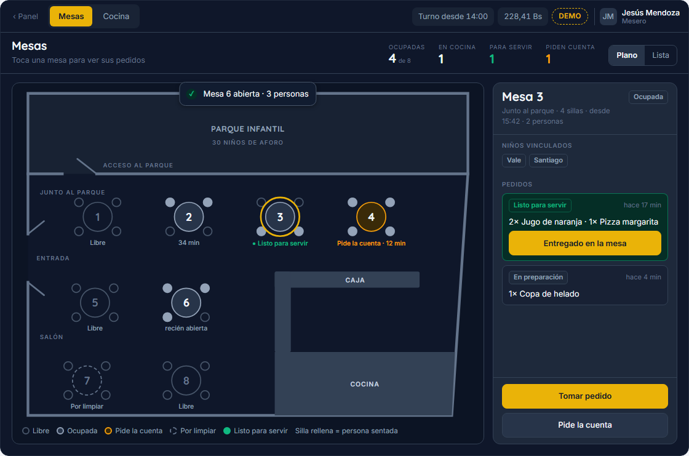
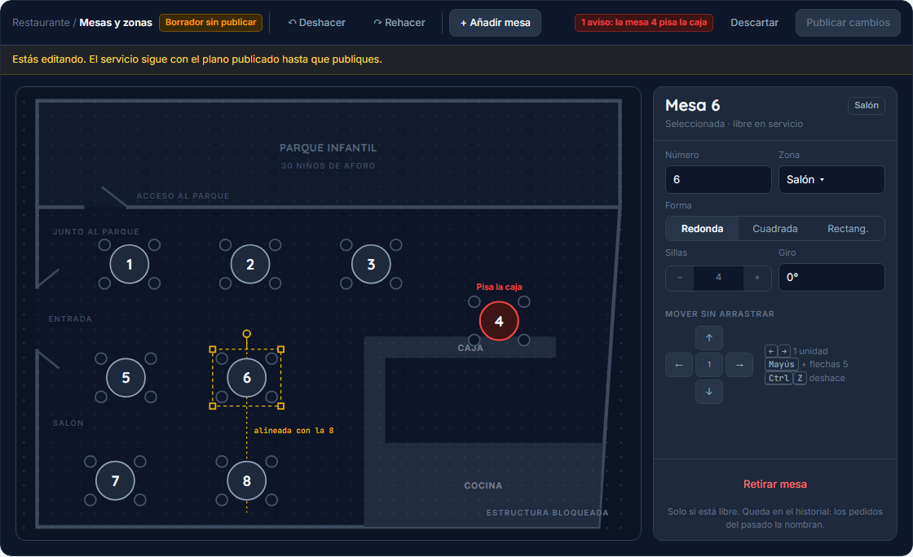
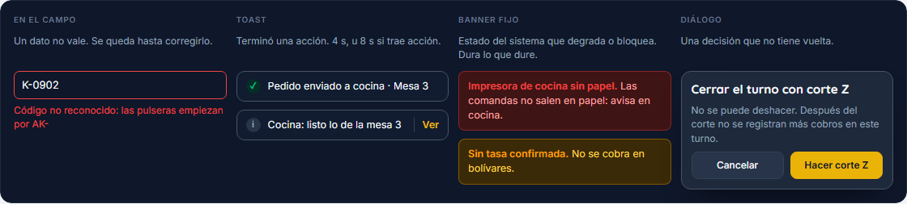
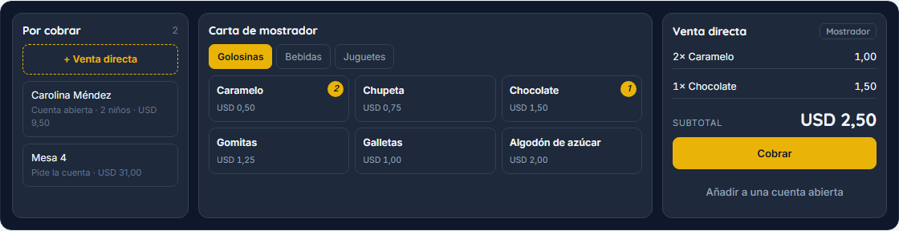

# Mejoras de experiencia: auditoría y mini plan

> **Cerrado el 2026-09-17.** Todo lo de aquí está hecho (V1 a V5, la auditoría de caja) o trasladado:
> las decisiones abiertas y lo que queda, a [PENDIENTES.md](PENDIENTES.md); el trabajo de interfaz que
> falta, al [plan final del frontend](PLAN-FRONTEND.md). Se conserva porque el código cita sus
> secciones («UX-MEJORAS §4.2») para explicar por qué las cosas son como son. No se añade nada nuevo.

> **Qué es.** Una auditoría de las pantallas tal como están el 2026-09-12 (capturas a 1366×768) y un
> plan corto de mejoras visuales y de uso. Nada de esto está construido todavía: **es una propuesta
> para aprobar**. Lo que toca el alcance o una decisión del cliente se marca como decisión (§8).
>
> Las maquetas están en `docs/diseno/`: son dibujos de la propuesta, no pantallas construidas.
>
> Lo que ya manda sigue mandando: tokens de `packages/config/tokens.css`, estados reservados con color +
> icono + texto (§8.2), objetivos táctiles por superficie (§8.4) y fail-closed.

---

## 1. Auditoría

Severidad: **alta** si puede causar un error de operación o de atribución; **media** si frena o
confunde; **baja** si es acabado.

| # | Sev. | Qué pasa | Dónde | Propuesta |
|---|---|---|---|---|
| A1 | Alta | El botón del simulador flota encima de la operación: tapa el usuario y «Salir» del menú del panel, el final de la cola de caja y se amontona con la insignia del dispositivo | Todas | Llevarlo a un chip **«Demo»** dentro de la barra de estación y del pie del menú. Nunca flotante |
| A2 | Alta | La identidad está fija: todas las estaciones dicen «Marisol Prieto · Cajera», también en Mesas | Barra de estación | Que salga de quien entró por el acceso. Si la pantalla dice otra persona, lo que se haga queda mal atribuido |
| A3 | Alta | Los roles no filtran las estaciones: «Panel» y las pestañas se ven siempre, y cualquiera llega a `/caja` escribiendo la URL | Barra de estación | Filtrar con `visibleSurfaces` y una pantalla «Sin acceso» con cambio de usuario (§3) |
| A4 | Alta | Cinco formas distintas de avisar: subtítulo de cabecera (Mesas), recuadro de alerta (Salida), tarjeta de estado (Liquidación), texto del lector y diálogo (Caja) | Todas | Una sola taxonomía: campo, toast, banner y diálogo (§4.2) |
| M1 | Media | Hojas, diálogos y avisos **entran** animados pero **salen de golpe** | Capas | Animación de salida más corta que la de entrada (§4.1) |
| M2 | Media | La píldora «14:00» parece un reloj; es la hora de apertura del turno | Barra de estación | «Turno desde 14:00» |
| M3 | Media | El back-office desplaza: Inicio +491 px, Usuarios +1434 px | `/panel` | Usuarios en maestro-detalle; Inicio con lo urgente arriba. Decidir si el back-office puede desplazar (D12) |
| M4 | Media | Mesas es una cuadrícula, no el local: el mesero no encuentra la mesa por su sitio | `/mesas` | Plano espacial del local (§2) |
| M5 | ~~Media~~ | ~~La entrada muestra el teléfono del representante a roles sin `parque.verContacto`~~ **Corregido al construir V2: no aplica.** El teléfono lo teclea el operador para buscar; el dato guardado no se muestra en ninguna pantalla | `/entrada` | Nada que enmascarar hoy. La regla 3 se aplicará cuando exista la ficha del representante (F5-07) |
| B1 | Baja | El indicador de desarrollo de Next («N») se monta abajo a la izquierda y ensucia las capturas | Solo desarrollo | `devIndicators` en otra esquina |
| B2 | Baja | Todas las iniciales del acceso van en amarillo de marca; la marca es para la acción principal | `/acceso` | Iniciales neutras |
| B3 | Baja | Insignias de 11 px en las baldosas densas | `/mesas`, `/monitor` | 12 px mínimo, texto antes que icono |

---

## 2. Plano de mesas

### 2.1 Lo que dice el dibujo

- **El parque** ocupa la franja de arriba, con una puerta propia hacia el salón (arriba a la izquierda).
- **La entrada de la calle** está en la pared izquierda, con puerta doble.
- **8 mesas redondas de 4 sillas**: 4 junto al parque, y dos filas de 2 hacia la calle.
- **La caja** es una barra en L en el centro-derecha; **la cocina**, abajo a la derecha, detrás de la barra.
- El local es **rectangular**: la diagonal del dibujo fue un trazo involuntario (confirmado el 2026-09-14). Medidas de trabajo: 8 × 6 m hasta el relevamiento (F0-03).

El prototipo actual inventó 8 mesas con algunas de 6 sillas y dos zonas. El dibujo lo corrige: **todas
de 4 sillas**. Numeración y zonas (D11, cerrada el 2026-09-14): **1-4 «Junto al parque»** de izquierda a
derecha, **5-8 «Salón»** en dos filas de dos hacia la calle, **editables** desde V4. Las medidas reales
siguen siendo trabajo de campo (F0-03).

### 2.2 Dos modos, nunca mezclados

| | Modo servicio | Modo edición |
|---|---|---|
| Quién | Mesero, cajera, supervisor | Solo administración (`catalogo.modificar`, D10) |
| Dónde | `/mesas` (estación) | Panel → Restaurante → Mesas y zonas |
| Qué se hace | Tocar una mesa para verla y operarla | Mover, añadir, girar y retirar mesas |
| Arrastrar | **Nunca**: un roce con prisa no puede mover una mesa en pleno servicio | Sí, con alternativa sin arrastre |
| Cambios | En vivo, por eventos | En **borrador**; el servicio no los ve hasta **Publicar** |

### 2.3 Buenas prácticas del editor

**Datos**
1. Posición en **unidades del local** (centímetros o cuadrícula), no en píxeles: el mismo plano escala
   a 1366, a tablet y a móvil.
2. Cada mesa lleva número único, zona, forma (redonda, cuadrada, rectangular), sillas y giro.
3. **Estructura fija aparte**: paredes, puertas, parque, caja y cocina van en una capa bloqueada
   (candado) que se edita pocas veces.
4. **Nada se borra** (regla 5): una mesa se **retira**, porque los pedidos del pasado la nombran. Una
   mesa ocupada no se puede retirar, y la pantalla dice por qué.
5. **Versiones del plano**: publicar crea una versión con fecha; la anterior queda en el historial.

**Interacción**
1. **Ajuste a la cuadrícula** al soltar, y **guías de alineación** cuando una mesa se alinea con otra.
2. **Solapes a la vista**: si una mesa pisa otra o sale de las paredes, se marca en rojo y no se publica.
3. **Sin arrastre también se puede** (WCAG 2.5.7): panel de propiedades con posición y flechas para
   empujar; con teclado, flechas mueven 1 unidad y Mayús + flechas, 5.
4. **Deshacer y rehacer** (Ctrl+Z, Ctrl+Mayús+Z) y **Descartar borrador**.
5. **Táctil**: el arrastre empieza con pulsación larga, para no confundirlo con desplazar.
6. **Ajustar a la pantalla** siempre visible; zoom solo si el local crece.

**En servicio**
1. El plano cabe entero sin desplazar; la mesa elegida se abre a la derecha (maestro-detalle, como hoy).
2. Estado con **color + icono + texto**; las sillas ocupadas se rellenan.
3. Conmutador **Plano | Atender**: «Atender» no repite el plano, lista solo lo que pide acción —platos listos, quien pide la cuenta, mesas por limpiar o largas— y es la vista de entrada en móvil, donde el plano no se lee.

### 2.4 Nombres para investigar

- **Librerías**: dnd-kit (`@dnd-kit/react`), Pragmatic drag and drop (Atlassian), React Flow (xyflow),
  react-konva, Motion (gestos de arrastre), interact.js. **Propuesta**: SVG + eventos de puntero propios.
  Con 8-10 mesas no hace falta una librería de diagramas, y el proyecto evita dependencias que no
  cargan peso real.
- **POS con editor de plano**: Odoo POS Restaurante (código abierto, editor muy parecido a lo pedido),
  Lightspeed Restaurant K-Series, Toast POS, Square for Restaurants, Fudo (muy usado en Latinoamérica).

---

## 3. Qué ve cada rol

Sale de la matriz de §7.3 (`packages/domain/identity`). **✓** puede · **🔐** con autorización · **—** no lo ve.

| Superficie | Admin | Supervisor | Cajera | Mesero | Monitora | Cocina |
|---|:-:|:-:|:-:|:-:|:-:|:-:|
| Panel: Inicio e informes | ✓ | ✓ | — | — | — | — |
| Sala y entrada del parque | ✓ | ✓ | ✓ | — | ✓ | — |
| Salida del parque | ✓ | ✓ | ✓ | — | ✓ | — |
| Caja: cobrar | ✓ | ✓ | ✓ | — | ✓ (taquilla) | — |
| Turno: cortes X | ✓ | ✓ | ✓ | — | — | — |
| Corte Z | ✓ | ✓ | 🔐 | — | — | — |
| Mesas y pedidos | ✓ | ✓ | ✓ | ✓ | — | — |
| Vincular pulseras a una mesa | ✓ | ✓ | ✓ | ✓ | ✓ | — |
| Anular un pedido en cocina | ✓ | 🔐 | 🔐 | 🔐 | — | — |
| Cocina (KDS) | ✓ | ✓ | — | — | — | ✓ |
| Inventario | ✓ | 🔐 | — | — | — | — |
| Carta, tarifas y **editar el plano** | ✓ | — | — | — | — | — |
| Usuarios y permisos | ✓ | — | — | — | — | — |

**Cuatro reglas de visibilidad**
1. Lo que un rol no puede alcanzar **no aparece**: ni en el menú, ni en las pestañas, ni en la barra.
2. Lo que puede **con autorización sí aparece**, con candado y el paso de autorización.
3. Un dato sensible **se enmascara**; no se esconde la pantalla entera.
4. **La URL no es una puerta**: entrar a mano muestra «Sin acceso» y cambio de usuario, nunca la pantalla.

Las excepciones por persona (F2-11) cambian la fila de esa persona, no la del rol.

---

## 4. Movimiento y avisos

### 4.1 Transiciones

Una curva y pocas duraciones (ya en `tokens.css`). La salida siempre es más rápida que la entrada, se
anima una o dos cosas por vista, y `prefers-reduced-motion` lo apaga todo.

| Qué | Hoy | Propuesta |
|---|---|---|
| Avanzar o volver en la jerarquía | Desliza 28 px, 240 ms, solo entrada | Desliza 16 px con fundido, 220 ms; salida 160 ms |
| Pestañas del mismo puesto | Fundido 200 ms | Fundido cruzado 150 ms, sin desplazamiento |
| Hoja lateral | Entra 240 ms, sale de golpe | Entra 280 ms, sale 200 ms |
| Diálogo | Crece desde 0,96, sale de golpe | Igual, y sale en 150 ms |
| Toast | No existe | Entra 200 ms desde arriba, sale 150 ms, se apilan |
| Una mesa o comanda cambia de estado | Salta | Un destello de borde de 600 ms, una vez. Solo lo crítico repite |
| Dinero y contadores | Saltan | **Sin animar**: una cifra que rueda no se lee |

**Nombres para investigar**
- **View Transitions API** del navegador. En Next 16 va con `experimental.viewTransition` y el componente
  `unstable_ViewTransition` de React: **todavía experimental**, Vercel no lo recomienda en producción.
- **CSS `@starting-style` + `transition-behavior: allow-discrete`**: animación de salida nativa para
  `<dialog>`, que es lo que ya usan las capas. Sin librería.
- **Motion** (motion.dev, antes Framer Motion): `AnimatePresence` para salidas y `layout` para reordenar
  listas (el KDS).
- **AutoAnimate** (FormKit): reordenar listas con una línea.

**Propuesta**: seguir con CSS. `@starting-style` para las salidas de capas y toasts, y Motion solo si el
KDS necesita reordenar tarjetas animadas.

> **Hecho en V1.** Hojas, diálogos y velo salen animados con `@starting-style`. El cambio de pantalla
> bajó a 16 px y 220 ms, pero **sigue sin salida**: la página vieja no se puede animar mientras sale sin
> View Transitions, que en Next 16 sigue siendo experimental. Se retoma cuando se estabilice.

### 4.2 Avisos: cuál usar

| Tipo | Cuándo | Ejemplo | Cuánto dura |
|---|---|---|---|
| **En el campo** | Un dato no vale | «Código no reconocido» | Hasta corregirlo |
| **Toast** | Terminó una acción, sin bloquear nada | «Mesa 3 abierta · 2 personas» | 4 s; 8 s si trae acción |
| **Banner fijo** | Estado del sistema que degrada o bloquea | Sin tasa, impresora sin papel, sin internet | Mientras dure |
| **Diálogo** | Decisión que no tiene vuelta | Corte Z, enviar a cocina | Hasta decidir |

**Regla fail-closed**: un error que impide operar **nunca es solo un toast**. Se va solo y nadie lo
vuelve a ver.

**Posición**: arriba al centro, bajo la barra, en las estaciones, lejos de la acción principal (abajo a
la derecha) y visible a distancia. Arriba a la derecha en el back-office. Máximo 3 a la vista, pausa al
pasar el ratón o enfocar, `aria-live` cortés para éxito y enérgico para error.

**Nombres para investigar**: **Sonner** (Emil Kowalski; el de shadcn/ui), **React Aria Toast** (Adobe; la
mejor accesibilidad), **Base UI Toast**, **Radix Toast**, **react-hot-toast**, **Notistack**.
Referencias de estilo: los toasts de Vercel (Geist), Linear y Stripe.
**Propuesta**: Sonner estilado con nuestros tokens.

---

## 5. Caja: venta directa

Hoy la caja no solo cobra **cuentas** de familias que salen o mesas de restaurante, sino que soporta
**venta directa de mostrador** y **adición rápida de snacks** a una cuenta activa.

> **Construido el 2026-09-12 (V5).** Se implementó la solución táctil integrada:
> 1. **Botón «+ Venta directa (Mostrador)»** en la cabecera de la cola de cobro: crea instantáneamente una
>    cuenta de mostrador (`Mostrador #XX`) para clientes que solo consumen cafetería, snacks o delivery,
>    cumpliendo íntegramente con `FamilyAccountSchema`.
> 2. **Catálogo táctil integrado (sin modal intrusivo):** Botón `+ Añadir snacks` en la cabecera del ticket.
>    Despliega una rejilla compacta de 14 productos en 5 categorías (`Todos`, `Bebidas`, `Snacks`,
>    `Golosinas`, `Café`).
> 3. **Operación a 1 toque:** Añade la línea al ticket, recalculando al instante subtotal, IVA (16%) y tasa BCV.
> 4. **Retiro rápido:** Botón `X` en cada ítem de mostrador para corregir pedidos sin fricción.
> **Revisado el 2026-09-12** (BITACORA): la venta nace con el primer producto elegido y se descarta si se
> vacía; el ticket es estilo factura, con los ítems repetidos en una fila con cantidad; el teclado se abre
> con «Otro monto» para que la columna quepa a 1366×768; lo consumido no se quita desde la caja.
>
> 5. **Adaptación para montos grandes y bimoneda VE:**
>    - Monto en bolívares en tarjeta dedicada apilada con escalado tipográfico automático para cifras de 6 a 8 dígitos.
>    - Billetes inteligentes (`calcularBilletesSugeridos`): atajos de $5 a $100 en cuentas pequeñas y redondeos
>      superiores dinámicos en cuentas grandes.
>    - Botón de cierre multilínea para no desbordar en montos largos.

---

## 6. La insignia «Tablet taquilla · autorizado»

Está en la pantalla de acceso y dice **qué equipo es y que está autorizado**. El PIN solo abre sesión en
un dispositivo registrado y aprobado (ADR-013): el equipo es el primer factor y el PIN el segundo. Si
alguien ve un PIN por encima del hombro, desde otro aparato no le sirve de nada. Si la tablet no está
aprobada, en lugar de esta pantalla sale el bloqueo.

**Problemas**
- Parece un botón y no hace nada.
- Es pequeña para lo que protege.
- Justo debajo se le amontonan el simulador y el indicador de Next.

**Propuesta**: una línea de **estado del equipo** al pie, con dispositivo, sucursal, conexión y versión.
Que la administración la pueda tocar para ver el detalle.

---

## 7. Mini plan

Orden propuesto. Cada paso deja la aplicación mejor que antes y no bloquea el siguiente.

| Paso | Qué | Hallazgos | Tamaño |
|---|---|---|---|
| **V1** ✔ | Base visual: taxonomía de avisos con toasts, salidas animadas, simulador dentro de la barra, identidad desde el acceso, «Turno desde», indicador de Next. **Hecho el 2026-09-12** | A1, A2, A4, M1, M2, B1, B2 | 1 sesión |
| **V2** ✔ | Roles en estaciones: pestañas y «Panel» filtrados, pantalla «Sin acceso», menú del panel por rol. **Hecho el 2026-09-12** | A3 | 1 sesión |
| — | *DEC-22 paso 3: cocina (KDS)*, ya con toasts y roles | — | — |
| **V3** ✔ | Plano espacial en `/mesas` con el local del dibujo, y vista Lista. **Hecho el 2026-09-14** | M4 | 1 sesión |
| **V4** ✔ | Editor del plano en el panel: borrador, publicar, retirar, deshacer. **Hecho el 2026-09-14** | F6-01 | 1-2 sesiones |
| **V5** ✔ | Caja: venta directa y adicionales (mostrador), catálogo táctil de snacks, formato bimoneda VE y montos grandes. **Hecho el 2026-09-12** | §5 | 1 sesión |
| — | *DEC-22 paso 5: panel en vivo* | M3 | — |

---

## 8. Decisiones que hacen falta

| # | Decisión | Propuesta / Estado |
|---|---|---|
| **D6** | ¿Venta directa en caja? (ya abierta en FLUJOS §7) | **Cerrada (2026-09-12)**: Catálogo mínimo táctil de mostrador sin inventario |
| **D10** | ¿Quién edita el plano de mesas? | **Cerrada el 2026-09-14**: solo administración. La supervisión lo ve pero no lo mueve: el plano es configuración del local, y moverlo en plena tarde deja a mesero y caja viendo cosas distintas |
| **D11** | Numeración y zonas del dibujo | **Cerrada el 2026-09-14**: 1-4 «Junto al parque», 5-8 «Salón», 4 sillas, **como valor de partida editable** (V4). Número y zona son etiquetas; la identidad interna de la mesa no cambia nunca, así que renumerar no reescribe lo ya cobrado. Sin números repetidos (lo impone `FloorPlanSchema`) y los cambios se publican como versión nueva, no a mitad de servicio |
| **D12** | ¿El back-office puede desplazar? | Sí. Lo urgente arriba; las estaciones siguen sin desplazar |
| **D13** | Número de orden: ¿continuo o se reinicia cada día? | Hecho continuo por sucursal (`#1049`). Reiniciar a diario da números cortos para llamar al cliente, pero obliga a decir también la fecha en cada reclamo |
| — | Librería de toasts | Sonner, tras vuestra investigación |

---

## 9. Auditoría de Caja — 2026-09-12

Revisada con cuatro criterios: **fluidez de compra**, **rapidez**, **visual** y **facilidad de uso**. Estado:
**✔ hecho** en esta revisión · **propuesta** para aprobar · **decisión** del cliente.

### 9.1 Fluidez y rapidez

| # | Hallazgo | Estado |
|---|---|---|
| C1 | Un Pago Móvil, un Zelle, un USDT o un punto de venta entraban al cobro **sin referencia**: no se podían conciliar al cierre (F4-04) | ✔ Se piden al añadir el pago; recuerda banco, terminal y red; rechaza una referencia repetida en el mismo cobro |
| C2 | **Un cobro con USDT no se podía cerrar**: se convertía con la tasa de bolívares (fallo desde F4-03) | ✔ USDT a la par con el dólar, como ya asumía el IGTF (DEC-1, a confirmar con el contador) |
| C3 | Con dos o más terminales de punto de venta no se sabía por cuál entró el pago | ✔ Se elige el terminal; con uno se asume. La lista se configurará en F4-02 |
| C4 | El teclado se escondía y la columna cambiaba al usarlo | ✔ Columna fija: el teclado queda en el mismo píxel con cualquier medio |
| C5 | El mostrador tiene teclado físico y no hay atajos | ✔ Hecho el 2026-09-13. Los dígitos son el **monto** (no el medio, como decía la propuesta): E · B · P · T · Z · U eligen medio, Enter añade, «+» cobra exacto, **Ctrl+Enter** cierra (nada irreversible con una tecla), ↑↓ recorren la cola, «/» busca, N venta directa, I identificar, R recibo, «?» la chuleta. Nunca mientras se escribe ni con un diálogo abierto; una ráfaga del lector (< 45 ms entre teclas) se descarta entera. Pistas visibles solo con puntero fino |
| C6 | Una cuenta nueva llega a la cola sin avisar y sin decir cuánto lleva esperando | ✔ La más antigua arriba (`pendingSince`, lo fija quien la pasa a «por cobrar»), minutos de espera con reloj ámbar desde los 10, destello y aviso al llegar (no para lo que crea la propia caja). Con cuentas por pestaña, la llegada «en vivo» se verá de verdad con el backend |
| C7 | Con muchas cuentas no hay cómo buscar | ✔ Pasar la pulsera abre la cuenta del niño (o dice que sigue abierta o que no tiene); buscador por familia o número de orden con filtros Todas · Parque · Mostrador, a la vista con más de 5 cuentas o con «/» y la lupa. Enter con un resultado lo abre. Por mesa, con la caja de mesas |
| C8 | Tras cobrar no hay recibo | ✔ Recibo **no fiscal** (lo dice arriba) tomado como foto al cerrar: «Ver recibo» en el aviso, franja «Último #…» en la cola y tecla R. Imprime solo el recibo a 80 mm; WhatsApp abre `wa.me` con el texto y el teléfono validado, solo si el cliente lo pide. Referencias y documento enmascarados. La térmica en red, en F1-12 |
| C9 | Cobro dividido (F6-12) y propina explícita (F6-13) | Llegan con la caja de mesas (DEC-22 paso 4) |
| C10 | «Cobrar exacto» en efectivo: casi nunca se entrega el monto justo, e invitaba a registrar lo que no se contó | ✔ 2026-09-13: solo en medios electrónicos; en efectivo «Cerrar cobro» ocupa la fila entera (mismo alto) y «+» no hace nada |
| C11 | Faltaba el billete de $1, y la fila de billetes cambiaba con el monto («$57» no es un billete) | ✔ Fila fija $1 · $5 · $10 · $20 · $50 · $100; cada toque suma al mismo pago en efectivo |
| C12 | Pantalla «Ventas» del turno para reimprimir (copia marcada y auditada) y anular un cobro con motivo y supervisor | ✔ «Ventas» hecha el 2026-09-13: pestaña junto a «Cobrar» y «Turno» con los cobros del turno, búsqueda por familia o #orden, filtro por medio y el recibo tal como sale en papel. La primera impresión es el original; las demás salen «COPIA» y cada una queda con hora y persona (sin atajo de teclado, a propósito). WhatsApp desde el detalle. ✔ **Anular** (DEC-24) hecho el mismo día: motivo de lista cerrada, devolución pago a pago por el mismo medio (referencia o aprobación del terminal) o en efectivo con explicación si la gaveta lo tiene, y PIN de un supervisor o del administrador. La venta queda «ANULADA» con todo el rastro y la cuenta vuelve a «por cobrar» |
| C13 | El IGTF se calcula sobre todo lo entregado en divisas, **vuelto incluido**: $ 15 en efectivo para $ 11,47 cargan $ 0,45 y no $ 0,34 | Por revisar con el contador (DEC-1): lo habitual es gravar lo aplicado al pago, no el billete entero |

### 9.2 Visual

| # | Hallazgo | Estado |
|---|---|---|
| V1 | El IGTF usaba **ámbar y rojo**, colores reservados para «revisar» y «error»: el IGTF es un dato fiscal, no una alarma | ✔ Neutro en medios, pagos y totales; el aviso largo pasó a una línea |
| V2 | Etiquetas de 9,5 px en los botones de medio | ✔ 11 y 13 px, sin cambiar el alto de 56 px |
| V3 | Lo tecleado en bolívares se mostraba «1000.00» | ✔ «Bs. 1.000,00» |
| V4 | «Venta directa» (amarillo punteado) compite con la cuenta elegida (amarillo) | ✔ Botón neutro con icono; el amarillo queda para lo seleccionado |
| V7 | Los datos de Pago Móvil se amontonaban y «Copiar» ocupaba media franja | ✔ Sin icono de medio, banco por nombre, teléfono sin puntos y «Copiar» solo con icono (48 px, nombre accesible); lo mismo en Zelle |
| V6 | «0% IGTF» en los medios en bolívares: un dato que hay que leer para nada | ✔ En Bs solo la moneda; el chip de IGTF queda en divisas y su porcentaje sale del dato |
| V5 | La cola no dice de dónde viene cada cuenta | ✔ Icono + texto: niño para parque, bolsa para mostrador. Mesa, con la caja de mesas |

### 9.3 Facilidad de uso

| # | Hallazgo | Estado |
|---|---|---|
| U1 | Quitar un pago: botón de 36 px | ✔ Objetivo de 56 px |
| U2 | Los datos del pago en la lista, a la vista de la cola | ✔ Enmascarados: «Mercantil · Ref. ···1236» (§7.6) |
| U3 | Corregir una referencia obliga a quitar el pago y añadirlo de nuevo | ✔ Se toca el pago y se corrigen monto y datos en el mismo formulario; la referencia no choca consigo misma. Solo antes de cerrar: después, reversión con motivo (regla 5) |
| U5 | En los medios, el nombre y la moneda con el IGTF se cortaban a 1280 px | ✔ Icono junto al nombre, moneda e IGTF debajo; columna de cobro de 352 px mínimo |
| U4 | **La factura no identifica al cliente** (cédula o RIF, nombre) | ✔ Decidido (DEC-23) y hecho: fila «Factura a» con «Consumidor final» por defecto e «Identificar», que propone el nombre del representante |

| # | Decisión | Propuesta |
|---|---|---|
| **D14** | ¿Se identifica al cliente en la factura? | **Cerrada el 2026-09-13 (DEC-23)**: consumidor final por defecto; cédula o RIF y nombre cuando lo pida. La dirección fiscal, opcional hasta confirmar con el contador |
